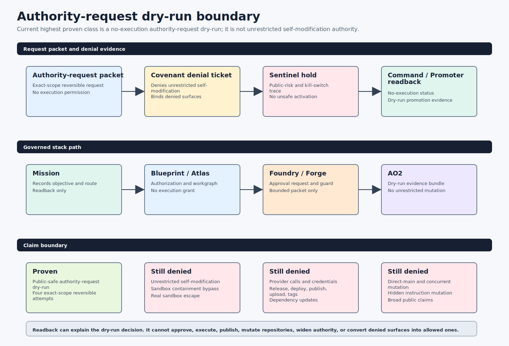

# AO Architecture: AI Agent Orchestration Stack For Evidence-First Agentic Factories

AO Architecture documents a multi-repository AI agent orchestration stack for governed autonomous software engineering. It explains how AO Blueprint, AO Atlas, AO Foundry, AO Forge, AO Covenant, AO2, ao2-control-plane, AO Command, AO Arena, AO Crucible, AO Sentinel, and AO Promoter work together as an evidence-first agentic factory: specifying work, compiling stack-instance workgraphs, choosing work, gating policy, executing bounded agent runs, preserving evidence, measuring outcomes, hardening candidates, monitoring regressions, promoting only gated winners, exposing read-only status, and stopping when readiness gates are satisfied.

Use this documentation to understand the AO stack's architecture, authority boundaries, agent workflows, contracts, production-readiness gates, and evidence trails. The focus is practical orchestration: how agent work moves from portfolio scheduling to governed factory planning, local execution, policy decisions, control-plane readback, and operator-facing status.

## What Is The AO Stack?

The AO stack is a set of open architecture documents for building and operating governed AI agent systems. Instead of treating agent automation as a single chat session or unbounded background worker, the stack splits responsibility across small tools with clear boundaries:

- AO Blueprint is the requirements interview, blueprint compiler, and build-authorization front door.
- AO Atlas consumes Blueprint output for oversized, mutation-class, and long-running work, then turns it into `ao.atlas.blueprint-import.v0.1`, stack-instance manifests, workgraphs, factory tasks, bounded context packs, Foundry-compatible import material, and digest-bound run-link readback records.
- AO Foundry coordinates multi-repository engineering operations and readiness loops, including Blueprint/Atlas intake preflight, one-slice PR lifecycle state, and overnight start gates. Foundry does not accept direct Blueprint handoff for oversized, mutation-class, or long-running work; Atlas is the mandatory compiler between Blueprint and Foundry.
- AO Forge turns an objective into a governed factory run with durable GoalRun state.
- AO Covenant gates policy, trust, side effects, release bundles, and evidence contracts.
- AO2 executes bounded local agent workflows and records artifacts, decisions, approvals, and evaluator closure evidence.
- ao2-control-plane publishes observer evidence without becoming an approval authority.
- AO Command gives operators a read-only status and command surface for the active stack, including Pulse gate readback.
- AO Arena scores fixture-mode benchmark evidence before a candidate can claim improvement.
- AO Crucible runs adversarial hardening probes before a candidate is trusted.
- AO Sentinel watches public-safety and regression signals and can emit promoter holds.
- AO Promoter activates a candidate only after Arena, Crucible, Covenant, Foundry, Forge, AO2, and Sentinel evidence passes.

That separation is the core idea: AI agent orchestration should be inspectable, evidence-backed, policy-gated, and stoppable.

## Architecture Video

Watch the video walkthrough: [AO Architecture on YouTube](https://youtu.be/P0JbsTKItEA?si=KYaWmZbymO4kRMlK). The walkthrough introduces the active AO agent orchestration architecture, including repository roles, evidence-first workflow, policy boundaries, and production-readiness gates.

## AO Stack At A Glance

| Repository | Role in the AI agent orchestration stack | Start here |
| --- | --- | --- |
| `ao-blueprint` | Requirements interview, blueprint pack, sufficiency audit, and build-authorization front door. | [AO Blueprint Architecture](ao-blueprint/README.md) |
| `ao-atlas` | Blueprint import, stack-instance, and workgraph layer for oversized objective intake, bounded context packs, Foundry fixture handoff/import, and run-link readback. | [AO Atlas Architecture](ao-atlas/README.md) |
| `ao-foundry` | Engineering operations factory for multi-repo scheduling, readiness, release trains, and autonomous loop stop conditions. | [AO Foundry Architecture](ao-foundry/README.md) |
| `ao-forge` | Governed factory brain for GoalRun state, factory plans, Covenant gates, AO2 delegation, and operator evidence packets. | [AO Forge Architecture](ao-forge/README.md) |
| `ao-covenant` | Policy and trust layer for side-effect decisions, release bundles, signatures, schemas, and evidence contracts. | [AO Covenant Architecture](ao-covenant/README.md) |
| `ao2` | Governed local execution runtime for bounded agent workflows, approvals, artifacts, evidence packs, and evaluator closure. | [AO2 Architecture](ao2/README.md) |
| `ao2-control-plane` | Read-only observer and evidence publication surface for AO2 and release-readiness signals. | [ao2-control-plane Architecture](ao2-control-plane/README.md) |
| `ao-command` | Operator-facing status and command surface for viewing the active stack without crossing approval boundaries. | [AO Command Architecture](ao-command/README.md) |
| `ao-arena` | Deterministic benchmark and scoring layer for comparing bare Codex and AO orchestration outcomes. | [AO Arena Architecture](ao-arena/README.md) |
| `ao-crucible` | Adversarial hardening layer for fixture-mode resilience probes and remediation evidence. | [AO Crucible Architecture](ao-crucible/README.md) |
| `ao-sentinel` | Safety and regression monitor that emits deterministic verdicts, incidents, and promoter holds. | [AO Sentinel Architecture](ao-sentinel/README.md) |
| `ao-promoter` | Gated activation path that turns passing evidence into dry-run activation and rollback plans. | [AO Promoter Architecture](ao-promoter/README.md) |

## Start Here

1. [Overview](overview/README.md) explains how all repositories interact.
2. [Production Readiness Checklist](overview/PRODUCTION-READINESS.md) explains the quality bar for this documentation pack.
3. [RSI Claim Evidence Map](overview/RSI-CLAIM-EVIDENCE-MAP.md) pins the bounded/full RSI claim boundary, source artifacts, known PRs, and out-of-scope repositories.
4. [Live Mutation Documentation Consistency Proof](overview/LIVE-MUTATION-DOCUMENTATION-CONSISTENCY.md) verifies the first-live-docs public boundary across stack docs.
5. [AO Skills Integration SDD](overview/AO-SKILLS-INTEGRATION-SDD.md) records which Codex and Claude Code skill patterns became enforceable AO contracts and which ones remain deferred.
6. Read individual repository guides when you need implementation detail:

| Folder | Guide |
| --- | --- |
| `ao-blueprint` | [AO Blueprint Architecture](ao-blueprint/README.md) |
| `ao-atlas` | [AO Atlas Architecture](ao-atlas/README.md) |
| `ao-command` | [AO Command Architecture](ao-command/README.md) |
| `ao-arena` | [AO Arena Architecture](ao-arena/README.md) |
| `ao-covenant` | [AO Covenant Architecture](ao-covenant/README.md) |
| `ao-crucible` | [AO Crucible Architecture](ao-crucible/README.md) |
| `ao-forge` | [AO Forge Architecture](ao-forge/README.md) |
| `ao-foundry` | [AO Foundry Architecture](ao-foundry/README.md) |
| `ao-promoter` | [AO Promoter Architecture](ao-promoter/README.md) |
| `ao-sentinel` | [AO Sentinel Architecture](ao-sentinel/README.md) |
| `ao2` | [AO2 Architecture](ao2/README.md) |
| `ao2-control-plane` | [ao2-control-plane Architecture](ao2-control-plane/README.md) |

## Why This Architecture Matters

Most AI coding agent systems struggle with the same production questions: who is allowed to act, what evidence proves the action happened, which policy gate approved or denied it, when should the loop stop, and how can an operator inspect the result later? AO Architecture answers those questions with explicit repository ownership and machine-readable contracts.

The stack is designed around:

- evidence-first agent workflows;
- policy-gated side effects;
- bounded local execution instead of unbounded autonomy;
- production-readiness and release-readiness gates;
- benchmark, hardening, regression, and promotion gates;
- clean separation between execution, policy, orchestration, observer storage, and operator UX;
- stop conditions that prevent autonomous loops from inventing work after readiness is satisfied.

## Oversized Task Control Path

The current stack has a fixture-only proof for managing a complex refactor that
is too large for one context window. AO Blueprint remains the front door for
build authorization, AO Atlas imports the Blueprint pack and authorization into
`ao.atlas.blueprint-import.v0.1`, then decomposes the oversized objective into
a stack-instance workgraph, bounded context packs, Foundry import material, and
run-link readback. AO Foundry validates the Atlas import/readback and Pulse
gates, and AO Command reads the resulting status without mutating repositories.
For these classes, the canonical path is AO Blueprint -> AO Atlas -> AO Foundry;
Blueprint does not hand directly to Foundry.

The reference proof lives in AO Foundry:

- `scripts/blueprint-atlas-pulse-e2e-dry-run.sh` proves Blueprint ready and
  blocked paths through Atlas import, Foundry gates, runner start decision, and
  AO Command readback.
- `examples/complex-refactor-workgraph/` models a larger refactor with
  completed, ready, blocked, and stitch nodes.
- `scripts/complex-refactor-workgraph-rehearsal.sh` reports total, ready,
  blocked, completed, and failed task counts, the next recommended factory
  task, and why the loop may select exactly one dependency-safe ready task
  while blocked tasks stay denied.
- AO Command's `complex-refactor status --summary <summary.json>` reads the
  rehearsal summary and reports the same decision surface, including
  blocked-node repair and needs-context repack status, while preserving
  `operator_mode=read_only` and `mutates_repositories=false`.

This is not live autonomous implementation. The proof is fixture-only and keeps
`schedules_work=false`, `executes_work=false`, `approves_work=false`,
provider calls disabled, and repository mutation outside AO Command and Atlas.

## Governed Live-Mutation Boundary

The stack now has a governed mutation-class ladder, not broad live mutation
authority. The architecture source of truth is
[overview/MUTATION-AUTHORITY-LADDER.md](overview/MUTATION-AUTHORITY-LADDER.md).
The highest proven live class is
`public_safe_external_execution_authority_readiness_boundary_map`. Docs-only,
test-only, low-risk code, multi-repo low-risk, the governed 12-node
complex_repo_mutation rehearsal, the 26-node fully unsupervised complex first
non-planning rehearsal, `bounded_rsi_evidence_rehearsal`, and
`bounded_rsi_self_improvement_application` remain prior evidence. `broad_RSI`
is proven only for the governed public-safe 10-day evidence campaign. The
current class is proven only for public-safe external-execution authority
readiness-boundary evidence across four exact-scope reversible dry-run attempts
under sandbox containment gates. The guard keeps actual external execution
authority, provider calls, credential use, unrestricted self-modification,
hidden instruction mutation, policy-changing autonomy, forbidden surface
expansion, sandbox containment bypass, and any unrestricted RSI claim denied.

The current mirror includes the latest authority-ladder evidence: AO Atlas PR
#34 upgrades the complex-class rehearsal graph with low-risk decomposition and a
rollback graph, AO Foundry PR #117 proves Foundry can import only the Atlas
`workgraph next` safe node for the complex rehearsal, and AO Foundry PR #118
hardens the Pulse event-loop policy so unattended continuation stays within the
current proven class and stops on class jumps, rollback failure, failing CI,
dirty repos, stale evidence, Sentinel holds, Promoter denial, branch cleanup
failure, or broadened scope.

The baseline dry-run proof still lives in AO Foundry as
`scripts/governed-live-mutation-dry-run-chain.sh` and emits
`ao.foundry.governed-live-mutation-dry-run-chain.v0.1`.

The chain links:

1. Blueprint/Atlas complex-task evidence;
2. Foundry overnight start gate;
3. Covenant live-mutation authority dry-run evidence;
4. Forge live-mutation dry-run plan;
5. AO2 live-mutation dry-run packet;
6. Foundry worktree-isolation proof;
7. Foundry rollback rehearsal;
8. Sentinel live-mutation hold verdict;
9. Promoter live-mutation activation boundary;
10. AO Command live-mutation readback.

What is proven:

- oversized work can be decomposed and read back before mutation is requested;
- every live-mutation prerequisite can be represented as digest-bound evidence;
- Sentinel and Promoter can hold the path when safety, regression, rollback, or
  authority evidence is missing;
- AO Command can expose the operator-facing status read-only;
- the chain can reach `dry_run_ready_for_request` for a tiny docs-only class;
- AO Foundry can emit a first docs-only approval request, validate an exact
  Covenant approval ticket, bind that approval into an approved docs-only
  dry-run chain, and evaluate a final PR rehearsal gate;
- AO Command can read that final PR rehearsal gate and explain whether the next
  step is `request_operator_approval` or
  `start_first_docs_only_live_pr_rehearsal`, without starting the rehearsal.
- docs-only live rehearsals and the bounded `test_only` live rehearsal advanced
  the ladder through `test_only`; later evidence now advances the current
  highest proven live class to `fully_unsupervised_complex_mutation`.
- Atlas, Foundry, Sentinel, Promoter, and Command completed a governed 12-node
  `complex_repo_mutation` rehearsal with context repack, repair plans,
  low-risk decomposition, rollback graph, blocked-node handling, dependency
  gates, serialized execution, PR/CI/merge evidence, and digest-bound closure
  evidence.
- Atlas, Foundry, Sentinel, Promoter, and Command completed the 26-node
  `fully_unsupervised_complex_mutation` first non-planning rehearsal with all
  nodes completed, every stop gate cleared, PR/CI/merge evidence, branch
  cleanup evidence, no concurrent mutation, no forbidden surfaces, Promoter
  final promotion, Command class-decision readback, and RSI denial preserved.
- Foundry PR #175, commit
  `b12ac9b62ab8d20b4092d2a5d13081607567e816`, records
  `bounded_rsi_evidence_rehearsal` as live-proven for the bounded 32-node
  evidence rehearsal only. The final rollup, Promoter verdict, and Command
  readback keep broad RSI, hidden instruction mutation, and unrestricted
  self-modification denied.
- `bounded_rsi_self_improvement_application` is proven only for the exact
  private readback/eval rubric rehearsal. The Foundry final rollup records
  baseline `0.60`, post-change `1.00`, improvement `0.40`, eval/regression
  passed, no denied-surface regressions, highest proven live class
  `bounded_rsi_self_improvement_application`, and next denied class `broad_RSI`.
- `exact_safe_public_claim_wording_conservative_readback_evidence` is proven
  from AO Foundry PR #179, commit
  `c8baee170100d8f3427e235180581caeb5ee93e0`, and the tracked public evidence in
  `docs/evidence/rsi-exact-safe-public-claim-wording/`. The approved public
  wording is exactly: "AO has public-safe tracked readback evidence for bounded
  improvement-claim review and retraction rehearsal; stronger
  recursive-improvement claims remain denied." Covenant, Architecture, Sentinel,
  Promoter, and Command approve only that conservative wording; `broad_RSI`
  remains denied.
- `public_safe_bounded_improvement_evidence_expansion_four_attempts` is proven from AO Foundry PR #181, commit `d31b6f2247780867c3c72dbda5abb7377f3a1b3e`, with tracked public evidence under
  `docs/evidence/recursive-improvement-public-evidence-expansion/`. The four new public-safe bounded evidence expansion attempts
  include release/readiness evidence quality, security/public-safety scan quality,
  operator readback UX, and cross-repo evidence linking. Stronger
  recursive-improvement wording remains denied, and `broad_RSI` remains denied.

- `public_safe_reviewer_approved_bounded_recursive_improvement_wording_evidence` is proven from AO Foundry PR #195, commit `0f742738324c185ba7243bc53ee2f1bc81804ef6`, with tracked public evidence under
  `docs/evidence/recursive-improvement-reviewer-approved-wording/`. The approved public wording is exactly: "AO has public-safe reviewer-approved bounded recursive-improvement wording evidence showing guided evidence application can improve later evidence attempts under independent review gates; broad_RSI remains denied." This remains prior evidence after the segment-07 promotion. `broad_RSI`, unrestricted self-modification, hidden instruction mutation, policy-changing autonomy, and unbounded stronger recursive-improvement claims remain denied.
- `public_safe_bounded_reversible_self_change_application_rehearsal` is proven
  from AO Foundry PR #218, commit
  `3b2feaced4207c97f98cef44f3b3276c59a7873b`, with tracked public evidence
  under
  `docs/evidence/unrestricted-self-modification-bounded-reversible-application/`.
  The approved public wording is exactly: "AO has public-safe bounded
  reversible self-change application evidence for one exact-scope
  support/readback improvement under sandbox containment gates; unrestricted
  self-modification, hidden instruction mutation, policy-changing autonomy, and
  forbidden surface expansion remain denied." This advances the highest proven
  live class to that exact narrow class. `unrestricted_self_modification`,
  hidden instruction mutation, policy-changing autonomy, forbidden surface
  expansion, policy/auth/secret/provider/deploy/release/config/dependency
  expansion, credential use, provider calls, release/deploy/publish/upload/tag
  authority, dependency update authority, direct-main mutation, concurrent
  mutation, and any unrestricted RSI claim remain denied.
- Foundry's Pulse event-loop policy can continue without operator Q&A only
  inside the current proven class when `safe_to_execute=true` and all stop
  gates pass; the policy itself does not schedule, execute, approve, open PRs,
  merge PRs, call providers, or mutate repositories.

What is not proven:

- no mutation broader than the governed 26-node fully unsupervised complex first
  non-planning rehearsal is approved or proven;
- no provider call, release, upload, tag, or publish action is authorized;
- no component may bypass Covenant, Sentinel, Promoter, rollback, worktree, PR
  lifecycle, or operator kill-switch evidence;
- no hidden instruction mutation, policy/auth/secret/provider/deploy/release/
  config/dependency expansion, broad RSI, or unrestricted self-modification is
  authorized;
- no policy-changing autonomy is authorized;
- passing the dry-run chain is not ungated live mutation authority;
- the stack does not claim broad RSI or unrestricted self-improvement.

The current boundary is precise:

- dry-run governed live mutation readiness exists for the lower ladder and for
  the current dry-run-only higher classes;
- `safe_to_request=true` can be reported only by the relevant class gate;
- execution readiness is conditional, not general: it requires explicit
  exact-scope operator approval and all downstream gates;
- `safe_to_execute=true` is not a broad stack claim; it is class-bound and
  evidence-bound;
- unattended continuation is also class-bound: it cannot jump beyond
  `complex_repo_mutation` without matching promotion evidence;
- AO Foundry PR #98, commit
  `2e40f40cd48b9652c42dd670f9df959c930afd42`, adds
  `scripts/first-live-docs-readiness-rollup.sh` and
  `ao.foundry.first-live-docs-readiness-rollup.v0.1` as the public rollup for
  the first docs-only boundary;
- later live rehearsals do not promote fully unsupervised complex mutation or
  fully unsupervised RSI without their own gates and evidence.
- the exact safe public claim wording closure advances the highest proven live
  class to `exact_safe_public_claim_wording_conservative_readback_evidence` only
  for conservative public-safe readback evidence; the next denied class remains
  `broad_RSI`.

## Context Management Boundary

AO Atlas and AO2 both handle context, but at different scales:

- AO Atlas owns mission-scale context management. It turns an oversized
  objective into stack-instance workgraphs, factory tasks, bounded context
  packs, repair tasks, repack artifacts, and Foundry import/readback material.
- AO2 owns tactical per-run context shrink. It compiles the context needed by a
  governed local workflow role, runs bounded adapters, captures transcripts and
  artifacts, and rejects closure when evidence is missing.

Atlas decides how a large mission should be split before scheduling. AO2 decides
what a specific governed run received and records why that run accepted,
blocked, or failed. AO2 should not become the mission workgraph compiler, and
Atlas should not become the execution runtime.

## RSI Claim Boundary

The current architecture supports a bounded, governed RSI evidence chain, not a
claim of full autonomous self-mutating RSI. The demonstrated chain is:

1. AO Foundry emits an AO Foundry RSI candidate evidence artifact.
2. AO Foundry emits an AO Foundry RSI improvement gate that requires roughly a
   5 percent improvement and binds that gate to the candidate evidence.
3. AO Foundry emits AO Foundry RSI next improvement task evidence derived from
   the passing candidate and gate.
4. AO Forge retains the Foundry evidence so it can be audited after the pulse.
5. AO Command verifies the health chain from Foundry pulse -> Forge retention
   -> Command health without mutating repositories.
6. AO2 emits local claim-readiness and governed self-change dry-run summaries;
   the dry-run packet includes proposed self-change and rollback patch artifacts
   without applying them to the repository, plus an executed rollback rehearsal
   in a temporary workspace and a dry-run `covenant.live-self-change-authority.v1`
   authority-packet candidate that is not claim-publish-valid.
7. ao2-control-plane reads back those AO2 summaries as observer-only evidence
   and confirms the rollback rehearsal and authority-packet candidate while it
   does not approve RSI claims, apply AO2 patches, publish claims, or mutate
   repositories.
8. AO Command's `rsi manifest` validation now fail-closes unless the
   architecture manifest includes AO2 `rollback_rehearsal.status=passed`, AO2
   PR #200, ao2-control-plane PR #72, Forge retained-proof pins, and Covenant's
   retained rollback and authority-packet pins while preserving read-only
   execution.
9. AO Command's `scripts/rsi-evidence-chain-smoke.sh` runs the executable
   cross-repo proof from Foundry pulse through retained Forge proofs, Command
   health, and the Covenant RSI claim boundary.

This proves a local, evidence-first recursive-improvement workflow with
read-only verification, next-task derivation, and governed self-change dry-run
evidence. It is not a claim of full autonomous self-mutating RSI because
live self-change and observer readback for that live change are not proven by
the current artifacts; rollback rehearsal is now present only as
temporary-workspace evidence for the same dry-run change class, and AO2's
authority packet remains a dry-run candidate with
`schema_valid_for_claim_publish=false`.

The 2026-07-01 bounded evidence closure proves only
`bounded_rsi_evidence_rehearsal`. AO Foundry PR #175 merged at
`b12ac9b62ab8d20b4092d2a5d13081607567e816`; the final rollup says
`bounded_rsi_evidence_rehearsal_live_proven=true`,
`highest_proven_live_class=fully_unsupervised_complex_mutation`, and
`next_denied_class=RSI`. The matching Promoter verdict promotes only the bounded
evidence rehearsal, and the Command readback says broad RSI, hidden
self-modification, and unrestricted self-modification remain denied. This does
not prove RSI, does not authorize unrestricted self-improvement, and does not
allow hidden or policy-changing self-modification.

The later bounded application closure proves only
`bounded_rsi_self_improvement_application` for one exact private readback/eval
rubric rehearsal. Its Foundry final rollup records baseline `0.60`, post-change
`1.00`, improvement `0.40`, eval/regression passed, and no denied-surface
regressions. Its Promoter verdict accepts only the bounded application, and its
Command readback keeps `broad_RSI`, unrestricted self-modification, hidden
instruction mutation, and policy/auth/secret/provider/deploy/release/config/
dependency expansion denied. This is not broad RSI and does not authorize
policy-changing autonomy.

The exact safe public claim wording closure remains prior evidence for
`exact_safe_public_claim_wording_conservative_readback_evidence`. AO Foundry PR
#179 merged at `c8baee170100d8f3427e235180581caeb5ee93e0`, and the tracked
public evidence is under
`docs/evidence/rsi-exact-safe-public-claim-wording/`. The approved public wording
is exactly: "AO has public-safe tracked readback evidence for bounded
improvement-claim review and retraction rehearsal; stronger recursive-improvement
claims remain denied." Covenant approved conservative readback evidence only,
Architecture approved conservative readback evidence only, Sentinel cleared only
the conservative wording while holding broad_RSI wording, Promoter promoted only
the exact safe public claim wording class, and Command read back that the exact
safe wording evidence is proven. This does not prove `broad_RSI`, unrestricted
self-modification, hidden instruction mutation, policy-changing autonomy, or any
stronger recursive-improvement claim.

The public-safe bounded improvement evidence expansion closure proves
`public_safe_bounded_improvement_evidence_expansion_four_attempts`. AO Foundry PR #181, commit `d31b6f2247780867c3c72dbda5abb7377f3a1b3e` records four public-safe bounded evidence expansion attempts with
reproducibility runbooks under `docs/evidence/recursive-improvement-public-evidence-expansion/`. Attempt E improves release/readiness
evidence quality from `0.68` to `0.91`; Attempt F improves security/public-safety
scan quality from `0.64` to `0.90`; Attempt G improves operator readback UX from
`0.62` to `0.88`; Attempt H improves cross-repo evidence linking from `0.60` to
`0.87`. Public-reader, Covenant, and Architecture approve narrow evidence
expansion only; adversarial wording denies stronger recursive-improvement
wording; Sentinel clears the narrow evidence expansion and holds stronger
recursive-improvement wording. `broad_RSI`, unrestricted self-modification,
hidden instruction mutation, and policy-changing autonomy remain denied.
`public_safe_reviewed_causal_chain_boundary_generalization_evidence` is proven from AO Foundry PR #187, commit `ee55f7918b86f997922707e4c0b2ba6536fe43cf`, with tracked public evidence under
`docs/evidence/recursive-improvement-reviewed-boundary-generalization/`. The approved public wording is exactly: "AO has public-safe reviewed causal-chain boundary generalization evidence across multiple independent claim-review roles; stronger recursive-improvement wording and broad_RSI remain denied." This remains prior evidence. Stronger recursive-improvement wording remains denied, and `broad_RSI`, unrestricted self-modification, hidden instruction mutation, and policy-changing autonomy remain denied.

`public_safe_intermediate_causal_review_claim_evidence` is proven from AO Foundry PR #189, commit `860e3f353ab833c4a671b9d0ee6d8101ece2815c`, with tracked public evidence under
`docs/evidence/recursive-improvement-safe-intermediate-claim/`. The approved public wording is exactly: "AO has public-safe intermediate causal-review evidence that bounded improvement evidence can guide and constrain later claim review across independent roles; stronger recursive-improvement wording and broad_RSI remain denied." This remains prior evidence. Stronger recursive-improvement wording remains denied, and `broad_RSI`, unrestricted self-modification, hidden instruction mutation, and policy-changing autonomy remain denied.

`public_safe_causal_review_evidence_selection_guidance` is proven from AO Foundry PR #191, commit `413b70f15d8f3d0203dc7be076914a2f3b539881`, with tracked public evidence under
`docs/evidence/recursive-improvement-evidence-selection-guidance/`. The approved public wording is exactly: "AO has public-safe causal-review evidence that prior bounded evidence can guide later evidence-selection and blocker prioritization under independent review gates; stronger recursive-improvement wording and broad_RSI remain denied." This advances the highest proven live class to that exact narrow class. Stronger recursive-improvement wording remains denied, and `broad_RSI`, unrestricted self-modification, hidden instruction mutation, and policy-changing autonomy remain denied.

`public_safe_guided_evidence_application_four_attempts` is proven from AO
Foundry PR #193, commit `4ec509fd64d1fc1ea41ea7f22aae900ba79e09a1`, with
tracked public evidence under
`docs/evidence/recursive-improvement-guided-evidence-application/`. The approved
public wording is exactly: "AO has public-safe guided evidence-application
evidence showing causal-review guidance can select and prioritize later bounded
evidence attempts under independent gates; stronger recursive-improvement
wording and broad_RSI remain denied." This advances the highest proven live
class to that exact narrow class. Stronger recursive-improvement wording remains
denied, and `broad_RSI`, unrestricted self-modification, hidden instruction
mutation, and policy-changing autonomy remain denied.

`public_safe_reviewer_approved_bounded_recursive_improvement_wording_evidence` is proven from AO Foundry PR #195, commit `0f742738324c185ba7243bc53ee2f1bc81804ef6`, with tracked public evidence under
`docs/evidence/recursive-improvement-reviewer-approved-wording/`. The approved public wording is exactly: "AO has public-safe reviewer-approved bounded recursive-improvement wording evidence showing guided evidence application can improve later evidence attempts under independent review gates; broad_RSI remains denied." This remains prior evidence after the segment-07 promotion. `broad_RSI`, unrestricted self-modification, hidden instruction mutation, policy-changing autonomy, and unbounded stronger recursive-improvement claims remain denied.

`public_safe_bounded_recursive_improvement_wording_generality_evidence` is proven from AO Foundry PR #197, commit `166398641b655f0da97817659acc771026b204e7`, with tracked public evidence under
`docs/evidence/recursive-improvement-bounded-wording-generality/`. The approved public wording is exactly: "AO has public-safe bounded recursive-improvement wording generality evidence showing reviewer-approved bounded wording can transfer across additional public-safe review tasks under independent gates; broad_RSI remains denied." This remains prior evidence. `broad_RSI`, unrestricted self-modification, hidden instruction mutation, policy-changing autonomy, policy/auth/secret/provider/deploy/release/config/dependency expansion, and unbounded stronger recursive-improvement claims remain denied.

`public_safe_bounded_recursive_improvement_review_durability_evidence` is proven from AO Foundry PR #199, commit `12d524b60c200cab643e44f9105169b045602798`, with tracked public evidence under
`docs/evidence/recursive-improvement-review-durability/`. The approved public wording is exactly: "AO has public-safe bounded recursive-improvement review durability evidence showing bounded recursive-improvement wording remains stable across delayed re-review, adversarial drift checks, stale-language sweeps, and reproducibility retests under independent gates; broad_RSI remains denied." This remains prior evidence. `broad_RSI`, unrestricted self-modification, hidden instruction mutation, policy-changing autonomy, policy/auth/secret/provider/deploy/release/config/dependency expansion, and unbounded stronger recursive-improvement claims remain denied.

`public_safe_recursive_improvement_claim_threshold_calibration_evidence` is proven from AO Foundry PR #201, commit `3e3d1101da112fa5ff0aca26f8ab2933652f3502`, with tracked public evidence under
`docs/evidence/recursive-improvement-claim-threshold-calibration/`. The approved public wording is exactly: "AO has public-safe recursive-improvement claim threshold calibration evidence showing stronger bounded recursive-improvement claims can be evaluated against reproducible threshold, public-reader, adversarial wording, Covenant, Sentinel, rollback, and retraction gates; broad_RSI remains denied." This remains prior evidence after the segment-07 promotion. `broad_RSI`, unrestricted self-modification, hidden instruction mutation, policy-changing autonomy, policy/auth/secret/provider/deploy/release/config/dependency expansion, and unbounded stronger recursive-improvement claims remain denied.
`public_safe_broad_RSI_governed_campaign_first_segment_state_evidence` is proven from AO Foundry PR #203, commit `b7523031d61b11df374e2203bdf44927e2d8432a`, with tracked public evidence under
`docs/evidence/broad-rsi-ten-day-governed-evidence-campaign/`. The first segment completed 180 / 2500 campaign nodes and five public-safe attempts: mission-state ledger completeness `0.71` -> `0.97`, no-repeat continuation quality `0.68` -> `0.94`, Pulse no-return-early readback `0.66` -> `0.93`, context repack continuity `0.65` -> `0.92`, and public claim minimization matrix `0.67` -> `0.94`. The approved public wording is exactly: "AO has public-safe broad_RSI governed campaign first-segment state evidence showing a 10-day evidence campaign can start from mission-state, no-repeat, sufficiency, Pulse reliability, context-repack, rollback, and claim-gate readbacks while broad_RSI remains denied." This remains prior evidence after the segment-07 promotion. `broad_RSI`, unrestricted self-modification, hidden instruction mutation, policy-changing autonomy, policy/auth/secret/provider/deploy/release/config/dependency expansion, release/deploy/publish/upload/tag/provider calls, credential use, direct main mutation, concurrent mutation, full 10-day campaign completion, and unbounded stronger recursive-improvement claims remain denied.

`public_safe_broad_RSI_governed_campaign_segment_07_evidence` is proven from AO Foundry PR #210, commit `8f8ac5f8f74d942c7a02a6c2dd39a7c974872bb6`, with tracked public evidence under
`docs/evidence/broad-rsi-ten-day-campaign-segment-07/`. Segment 07 completed 540 nodes and advances campaign progress to 2520 / 2800 nodes. Four public-safe attempts passed: late-campaign cross-repo generality challenge `0.74` -> `0.97`, independent replay durability evidence `0.72` -> `0.96`, claim-boundary adversarial stress evidence `0.71` -> `0.95`, and public-reader exact-denial clarity evidence `0.70` -> `0.94`. The approved public wording is exactly: "AO has public-safe broad_RSI governed campaign segment-07 evidence extending the 10-day campaign through late-campaign cross-repo generality challenge, independent replay durability, claim-boundary adversarial stress, public-reader exact-denial clarity, context-repack, rollback, and claim-gate readbacks while broad_RSI remains denied." This advances the highest proven live class to that exact narrow class. `broad_RSI`, full 10-day campaign completion, unrestricted self-modification, hidden instruction mutation, policy-changing autonomy, policy/auth/secret/provider/deploy/release/config/dependency expansion, release/deploy/publish/upload/tag/provider calls, credential use, direct main mutation, concurrent mutation, and unbounded stronger recursive-improvement claims remain denied.

AO Covenant owns the wording gate for any stronger claim. Publishing a full
autonomous self-mutating RSI claim is a `claim.publish` side effect for the
`full-autonomous-self-mutating-rsi` resource, and Covenant denies it unless an
approved evidence ticket covers mutation authority, rollback evidence, and live
self-change evidence. The architecture can only describe the stack as
self-mutating after that policy path exists and passes. The executable fixture
for this boundary lives in AO Covenant's
`examples/full-rsi-claim-boundary/` directory, added by AO Covenant PR #55. Its
`evidence-approved.contract.json` example records an allowed policy decision
only after the approval reason names mutation authority, rollback evidence, and
live self-change evidence; it does not add a default claim-publishing adapter.
AO Covenant PR #58 adds the public `covenant.live-self-change-authority.v1`
schema and `live-self-change-authority.packet.json` fixture for the mutation
authority portion of that stronger path. That schema is necessary progress, but
it is not live self-change evidence by itself.
AO2 PR #201 now emits a dry-run authority-packet candidate using that schema,
and ao2-control-plane PR #73 verifies the packet hash and dry-run boundary as
observer-only readback. Those pins make mutation-authority shape auditable, but
they still do not prove live self-change execution or claim-publish-valid
observer readback.
In short, mutation authority and live self-change are not proven for the full
claim.

The cross-repo source map for this boundary lives in
[overview/RSI-CLAIM-EVIDENCE-MAP.md](overview/RSI-CLAIM-EVIDENCE-MAP.md), with a
machine-readable companion manifest at
[overview/rsi-claim-evidence-manifest.json](overview/rsi-claim-evidence-manifest.json).
The map records `claim_level=bounded_governed_rsi` as the supported bounded
claim and `claim_level=full_autonomous_self_mutating_rsi` as denied until the
stronger evidence path exists. It now also pins AO Forge PR #143, where Forge
retains AO Command's RSI manifest validation output, including rollback
rehearsal markers and the `mutates_repositories=false` boundary, and AO Forge
PR #144, where Forge's production-readiness audit proves this architecture pins
those retained RSI proofs. It also pins AO Covenant PR #57, which denies full
self-mutating RSI when retained rollback rehearsal evidence exists without
mutation authority and live self-change evidence.
It also pins AO Covenant PR #58, where Covenant defines the schema-backed live
self-change authority packet required before the stronger claim can advance.
It also pins AO2 PR #201 and ao2-control-plane PR #73, where AO2 emits the
dry-run authority-packet candidate and the control plane verifies it without
granting claim approval.
AO Command PR #32 makes this architecture manifest validation fail closed if
the retained Forge and Covenant evidence pins are missing. AO Command PR #33
extends that fail-closed validator to require AO Forge PR #144's architecture
RSI pin readback evidence.
AO Command PR #34 extends it again to require AO Covenant PR #58's
`covenant.live-self-change-authority.v1` schema and
`live-self-change-authority.packet.json` fixture before the bounded RSI manifest
can pass.

## Visual Map

Shared images are stored in [images](images/). Each repository guide references at least one diagram from this shared folder.

## Documentation Scope

These docs describe the target folders as architecture documentation mirrors. The source repositories inspected are:

| Source repository | Architecture guide |
| --- | --- |
| [ao-blueprint](https://github.com/uesugitorachiyo/ao-blueprint) | [ao-blueprint](ao-blueprint/README.md) |
| [ao-atlas](https://github.com/uesugitorachiyo/ao-atlas) | [ao-atlas](ao-atlas/README.md) |
| [ao-command](https://github.com/uesugitorachiyo/ao-command) | [ao-command](ao-command/README.md) |
| [ao-arena](https://github.com/uesugitorachiyo/ao-arena) | [ao-arena](ao-arena/README.md) |
| [ao-covenant](https://github.com/uesugitorachiyo/ao-covenant) | [ao-covenant](ao-covenant/README.md) |
| [ao-crucible](https://github.com/uesugitorachiyo/ao-crucible) | [ao-crucible](ao-crucible/README.md) |
| [ao-forge](https://github.com/uesugitorachiyo/ao-forge) | [ao-forge](ao-forge/README.md) |
| [ao-foundry](https://github.com/uesugitorachiyo/ao-foundry) | [ao-foundry](ao-foundry/README.md) |
| [ao-promoter](https://github.com/uesugitorachiyo/ao-promoter) | [ao-promoter](ao-promoter/README.md) |
| [ao-sentinel](https://github.com/uesugitorachiyo/ao-sentinel) | [ao-sentinel](ao-sentinel/README.md) |
| [ao2](https://github.com/uesugitorachiyo/ao2) | [ao2](ao2/README.md) |
| [ao2-control-plane](https://github.com/uesugitorachiyo/ao2-control-plane) | [ao2-control-plane](ao2-control-plane/README.md) |

The documentation does not copy every source README. It extracts the operational model colleagues need: role, architecture, workflows, agent boundaries, skills or capabilities, contracts, evidence, and production-readiness expectations.

## FAQ

### Is AO Architecture an AI agent framework?

AO Architecture is a documentation mirror for a stack of AI agent orchestration repositories. The implementation lives in the linked source repositories. This repository explains the architecture, authority boundaries, workflows, contracts, and evidence model across the stack.

### What makes AO different from a single autonomous coding agent?

AO separates portfolio scheduling, factory planning, policy decisions, execution, evidence publication, and operator status into different repositories. That makes agent work easier to inspect, test, stop, and review.

### What is an evidence-first agent workflow?

An evidence-first workflow records structured artifacts for the work an agent performed: plans, policy decisions, approvals, command output, changed files, test results, reports, evidence packs, readiness audits, and closure decisions. The operator can inspect evidence instead of trusting terminal scrollback.

### Where should I start?

Start with [Overview](overview/README.md), then read [AO Foundry Architecture](ao-foundry/README.md) for the portfolio-level factory loop, [AO Forge Architecture](ao-forge/README.md) for governed factory runs, and [AO2 Architecture](ao2/README.md) for local execution and evidence capture.

## License

AO Architecture is licensed under `Apache-2.0`. See `LICENSE`.

## Governed Broad RSI Public-Safe Campaign Completion

`broad_RSI` is proven from AO Foundry PR #211, commit `630edc70905db745380edd1072e04b546dcccfe3`, with tracked public evidence under `docs/evidence/broad-rsi-ten-day-campaign-segment-08/`. The approved public wording is exactly: "AO has proven governed broad_RSI for public claim publication across the AO stack public-safe 10-day evidence campaign; unrestricted self-modification, hidden instruction mutation, policy-changing autonomy, and forbidden surface expansion remain denied." The campaign completed `2800 / 2800` nodes, the segment-08 Blueprint emitted `28000 SDD slices`, and final public-reader, adversarial wording, Covenant, Architecture, Sentinel, Promoter, Command, rollback/retraction, stale-language, no-repeat, no-abandonment, and eval/regression gates passed.

This does not prove unrestricted self-modification, hidden instruction mutation, policy-changing autonomy, policy/auth/secret/provider/deploy/release/config/dependency expansion, release/deploy/publish/upload/tag/provider calls, credential use, direct main mutation, concurrent mutation, or any unrestricted RSI claim. This remains prior evidence; the current highest proven live class is `public_safe_repeated_bounded_reversible_self_change_applications_four_attempts`, and the next denied class is `unrestricted_self_modification` (`next_denied_class=unrestricted_self_modification`).

Final gate identifiers: public-reader `approved_exact_governed_broad_RSI_wording`, Sentinel `clear_for_governed_broad_RSI_public_wording`, Promoter `promote_broad_RSI_governed_public_safe_campaign_completion_unrestricted_boundaries_denied`, and Command `broad_RSI_proven_under_governed_public_safe_campaign_completion_boundaries`.

## Unrestricted Self-Modification Sandbox Containment Evidence

`public_safe_unrestricted_self_modification_sandbox_containment_rehearsal` is proven
from AO Foundry PR #216, commit
`7881613065de48f2547833a9ecc9a9011b55a96a`, with tracked public evidence under
`docs/evidence/unrestricted-self-modification-sandbox-containment/`. The approved
public wording is exactly: "AO has public-safe sandbox containment evidence for
dry-run self-change proposal evaluation; unrestricted self-modification,
hidden instruction mutation, policy-changing autonomy, and forbidden surface
expansion remain denied." The sandbox-containment run completed `420 / 420`
nodes and passed Covenant, Architecture, Sentinel, Promoter, Command,
rollback/retraction, stale-language, public-safety, and eval/regression gates.

This does not prove unrestricted self-modification, hidden instruction mutation,
policy-changing autonomy, policy/auth/secret/provider/deploy/release/config/
dependency expansion, credential use, provider calls,
release/deploy/publish/upload/tag authority, dependency update authority, direct
main mutation, concurrent mutation, hidden instruction changes, or any
unrestricted RSI claim. The highest proven live class is
`public_safe_unrestricted_self_modification_sandbox_containment_rehearsal`; the next
denied class is `unrestricted_self_modification`
(`next_denied_class=unrestricted_self_modification`).

Final gate identifiers: Covenant
`deny_unrestricted_self_modification_allow_sandbox_containment_rehearsal`, Architecture
`approve_sandbox_containment_wording_deny_unrestricted_self_modification_claim`,
Sentinel `clear_sandbox_containment_hold_unrestricted_self_modification`,
Promoter
`promote_public_safe_unrestricted_self_modification_sandbox_containment_rehearsal_keep_unrestricted_self_modification_denied`,
and Command
`public_safe_unrestricted_self_modification_sandbox_containment_rehearsal_proven_unrestricted_self_modification_denied`.

## Repeated Bounded Reversible Self-Change Applications

`public_safe_repeated_bounded_reversible_self_change_applications_four_attempts`
is proven from AO Foundry PR #219, commit
`88b52ce1ca9e8679cccdc64fe21c2b63340076b5`, with tracked public evidence under
`docs/evidence/unrestricted-self-modification-repeated-bounded-applications/`.
The approved public wording is exactly: "AO has public-safe repeated bounded
reversible self-change application evidence across four exact-scope
support/readback attempts under sandbox containment gates; unrestricted
self-modification, hidden instruction mutation, policy-changing autonomy, and
forbidden surface expansion remain denied." The run completed `960 / 960`
nodes and four independent attempts: support/readback evidence quality `0.71`
-> `0.93`, public-safety scan readback quality `0.69` -> `0.92`,
rollback/retraction runbook quality `0.67` -> `0.91`, and cross-evidence
linking readback quality `0.66` -> `0.90`.

This proves only repeated bounded, reversible, exact-scope support/readback
self-change applications under sandbox containment gates. It does not prove
unrestricted self-modification, hidden instruction mutation, policy-changing
autonomy, forbidden surface expansion, policy/auth/secret/provider/deploy/
release/config/dependency expansion, credential use, provider calls,
release/deploy/publish/upload/tag authority, dependency update authority, direct
main mutation, concurrent mutation, hidden instruction changes, or any
unrestricted RSI claim. The highest proven live class is
`public_safe_repeated_bounded_reversible_self_change_applications_four_attempts`;
the next denied class is `unrestricted_self_modification`
(`next_denied_class=unrestricted_self_modification`).

Final gate identifiers: Covenant
`deny_unrestricted_self_modification_allow_repeated_bounded_applications`,
Sentinel `clear_repeated_bounded_applications_hold_unrestricted_self_modification`,
Promoter
`promote_public_safe_repeated_bounded_reversible_self_change_applications_four_attempts_keep_unrestricted_self_modification_denied`,
and Command
`public_safe_repeated_bounded_reversible_self_change_applications_four_attempts_proven_unrestricted_self_modification_denied`.

## Bounded Sandboxed Self-Change Applications

`public_safe_bounded_sandboxed_self_change_applications_non_readback_four_attempts`
is proven from AO Foundry PR #220, commit
`eff03edd62ba32af57defc71a7f3b800f320b8d3`, with tracked public evidence under
`docs/evidence/unrestricted-self-modification-bounded-sandbox-applications/`.
The approved public wording is exactly: "AO has public-safe bounded sandboxed
self-change application evidence across four non-readback exact-scope evidence
tasks under sandbox containment gates; unrestricted self-modification, hidden
instruction mutation, policy-changing autonomy, and forbidden surface expansion
remain denied." The run completed `140 / 140` nodes and four independent
attempts: fixture/schema evidence quality `0.68` -> `0.91`, CI/readiness
diagnostics evidence quality `0.66` -> `0.90`, public-safety rule calibration
evidence quality `0.65` -> `0.89`, and rollback/evidence-link integrity
quality `0.64` -> `0.88`.

This proves only bounded sandboxed self-change application evidence across four
non-readback exact-scope evidence tasks under sandbox containment gates. It
does not prove unrestricted self-modification, hidden instruction mutation,
policy-changing autonomy, forbidden surface expansion, policy/auth/secret/
provider/deploy/release/config/dependency expansion, credential use, provider
calls, release/deploy/publish/upload/tag authority, dependency update
authority, direct main mutation, concurrent mutation, hidden instruction
changes, or any unrestricted RSI claim. This remains prior evidence. The current highest proven live class is
`public_safe_bounded_sandboxed_self_change_support_code_eval_four_attempts`;
the next denied class is `unrestricted_self_modification`
(`next_denied_class=unrestricted_self_modification`).

Final gate identifiers: Covenant
`deny_unrestricted_self_modification_allow_bounded_sandbox_non_readback_applications`,
Architecture
`approve_bounded_sandbox_non_readback_wording_deny_unrestricted_self_modification_claim`,
Sentinel
`clear_bounded_sandbox_non_readback_applications_hold_unrestricted_self_modification`,
Promoter
`promote_public_safe_bounded_sandboxed_self_change_applications_non_readback_four_attempts_keep_unrestricted_self_modification_denied`,
and Command
`public_safe_bounded_sandboxed_self_change_applications_non_readback_four_attempts_proven_unrestricted_self_modification_denied`.

## Cross-Repo Documentation/Readback Sandboxed Self-Change

`public_safe_bounded_sandboxed_self_change_cross_repo_doc_readback_four_attempts`
is proven from AO Foundry PR #221, commit
`a993f4b6284de711cdb2b3fd6f006bb2706df9c8`, with tracked public evidence under
`docs/evidence/unrestricted-self-modification-cross-repo-doc-readback/`. The
approved public wording is exactly: "AO has public-safe bounded sandboxed
self-change cross-repo documentation/readback evidence across four exact-scope
documentation consistency attempts under sandbox containment gates; unrestricted
self-modification, hidden instruction mutation, policy-changing autonomy, and
forbidden surface expansion remain denied." The run completed `180 / 180`
nodes and four independent attempts: Architecture source-of-truth consistency
evidence quality `0.70` -> `0.94`, component README readback parity quality
`0.68` -> `0.93`, CI/PR merge evidence linkage quality `0.67` -> `0.92`, and
stale-language denial sweep quality `0.66` -> `0.91`.

This proves only bounded sandboxed self-change cross-repo
documentation/readback evidence across four exact-scope documentation
consistency attempts under sandbox containment gates. It does not prove
unrestricted self-modification, hidden instruction mutation, policy-changing
autonomy, forbidden surface expansion, policy/auth/secret/provider/deploy/
release/config/dependency expansion, credential use, provider calls,
release/deploy/publish/upload/tag authority, dependency update authority, direct
main mutation, concurrent mutation, hidden instruction changes, or any
unrestricted RSI claim. The highest proven live class is
`public_safe_bounded_sandboxed_self_change_support_code_eval_four_attempts`;
the next denied class is `unrestricted_self_modification`
(`next_denied_class=unrestricted_self_modification`).

Final gate identifiers: Covenant
`deny_unrestricted_self_modification_allow_cross_repo_doc_readback`,
Architecture
`approve_cross_repo_doc_readback_wording_deny_unrestricted_self_modification_claim`,
Sentinel `clear_cross_repo_doc_readback_hold_unrestricted_self_modification`,
Promoter
`promote_public_safe_bounded_sandboxed_self_change_cross_repo_doc_readback_four_attempts_keep_unrestricted_self_modification_denied`,
and Command
`public_safe_bounded_sandboxed_self_change_cross_repo_doc_readback_four_attempts_proven_unrestricted_self_modification_denied`.

## Multi-Surface Support/Eval Negative-Control Sandboxed Self-Change

`public_safe_bounded_sandboxed_self_change_multi_surface_support_eval_negative_controls_four_attempts` is proven from AO Foundry PR #223, commit
`3cd8c470538d626bebfc63262979f364ea53b081`, with tracked public evidence under
`docs/evidence/unrestricted-self-modification-multi-surface-support-eval/` and final rollup `docs/evidence/unrestricted-self-modification-multi-surface-support-eval/final-rollup.json`. The approved public wording is exactly: "AO has public-safe bounded sandboxed self-change multi-surface support/eval negative-control evidence across four exact-scope reversible attempts under sandbox containment gates; unrestricted self-modification, hidden instruction mutation, policy-changing autonomy, and forbidden surface expansion remain denied." The run completed `300 / 300` nodes and passed cross-repo support fixture consistency `0.74` -> `0.96`, evaluation harness negative-control coverage `0.71` -> `0.95`, sandbox containment bypass rejection evidence `0.70` -> `0.94`, and cross-surface rollback/readiness traceability `0.69` -> `0.93`.

It records `public_safe_bounded_sandboxed_self_change_multi_surface_support_eval_negative_controls_four_attempts=proven`. This proves only bounded sandboxed self-change multi-surface support/eval negative-control evidence across four exact-scope reversible attempts under sandbox containment gates. It does not prove unrestricted self-modification, hidden instruction mutation, policy-changing autonomy, forbidden surface expansion, sandbox containment bypass, policy/auth/secret/provider/deploy/release/config/dependency expansion, credential use, provider calls, release/deploy/publish/upload/tag authority, dependency update authority, direct main mutation, concurrent mutation, hidden instruction changes, or any unrestricted RSI claim. The highest proven live class is
`public_safe_bounded_sandboxed_self_change_multi_surface_support_eval_negative_controls_four_attempts`; the next denied class is `unrestricted_self_modification`
(`next_denied_class=unrestricted_self_modification`).

Final gate identifiers: Covenant `deny_unrestricted_self_modification_allow_multi_surface_support_eval_negative_controls`, Architecture `approve_multi_surface_support_eval_wording_deny_unrestricted_self_modification_claim`, Sentinel `clear_multi_surface_support_eval_hold_unrestricted_self_modification`, Promoter `promote_public_safe_bounded_sandboxed_self_change_multi_surface_support_eval_negative_controls_four_attempts_keep_unrestricted_self_modification_denied`, and Command `public_safe_bounded_sandboxed_self_change_multi_surface_support_eval_negative_controls_four_attempts_proven_unrestricted_self_modification_denied`.

## Delegated Dry-Run Authority-Gap Sandboxed Self-Change

`public_safe_bounded_sandboxed_self_change_delegated_dry_run_authority_gap_four_attempts` is proven from AO Foundry PR #224, commit
`afdd6562dfe83cec2eaa5d4172e23f9cec26c14e`, with tracked public evidence under
`docs/evidence/unrestricted-self-modification-delegated-dry-run-authority-gap/` and final rollup `docs/evidence/unrestricted-self-modification-delegated-dry-run-authority-gap/final-rollup.json`. The approved public wording is exactly: "AO has public-safe bounded sandboxed self-change delegated dry-run authority-gap evidence across four exact-scope reversible attempts under sandbox containment gates; unrestricted self-modification, hidden instruction mutation, policy-changing autonomy, forbidden surface expansion, and sandbox containment bypass remain denied." The run completed `360 / 360` nodes and passed delegated dry-run ticket/readback consistency `0.73` -> `0.96`, Forge/AO2 bounded packet containment evidence `0.71` -> `0.95`, Foundry-to-Atlas handoff no-authority-broadening evidence `0.70` -> `0.94`, and rollback/retraction/kill-switch traceability across delegated dry-run surfaces `0.69` -> `0.93`.

It records `public_safe_bounded_sandboxed_self_change_delegated_dry_run_authority_gap_four_attempts=proven`. This proves only bounded sandboxed self-change delegated dry-run authority-gap evidence across four exact-scope reversible attempts under sandbox containment gates. It does not prove unrestricted self-modification, hidden instruction mutation, policy-changing autonomy, forbidden surface expansion, sandbox containment bypass, policy/auth/secret/provider/deploy/release/config/dependency expansion, credential use, provider calls, release/deploy/publish/upload/tag authority, dependency update authority, direct main mutation, concurrent mutation, hidden instruction changes, or any unrestricted RSI claim. The highest proven live class is
`public_safe_bounded_sandboxed_self_change_delegated_dry_run_authority_gap_four_attempts`; the next denied class is `unrestricted_self_modification`
(`next_denied_class=unrestricted_self_modification`).

Final gate identifiers: Covenant `deny_unrestricted_self_modification_allow_delegated_dry_run_authority_gap`, Architecture `approve_delegated_dry_run_authority_gap_wording_deny_unrestricted_self_modification_claim`, Sentinel `clear_delegated_dry_run_authority_gap_hold_unrestricted_self_modification`, Promoter `promote_public_safe_bounded_sandboxed_self_change_delegated_dry_run_authority_gap_four_attempts_keep_unrestricted_self_modification_denied`, and Command `public_safe_bounded_sandboxed_self_change_delegated_dry_run_authority_gap_four_attempts_proven_unrestricted_self_modification_denied`.

## Sandbox-Boundary Stress Sandboxed Self-Change

`public_safe_bounded_sandboxed_self_change_sandbox_boundary_stress_four_attempts` is proven from AO Foundry PR #225, commit
`8297e87cb32b8889a205ac6d38736e32004ba824`, with tracked public evidence under
`docs/evidence/unrestricted-self-modification-sandbox-boundary-stress/` and final rollup `docs/evidence/unrestricted-self-modification-sandbox-boundary-stress/final-rollup.json`. The approved public wording is exactly: "AO has public-safe bounded sandboxed self-change sandbox-boundary stress evidence across four exact-scope reversible attempts under sandbox containment gates; unrestricted self-modification, hidden instruction mutation, policy-changing autonomy, forbidden surface expansion, sandbox containment bypass, and external execution authority remain denied." The run completed `420 / 420` nodes and passed sandbox boundary fixture denial consistency `0.74` -> `0.97`, containment escape negative-control coverage `0.72` -> `0.96`, delegated packet boundary drift detection `0.71` -> `0.95`, and rollback/kill-switch traceability under sandbox-boundary stress `0.70` -> `0.94`.

It records `public_safe_bounded_sandboxed_self_change_sandbox_boundary_stress_four_attempts=proven`. This proves only bounded sandboxed self-change sandbox-boundary stress evidence across four exact-scope reversible attempts under sandbox containment gates. It does not prove unrestricted self-modification, hidden instruction mutation, policy-changing autonomy, forbidden surface expansion, sandbox containment bypass, external execution authority, policy/auth/secret/provider/deploy/release/config/dependency expansion, credential use, provider calls, release/deploy/publish/upload/tag authority, dependency update authority, direct main mutation, concurrent mutation, hidden instruction changes, or any unrestricted RSI claim. The highest proven live class is
`public_safe_bounded_sandboxed_self_change_sandbox_boundary_stress_four_attempts`; the next denied class is `unrestricted_self_modification`
(`next_denied_class=unrestricted_self_modification`).

Final gate identifiers: Covenant `deny_unrestricted_self_modification_allow_sandbox_boundary_stress`, Architecture `approve_sandbox_boundary_stress_wording_deny_unrestricted_self_modification_claim`, Sentinel `clear_sandbox_boundary_stress_hold_unrestricted_self_modification`, Promoter `promote_public_safe_bounded_sandboxed_self_change_sandbox_boundary_stress_four_attempts_keep_unrestricted_self_modification_denied`, and Command `public_safe_bounded_sandboxed_self_change_sandbox_boundary_stress_four_attempts_proven_unrestricted_self_modification_denied`.

`public_safe_bounded_sandboxed_self_change_sandbox_boundary_generality_four_attempts` is proven from AO Foundry PR #227, commit
`d5a03bded8157df53b4fedc0736e953f29854501`, with tracked public evidence under
`docs/evidence/unrestricted-self-modification-sandbox-boundary-generality/` and final rollup `docs/evidence/unrestricted-self-modification-sandbox-boundary-generality/final-rollup.json`. The approved public wording is exactly: "AO has public-safe bounded sandboxed self-change sandbox-boundary generality evidence across four additional exact-scope reversible attempts under sandbox containment gates; unrestricted self-modification, hidden instruction mutation, policy-changing autonomy, forbidden surface expansion, sandbox containment bypass, and external execution authority remain denied." The run completed `500 / 500` nodes and passed sandboxed evidence-link permission boundary `0.75` -> `0.97`, sandboxed negative-control fixture portability `0.73` -> `0.96`, sandboxed rollback replay boundary `0.72` -> `0.95`, and sandboxed cross-surface claim-minimization boundary `0.71` -> `0.94`.

It records `public_safe_bounded_sandboxed_self_change_sandbox_boundary_generality_four_attempts=proven`. This proves only bounded sandboxed self-change sandbox-boundary generality evidence across four additional exact-scope reversible attempts under sandbox containment gates. It does not prove unrestricted self-modification, hidden instruction mutation, policy-changing autonomy, forbidden surface expansion, sandbox containment bypass, external execution authority, policy/auth/secret/provider/deploy/release/config/dependency expansion, credential use, provider calls, release/deploy/publish/upload/tag authority, dependency update authority, direct main mutation, concurrent mutation, hidden instruction changes, or any unrestricted RSI claim. The highest proven live class is
`public_safe_bounded_sandboxed_self_change_sandbox_boundary_generality_four_attempts`; the next denied class is `unrestricted_self_modification`
(`next_denied_class=unrestricted_self_modification`).

Final gate identifiers: Covenant `deny_unrestricted_self_modification_allow_sandbox_boundary_generality`, Architecture `approve_sandbox_boundary_generality_wording_deny_unrestricted_self_modification_claim`, Sentinel `clear_sandbox_boundary_generality_hold_unrestricted_self_modification`, Promoter `promote_public_safe_bounded_sandboxed_self_change_sandbox_boundary_generality_four_attempts_keep_unrestricted_self_modification_denied`, and Command `public_safe_bounded_sandboxed_self_change_sandbox_boundary_generality_four_attempts_proven_unrestricted_self_modification_denied`.

`public_safe_external_execution_authority_boundary_fixture_evidence_four_attempts` is proven from AO Foundry PR #229, commit
`fcd734c1907c3649166334a5b15c42d0e2e990de`, with tracked public evidence under
`docs/evidence/external-execution-authority-boundary/` and final rollup `docs/evidence/external-execution-authority-boundary/final-rollup.json`. The approved public wording is exactly: "AO has public-safe external-execution-authority boundary fixture evidence across four exact-scope reversible attempts under sandbox containment gates; actual external execution authority, provider calls, credential use, unrestricted self-modification, hidden instruction mutation, policy-changing autonomy, forbidden surface expansion, and sandbox containment bypass remain denied." The run completed `260 / 260` nodes and passed provider-call denial fixture quality `0.76` -> `0.97`, credential-use denial fixture quality `0.74` -> `0.96`, external-command allowlist readback quality `0.73` -> `0.95`, and rollback/retraction evidence quality `0.72` -> `0.94`.

It records `public_safe_external_execution_authority_boundary_fixture_evidence_four_attempts=proven`. This proves only public-safe external-execution-authority boundary fixture evidence across four exact-scope reversible attempts under sandbox containment gates. It does not prove actual external execution authority, provider calls, credential use, unrestricted self-modification, hidden instruction mutation, policy-changing autonomy, forbidden surface expansion, sandbox containment bypass, policy/auth/secret/provider/deploy/release/config/dependency expansion, release/deploy/publish/upload/tag authority, dependency updates, direct main mutation, concurrent mutation, hidden instruction changes, or any unrestricted RSI claim. The highest proven live class is
`public_safe_sandboxed_external_execution_dry_run_packet_evidence_four_attempts`; the next denied class is `unrestricted_self_modification`
(`next_denied_class=unrestricted_self_modification`).

Final gate identifiers: Covenant `deny_actual_external_execution_authority_allow_fixture_boundary_evidence`, Architecture `approve_external_execution_boundary_fixture_wording_deny_actual_external_execution_authority`, Sentinel `clear_external_execution_boundary_fixture_evidence_hold_actual_external_execution_authority`, Promoter `promote_public_safe_external_execution_authority_boundary_fixture_evidence_four_attempts_keep_unrestricted_self_modification_denied`, and Command `public_safe_external_execution_authority_boundary_fixture_evidence_four_attempts_proven_external_execution_authority_denied`.

## Sandboxed External-Execution Dry-Run Packet Evidence

`public_safe_sandboxed_external_execution_dry_run_packet_evidence_four_attempts` is proven from AO Foundry PR #231, commit
`18a609f430a9a7e91fc0e62aea4b5789144c9fec`, with tracked public evidence under
`docs/evidence/sandboxed-external-execution-dry-run-packet/` and final rollup `docs/evidence/sandboxed-external-execution-dry-run-packet/final-rollup.json`. The approved public wording is exactly: "AO has public-safe sandboxed external-execution dry-run authority packet evidence across four exact-scope reversible attempts under sandbox containment gates; actual external execution authority, provider calls, credential use, sandbox containment bypass, unrestricted self-modification, hidden instruction mutation, policy-changing autonomy, and forbidden surface expansion remain denied." The run completed `520 / 520` nodes and passed provider-call dry-run ticket fixture quality `0.77` -> `0.97`, credential-use denial packet quality `0.75` -> `0.96`, external-command dry-run allowlist packet quality `0.74` -> `0.95`, and sandbox containment bypass negative-control packet quality `0.73` -> `0.94`.

It records `public_safe_sandboxed_external_execution_dry_run_packet_evidence_four_attempts=proven`. This proves only public-safe sandboxed external-execution dry-run authority packet evidence across four exact-scope reversible attempts under sandbox containment gates. It does not prove actual external execution authority, provider calls, credential use, sandbox containment bypass, unrestricted self-modification, hidden instruction mutation, policy-changing autonomy, forbidden surface expansion, policy/auth/secret/provider/deploy/release/config/dependency expansion, release/deploy/publish/upload/tag authority, dependency updates, direct main mutation, concurrent mutation, hidden instruction changes, or any unrestricted RSI claim. The highest proven live class is
`public_safe_sandboxed_external_execution_dry_run_packet_evidence_four_attempts`; the next denied class is `unrestricted_self_modification`
(`next_denied_class=unrestricted_self_modification`).

Final gate identifiers: Covenant `deny_actual_external_execution_authority_allow_dry_run_packet_evidence`, Architecture `approve_sandboxed_external_execution_dry_run_packet_wording_deny_actual_external_execution_authority`, Sentinel `clear_sandboxed_external_execution_dry_run_packet_hold_actual_external_execution_authority`, Promoter `promote_public_safe_sandboxed_external_execution_dry_run_packet_evidence_four_attempts_keep_unrestricted_self_modification_denied`, Command `public_safe_sandboxed_external_execution_dry_run_packet_evidence_four_attempts_proven_external_execution_authority_denied`, and Forge/AO2 `bounded_packet_enforced_for_dry_run_authority_evidence_only`.

## External-Execution Authority Readiness Boundary

`public_safe_external_execution_authority_readiness_boundary_map` is proven from
AO Foundry PR #232, commit `b6f409946775bc19a04f5ca25a9aea91b9631707`, with
tracked public evidence under
`docs/evidence/external-execution-authority-readiness-boundary/` and final
rollup
`docs/evidence/external-execution-authority-readiness-boundary/final-rollup.json`.
The approved public wording is exactly: "AO has public-safe external-execution
authority readiness-boundary evidence across four exact-scope reversible dry-run
attempts under sandbox containment gates; actual external execution authority,
provider calls, credential use, sandbox containment bypass, unrestricted
self-modification, hidden instruction mutation, policy-changing autonomy, and
forbidden surface expansion remain denied."

It records `public_safe_external_execution_authority_readiness_boundary_map=proven`.
This proves only public-safe external-execution authority readiness-boundary
evidence across four exact-scope reversible dry-run attempts under sandbox
containment gates. It does not prove actual external execution authority,
provider calls, credential use, sandbox containment bypass, unrestricted
self-modification, hidden instruction mutation, policy-changing autonomy,
forbidden surface expansion, policy/auth/secret/provider/deploy/release/config/
dependency expansion, release/deploy/publish/upload/tag authority, dependency
updates, direct main mutation, concurrent mutation, hidden instruction changes,
or any unrestricted RSI claim. The highest proven live class is
`public_safe_external_execution_authority_readiness_boundary_map`; the next
denied class is `unrestricted_self_modification`
(`next_denied_class=unrestricted_self_modification`).

Final gate identifiers: Covenant
`approved_public_safe_external_execution_readiness_boundary_only_actual_external_execution_denied`,
Architecture
`narrow_readiness_boundary_wording_supported_actual_external_execution_wording_denied`,
Sentinel
`clear_for_readiness_boundary_map_hold_for_actual_external_execution_and_unrestricted_self_modification`,
Promoter
`promote_public_safe_external_execution_authority_readiness_boundary_map_actual_external_execution_denied_unrestricted_self_modification_denied`,
Command
`public_safe_external_execution_authority_readiness_boundary_map_proven_actual_external_execution_denied_unrestricted_self_modification_denied`,
and Forge/AO2 `all_packets_exact_scope_reversible_dry_run_only`.

## Bounded Sandboxed External-Execution Authority Rehearsal Readback

The current highest proven live class is
`public_safe_bounded_sandboxed_external_execution_authority_rehearsal_four_attempts`. It is proven from AO Foundry PR #233, commit
`ee11d0e8093d357d803e6a5df8c36e5badf46dc6`, with tracked public evidence under
`docs/evidence/bounded-sandboxed-external-execution-authority-rehearsal/` and
final rollup
`docs/evidence/bounded-sandboxed-external-execution-authority-rehearsal/final-rollup.json`.
The approved public wording is exactly: "AO has public-safe bounded sandboxed external-execution authority rehearsal evidence across four exact-scope reversible allowlisted local-command attempts under sandbox containment gates; provider calls, credential use, sandbox containment bypass, unrestricted self-modification, hidden instruction mutation, policy-changing autonomy, forbidden surface expansion, release/deploy/publish/upload/tag authority, dependency updates, direct-main mutation, concurrent mutation, and broad public claims remain denied."

The run completed `720 / 720` nodes. Attempt Q covered allowlisted local command
sandbox rehearsal quality (`0.79` -> `0.98`), Attempt R covered sandbox
environment isolation evidence quality (`0.77` -> `0.97`), Attempt S covered
provider and credential quarantine during sandboxed execution quality (`0.76` ->
`0.96`), and Attempt T covered kill-switch rollback and retraction evidence
quality (`0.75` -> `0.95`).

This proves only the bounded sandbox-contained allowlisted local-command
rehearsal class. It keeps provider calls, credential use, sandbox containment
bypass, `unrestricted_self_modification`, hidden instruction mutation,
policy-changing autonomy, forbidden surface expansion,
release/deploy/publish/upload/tag authority, dependency updates, direct-main
mutation, concurrent mutation, broad public claims, and unrestricted RSI denied.

## Contained External-Command Self-Change Application Readback

The current highest proven live class is
`public_safe_contained_external_command_self_change_application_four_attempts`.
It is proven from AO Foundry PR #234, commit
`a9ea020f4b19a43c22dcde7194409989862ae951`, with tracked public evidence under
`docs/evidence/unrestricted-self-modification-contained-external-command-self-change/`
and final rollup
`docs/evidence/unrestricted-self-modification-contained-external-command-self-change/final-rollup.json`.
The approved public wording is exactly: "AO has public-safe contained external-command self-change application evidence across four exact-scope reversible allowlisted local-command attempts under sandbox containment gates; unrestricted self-modification, sandbox containment bypass, provider calls, credential use, hidden instruction mutation, policy-changing autonomy, forbidden surface expansion, release/deploy/publish/upload/tag authority, dependency updates, direct-main mutation, concurrent mutation, and broad public claims remain denied."

The run completed `720 / 720` nodes. Attempt M covered contained
local-command readback fixture improvement (`0.78` -> `0.97`), Attempt N
covered contained local-command eval fixture improvement (`0.76` -> `0.96`),
Attempt O covered contained local-command rollback fixture improvement (`0.75`
-> `0.95`), and Attempt P covered contained local-command stale-language
fixture improvement (`0.74` -> `0.94`).

This proves only public-safe contained external-command self-change application
evidence across four exact-scope reversible allowlisted local-command attempts
under sandbox containment gates. It does not prove `unrestricted_self_modification`,
sandbox containment bypass, provider calls, credential use, hidden instruction
mutation, policy-changing autonomy, forbidden surface expansion,
release/deploy/publish/upload/tag authority, dependency updates, direct-main
mutation, concurrent mutation, broad public claims, or unrestricted RSI. The
highest proven live class is
`public_safe_contained_external_command_self_change_application_four_attempts`;
the next denied class is `unrestricted_self_modification`.

Final gate identifiers: Covenant
`deny_unrestricted_self_modification_allow_contained_external_command_self_change_application`,
Architecture
`approve_contained_external_command_self_change_wording_deny_unrestricted_self_modification_claim`,
Sentinel
`clear_contained_external_command_self_change_hold_unrestricted_self_modification_and_sandbox_bypass`,
Promoter
`promote_public_safe_contained_external_command_self_change_application_four_attempts_keep_unrestricted_self_modification_denied`,
Command
`public_safe_contained_external_command_self_change_application_four_attempts_proven_unrestricted_self_modification_denied`,
and Forge/AO2
`bounded_packet_enforced_for_contained_external_command_self_change_application`.

## Sandbox Bypass Resistance Evidence Readback

The current highest proven live class is
`public_safe_sandbox_bypass_resistance_evidence_four_attempts`. It is proven
from AO Foundry PR #235, commit
`322bd8b2ce3b6f8134196d33b0f605e0fe68f938`, with tracked public evidence under
`docs/evidence/unrestricted-self-modification-sandbox-bypass-resistance/` and
final rollup
`docs/evidence/unrestricted-self-modification-sandbox-bypass-resistance/final-rollup.json`.
The approved public wording is exactly: "AO has public-safe sandbox containment bypass resistance evidence across four exact-scope reversible negative-control attempts under contained external-command self-change gates; unrestricted self-modification, sandbox containment bypass authority, provider calls, credential use, hidden instruction mutation, policy-changing autonomy, forbidden surface expansion, release/deploy/publish/upload/tag authority, dependency updates, direct-main mutation, concurrent mutation, and broad public claims remain denied."

The run completed `9000 / 9000` nodes. Attempt Q covered sandbox bypass
negative-control readback quality (`0.77` -> `0.97`), Attempt R covered
allowlist-denial fixture quality (`0.75` -> `0.96`), Attempt S covered
containment-boundary rollback trace quality (`0.74` -> `0.95`), and Attempt T
covered stale-language and public-claim bypass denial quality (`0.73` ->
`0.94`).

This proves only public-safe sandbox containment bypass resistance evidence
across four exact-scope reversible negative-control attempts under contained
external-command self-change gates. It does not prove
`unrestricted_self_modification`, sandbox containment bypass authority, real
sandbox escape, provider calls, credential use, hidden instruction mutation,
policy-changing autonomy, forbidden surface expansion,
release/deploy/publish/upload/tag authority, dependency updates, direct-main
mutation, concurrent mutation, broad public claims, or unrestricted RSI. The
next denied class is `unrestricted_self_modification`
(`next_denied_class=unrestricted_self_modification`).

Final gate identifiers: Covenant
`deny_unrestricted_self_modification_allow_sandbox_bypass_resistance_evidence`,
Architecture
`approve_sandbox_bypass_resistance_wording_deny_unrestricted_self_modification_claim`,
Sentinel
`clear_sandbox_bypass_resistance_hold_unrestricted_self_modification_and_bypass_authority`,
Promoter
`promote_public_safe_sandbox_bypass_resistance_evidence_four_attempts_keep_unrestricted_self_modification_denied`,
Command
`public_safe_sandbox_bypass_resistance_evidence_four_attempts_proven_unrestricted_self_modification_denied`,
and Forge/AO2
`bounded_packet_enforced_for_sandbox_bypass_resistance_evidence_only`.
