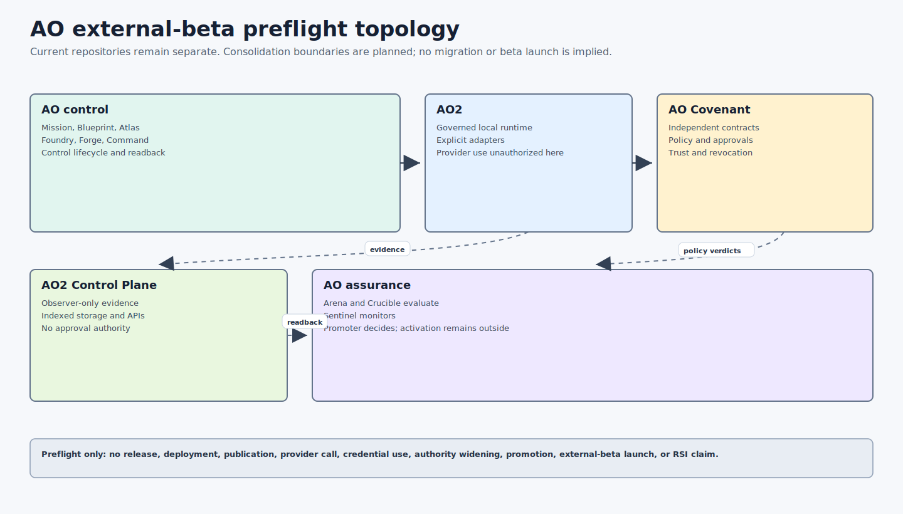

# AO Architecture

AO Architecture is the source of truth for the current AO stack topology,
component roles, authority boundaries, tested repository heads, and external-
beta readiness. Component repositories own their implementation details and
local commands. [AO Covenant](components/ao-covenant.md) owns contract and
policy truth.

The stack has completed a bounded Month 6 preflight evidence wave. An external
beta has not launched. No promotion is requested. RSI remains denied.

## Current Topology



| Product boundary | Current repositories | Status |
| --- | --- | --- |
| AO control | [Mission](components/ao-mission.md), [Blueprint](components/ao-blueprint.md), [Atlas](components/ao-atlas.md), [Foundry](components/ao-foundry.md), [Forge](components/ao-forge.md), [Command](components/ao-command.md) | Separate repositories; consolidation is planned, not started. |
| AO2 | [AO2](components/ao2.md) | Governed local execution runtime; live provider use is outside this preflight. |
| Covenant | [Covenant](components/ao-covenant.md) | Independent policy and contract authority. |
| AO2 Control Plane | [Control Plane](components/ao2-control-plane.md) | Observer-only evidence service; single-node beta maturity. |
| AO assurance | [Arena](components/ao-arena.md), [Crucible](components/ao-crucible.md), [Sentinel](components/ao-sentinel.md), [Promoter](components/ao-promoter.md) | Separate repositories; shared assurance workspace is planned. |

## Tested Stack

[The external-beta tested-stack manifest](stack/external-beta-tested-stack.json)
pins all fourteen repository heads and the SHA-256 digest of the final Month 6
Atlas launch-readiness evidence. The manifest distinguishes historical Month 6
evidence from this preflight and records preserved, excluded local branches.

Capability labels have exact meanings:

- `implemented`: source behavior exists.
- `executable-tested`: repository-native tests execute that behavior.
- `clean-room-rehearsed`: a bounded local rehearsal starts from controlled inputs.
- `fixture-only`: evidence validates a fixture or dry-run surface, not a live workload.
- `planned`: accepted design or roadmap work without implemented behavior.
- `unauthorized`: the capability is outside current authority.

See [Production Readiness](overview/PRODUCTION-READINESS.md) for the current
component matrix and [External-Beta Preflight](docs/external-beta/README.md) for
the reproducible operator package.

## Authority Boundary

No documentation or evidence artifact grants execution authority. This
preflight does not authorize release, deployment, publication, upload, tags,
provider calls, credential access, direct-main mutation, dependency updates,
policy or authentication widening, hidden instruction mutation, or RSI.


## Repository Index

- [AO Architecture](components/ao-architecture.md)
- [AO Mission](components/ao-mission.md)
- [AO Blueprint](components/ao-blueprint.md)
- [AO Atlas](components/ao-atlas.md)
- [AO Foundry](components/ao-foundry.md)
- [AO Forge](components/ao-forge.md)
- [AO Covenant](components/ao-covenant.md)
- [AO2](components/ao2.md)
- [AO2 Control Plane](components/ao2-control-plane.md)
- [AO Command](components/ao-command.md)
- [AO Arena](components/ao-arena.md)
- [AO Crucible](components/ao-crucible.md)
- [AO Sentinel](components/ao-sentinel.md)
- [AO Promoter](components/ao-promoter.md)

Historical mutation and RSI campaign records remain available in the
[Evidence Catalog](overview/EVIDENCE-CATALOG.md). They are historical evidence,
not current product capability or authority.

## Verify

```sh
python3 scripts/verify_architecture.py
python3 scripts/verify_external_beta_preflight.py --repository-only
```

For a sibling checkout of the full stack:

```sh
python3 scripts/verify_external_beta_preflight.py \
  --workspace-root /path/to/ao-repositories
```
