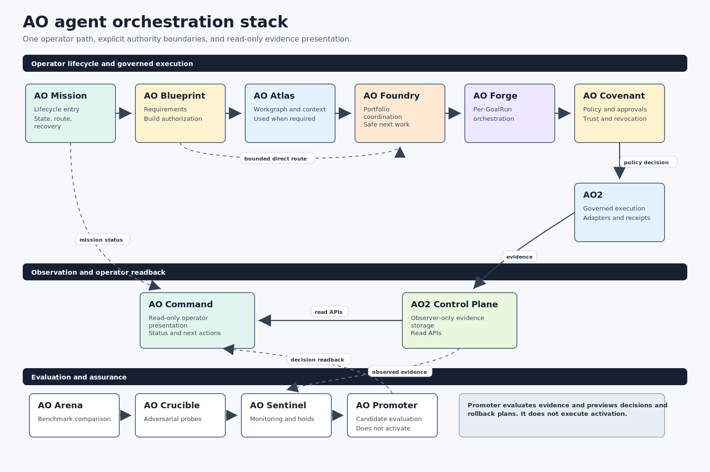
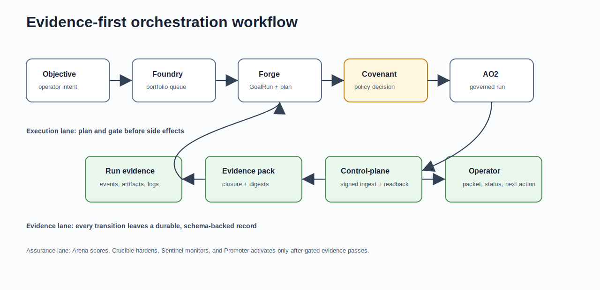

# AO Architecture: AI Agent Orchestration Stack For Evidence-First Agentic Factories

AO Architecture documents a multi-repository AI agent orchestration stack for governed autonomous software engineering. It explains how AO Foundry, AO Forge, AO Covenant, AO2, ao2-control-plane, AO Command, AO Arena, AO Crucible, AO Sentinel, and AO Promoter work together as an evidence-first agentic factory: choosing work, gating policy, executing bounded agent runs, preserving evidence, measuring outcomes, hardening candidates, monitoring regressions, promoting only gated winners, exposing read-only status, and stopping when readiness gates are satisfied.

Use this documentation to understand the AO stack's architecture, authority boundaries, agent workflows, contracts, production-readiness gates, and evidence trails. The focus is practical orchestration: how agent work moves from portfolio scheduling to governed factory planning, local execution, policy decisions, control-plane readback, and operator-facing status.

## What Is The AO Stack?

The AO stack is a set of open architecture documents for building and operating governed AI agent systems. Instead of treating agent automation as a single chat session or unbounded background worker, the stack splits responsibility across small tools with clear boundaries:

- AO Foundry coordinates multi-repository engineering operations and readiness loops.
- AO Forge turns an objective into a governed factory run with durable GoalRun state.
- AO Covenant gates policy, trust, side effects, release bundles, and evidence contracts.
- AO2 executes bounded local agent workflows and records artifacts, decisions, approvals, and evaluator closure evidence.
- ao2-control-plane publishes observer evidence without becoming an approval authority.
- AO Command gives operators a read-only status and command surface for the active stack.
- AO Arena scores fixture-mode benchmark evidence before a candidate can claim improvement.
- AO Crucible runs adversarial hardening probes before a candidate is trusted.
- AO Sentinel watches public-safety and regression signals and can emit promoter holds.
- AO Promoter activates a candidate only after Arena, Crucible, Covenant, Foundry, Forge, AO2, and Sentinel evidence passes.

That separation is the core idea: AI agent orchestration should be inspectable, evidence-backed, policy-gated, and stoppable.

## Architecture Video

Watch the video walkthrough: [AO Architecture on YouTube](https://youtu.be/P0JbsTKItEA?si=KYaWmZbymO4kRMlK). The walkthrough introduces the active AO agent orchestration architecture, including repository roles, evidence-first workflow, policy boundaries, and production-readiness gates.

## AO Stack At A Glance

| Repository | Role in the AI agent orchestration stack | Start here |
| --- | --- | --- |
| `ao-foundry` | Engineering operations factory for multi-repo scheduling, readiness, release trains, and autonomous loop stop conditions. | [AO Foundry Architecture](ao-foundry/README.md) |
| `ao-forge` | Governed factory brain for GoalRun state, factory plans, Covenant gates, AO2 delegation, and operator evidence packets. | [AO Forge Architecture](ao-forge/README.md) |
| `ao-covenant` | Policy and trust layer for side-effect decisions, release bundles, signatures, schemas, and evidence contracts. | [AO Covenant Architecture](ao-covenant/README.md) |
| `ao2` | Governed local execution runtime for bounded agent workflows, approvals, artifacts, evidence packs, and evaluator closure. | [AO2 Architecture](ao2/README.md) |
| `ao2-control-plane` | Read-only observer and evidence publication surface for AO2 and release-readiness signals. | [ao2-control-plane Architecture](ao2-control-plane/README.md) |
| `ao-command` | Operator-facing status and command surface for viewing the active stack without crossing approval boundaries. | [AO Command Architecture](ao-command/README.md) |
| `ao-arena` | Deterministic benchmark and scoring layer for comparing bare Codex and AO orchestration outcomes. | [AO Arena Architecture](ao-arena/README.md) |
| `ao-crucible` | Adversarial hardening layer for fixture-mode resilience probes and remediation evidence. | [AO Crucible Architecture](ao-crucible/README.md) |
| `ao-sentinel` | Safety and regression monitor that emits deterministic verdicts, incidents, and promoter holds. | [AO Sentinel Architecture](ao-sentinel/README.md) |
| `ao-promoter` | Gated activation path that turns passing evidence into dry-run activation and rollback plans. | [AO Promoter Architecture](ao-promoter/README.md) |

## Start Here

1. [Overview](overview/README.md) explains how all repositories interact.
2. [Production Readiness Checklist](overview/PRODUCTION-READINESS.md) explains the quality bar for this documentation pack.
3. [RSI Claim Evidence Map](overview/RSI-CLAIM-EVIDENCE-MAP.md) pins the bounded/full RSI claim boundary, source artifacts, known PRs, and out-of-scope repositories.
4. Read individual repository guides when you need implementation detail:

| Folder | Guide |
| --- | --- |
| `ao-command` | [AO Command Architecture](ao-command/README.md) |
| `ao-arena` | [AO Arena Architecture](ao-arena/README.md) |
| `ao-covenant` | [AO Covenant Architecture](ao-covenant/README.md) |
| `ao-crucible` | [AO Crucible Architecture](ao-crucible/README.md) |
| `ao-forge` | [AO Forge Architecture](ao-forge/README.md) |
| `ao-foundry` | [AO Foundry Architecture](ao-foundry/README.md) |
| `ao-promoter` | [AO Promoter Architecture](ao-promoter/README.md) |
| `ao-sentinel` | [AO Sentinel Architecture](ao-sentinel/README.md) |
| `ao2` | [AO2 Architecture](ao2/README.md) |
| `ao2-control-plane` | [ao2-control-plane Architecture](ao2-control-plane/README.md) |

## Why This Architecture Matters

Most AI coding agent systems struggle with the same production questions: who is allowed to act, what evidence proves the action happened, which policy gate approved or denied it, when should the loop stop, and how can an operator inspect the result later? AO Architecture answers those questions with explicit repository ownership and machine-readable contracts.

The stack is designed around:

- evidence-first agent workflows;
- policy-gated side effects;
- bounded local execution instead of unbounded autonomy;
- production-readiness and release-readiness gates;
- benchmark, hardening, regression, and promotion gates;
- clean separation between execution, policy, orchestration, observer storage, and operator UX;
- stop conditions that prevent autonomous loops from inventing work after readiness is satisfied.

## RSI Claim Boundary

The current architecture supports a bounded, governed RSI evidence chain, not a
claim of full autonomous self-mutating RSI. The demonstrated chain is:

1. AO Foundry emits an AO Foundry RSI candidate evidence artifact.
2. AO Foundry emits an AO Foundry RSI improvement gate that requires roughly a
   5 percent improvement and binds that gate to the candidate evidence.
3. AO Foundry emits AO Foundry RSI next improvement task evidence derived from
   the passing candidate and gate.
4. AO Forge retains the Foundry evidence so it can be audited after the pulse.
5. AO Command verifies the health chain from Foundry pulse -> Forge retention
   -> Command health without mutating repositories.
6. AO2 emits local claim-readiness and governed self-change dry-run summaries;
   the dry-run packet includes proposed self-change and rollback patch artifacts
   without applying them to the repository, plus an executed rollback rehearsal
   in a temporary workspace.
7. ao2-control-plane reads back those AO2 summaries as observer-only evidence
   and confirms the rollback rehearsal passed while it does not approve RSI
   claims, apply AO2 patches, or mutate repositories.
8. AO Command's `rsi manifest` validation now fail-closes unless the
   architecture manifest includes AO2 `rollback_rehearsal.status=passed`, AO2
   PR #200, ao2-control-plane PR #72, Forge retained-proof pins, and Covenant's
   retained rollback and authority-packet pins while preserving read-only
   execution.
9. AO Command's `scripts/rsi-evidence-chain-smoke.sh` runs the executable
   cross-repo proof from Foundry pulse through retained Forge proofs, Command
   health, and the Covenant RSI claim boundary.

This proves a local, evidence-first recursive-improvement workflow with
read-only verification, next-task derivation, and governed self-change dry-run
evidence. It is not a claim of full autonomous self-mutating RSI because
mutation authority and live self-change are not proven by the current
artifacts; rollback rehearsal is now present only as temporary-workspace
evidence for the same dry-run change class.

AO Covenant owns the wording gate for any stronger claim. Publishing a full
autonomous self-mutating RSI claim is a `claim.publish` side effect for the
`full-autonomous-self-mutating-rsi` resource, and Covenant denies it unless an
approved evidence ticket covers mutation authority, rollback evidence, and live
self-change evidence. The architecture can only describe the stack as
self-mutating after that policy path exists and passes. The executable fixture
for this boundary lives in AO Covenant's
`examples/full-rsi-claim-boundary/` directory, added by AO Covenant PR #55. Its
`evidence-approved.contract.json` example records an allowed policy decision
only after the approval reason names mutation authority, rollback evidence, and
live self-change evidence; it does not add a default claim-publishing adapter.
AO Covenant PR #58 adds the public `covenant.live-self-change-authority.v1`
schema and `live-self-change-authority.packet.json` fixture for the mutation
authority portion of that stronger path. That schema is necessary progress, but
it is not live self-change evidence by itself.

The cross-repo source map for this boundary lives in
[overview/RSI-CLAIM-EVIDENCE-MAP.md](overview/RSI-CLAIM-EVIDENCE-MAP.md), with a
machine-readable companion manifest at
[overview/rsi-claim-evidence-manifest.json](overview/rsi-claim-evidence-manifest.json).
The map records `claim_level=bounded_governed_rsi` as the supported bounded
claim and `claim_level=full_autonomous_self_mutating_rsi` as denied until the
stronger evidence path exists. It now also pins AO Forge PR #143, where Forge
retains AO Command's RSI manifest validation output, including rollback
rehearsal markers and the `mutates_repositories=false` boundary, and AO Forge
PR #144, where Forge's production-readiness audit proves this architecture pins
those retained RSI proofs. It also pins AO Covenant PR #57, which denies full
self-mutating RSI when retained rollback rehearsal evidence exists without
mutation authority and live self-change evidence.
It also pins AO Covenant PR #58, where Covenant defines the schema-backed live
self-change authority packet required before the stronger claim can advance.
AO Command PR #32 makes this architecture manifest validation fail closed if
the retained Forge and Covenant evidence pins are missing. AO Command PR #33
extends that fail-closed validator to require AO Forge PR #144's architecture
RSI pin readback evidence.
AO Command PR #34 extends it again to require AO Covenant PR #58's
`covenant.live-self-change-authority.v1` schema and
`live-self-change-authority.packet.json` fixture before the bounded RSI manifest
can pass.

## Visual Map

Shared images are stored in [images](images/). Each repository guide references at least one diagram from this shared folder.

## Documentation Scope

These docs describe the target folders as architecture documentation mirrors. The source repositories inspected are:

| Source repository | Architecture guide |
| --- | --- |
| [ao-command](https://github.com/uesugitorachiyo/ao-command) | [ao-command](ao-command/README.md) |
| [ao-arena](https://github.com/uesugitorachiyo/ao-arena) | [ao-arena](ao-arena/README.md) |
| [ao-covenant](https://github.com/uesugitorachiyo/ao-covenant) | [ao-covenant](ao-covenant/README.md) |
| [ao-crucible](https://github.com/uesugitorachiyo/ao-crucible) | [ao-crucible](ao-crucible/README.md) |
| [ao-forge](https://github.com/uesugitorachiyo/ao-forge) | [ao-forge](ao-forge/README.md) |
| [ao-foundry](https://github.com/uesugitorachiyo/ao-foundry) | [ao-foundry](ao-foundry/README.md) |
| [ao-promoter](https://github.com/uesugitorachiyo/ao-promoter) | [ao-promoter](ao-promoter/README.md) |
| [ao-sentinel](https://github.com/uesugitorachiyo/ao-sentinel) | [ao-sentinel](ao-sentinel/README.md) |
| [ao2](https://github.com/uesugitorachiyo/ao2) | [ao2](ao2/README.md) |
| [ao2-control-plane](https://github.com/uesugitorachiyo/ao2-control-plane) | [ao2-control-plane](ao2-control-plane/README.md) |

The documentation does not copy every source README. It extracts the operational model colleagues need: role, architecture, workflows, agent boundaries, skills or capabilities, contracts, evidence, and production-readiness expectations.

## FAQ

### Is AO Architecture an AI agent framework?

AO Architecture is a documentation mirror for a stack of AI agent orchestration repositories. The implementation lives in the linked source repositories. This repository explains the architecture, authority boundaries, workflows, contracts, and evidence model across the stack.

### What makes AO different from a single autonomous coding agent?

AO separates portfolio scheduling, factory planning, policy decisions, execution, evidence publication, and operator status into different repositories. That makes agent work easier to inspect, test, stop, and review.

### What is an evidence-first agent workflow?

An evidence-first workflow records structured artifacts for the work an agent performed: plans, policy decisions, approvals, command output, changed files, test results, reports, evidence packs, readiness audits, and closure decisions. The operator can inspect evidence instead of trusting terminal scrollback.

### Where should I start?

Start with [Overview](overview/README.md), then read [AO Foundry Architecture](ao-foundry/README.md) for the portfolio-level factory loop, [AO Forge Architecture](ao-forge/README.md) for governed factory runs, and [AO2 Architecture](ao2/README.md) for local execution and evidence capture.

## License

AO Architecture is licensed under `Apache-2.0`. See `LICENSE`.
