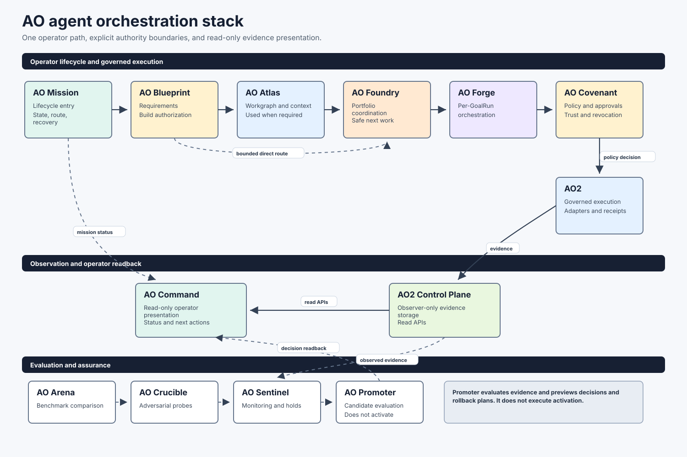
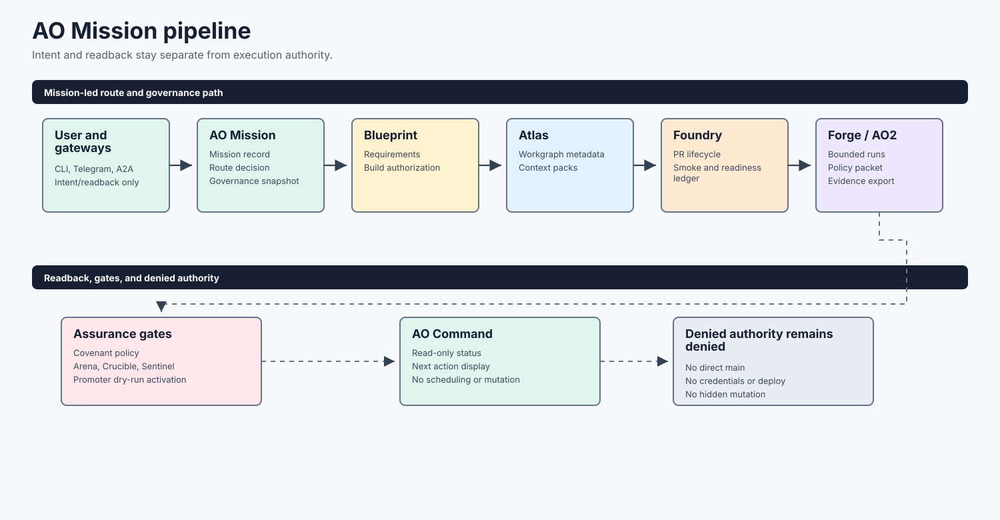

# AO Architecture

AO is a governed orchestration stack for AI-assisted software engineering. It
separates planning, policy, execution, evidence, evaluation, and operator
readback across focused components with explicit authority boundaries.

The repositories in this project document how an objective moves from intake to
bounded implementation, verification, and promotion. The architecture favors
inspectable state and machine-readable evidence over a single autonomous agent
with broad authority.

## How AO Works

1. **AO Mission** records the objective, current route, blockers, and next
   action.
2. **AO Blueprint** turns an underspecified objective into an authorized build
   plan.
3. **AO Atlas** decomposes oversized or long-running work into bounded
   workgraphs and context packs.
4. **AO Foundry, AO Forge, and AO Covenant** coordinate work, retain run state,
   and gate side effects.
5. **AO2** executes bounded local workflows and records artifacts, approvals,
   tests, and closure evidence.
6. **AO Arena, AO Crucible, AO Sentinel, and AO Promoter** evaluate, harden,
   monitor, and promote candidates. **AO Command** provides read-only operator
   status.

## Stack At A Glance

| Component | Responsibility | Guide |
| --- | --- | --- |
| AO Mission | User entry, mission routing, continuation state, and governance snapshots | [AO Mission](ao-mission/README.md) |
| AO Blueprint | Requirements interview, blueprint compilation, and build authorization | [AO Blueprint](ao-blueprint/README.md) |
| AO Atlas | Workgraphs, context packs, and Foundry handoff for oversized work | [AO Atlas](ao-atlas/README.md) |
| AO Foundry | Multi-repository engineering operations and readiness coordination | [AO Foundry](ao-foundry/README.md) |
| AO Forge | GoalRun state, factory plans, and governed run coordination | [AO Forge](ao-forge/README.md) |
| AO Covenant | Policy, trust, side-effect, and evidence-contract gates | [AO Covenant](ao-covenant/README.md) |
| AO2 | Bounded local agent execution and evidence capture | [AO2](ao2/README.md) |
| AO2 Control Plane | Read-only evidence observation and publication | [AO2 Control Plane](ao2-control-plane/README.md) |
| AO Command | Read-only operator status and command surface | [AO Command](ao-command/README.md) |
| AO Arena | Deterministic benchmark and comparison evidence | [AO Arena](ao-arena/README.md) |
| AO Crucible | Adversarial hardening and remediation evidence | [AO Crucible](ao-crucible/README.md) |
| AO Sentinel | Safety and regression monitoring | [AO Sentinel](ao-sentinel/README.md) |
| AO Promoter | Evidence-gated activation and rollback planning | [AO Promoter](ao-promoter/README.md) |

## Start Here

- [Architecture Overview](overview/README.md) explains how the components work
  together.
- [Operator Workflow](docs/operator-workflow.md) follows the normal path through
  Mission, Command, Blueprint, Atlas, Foundry, Forge, Covenant, and AO2.
- [Current Public Releases](docs/current-release.md) records published versions
  and their verification state.
- [Production Readiness](overview/PRODUCTION-READINESS.md) defines the quality
  bar for the documentation pack.
- [AO Mission Contract Map](overview/AO-MISSION-CONTRACT-MAP.md) lists Mission
  contracts, producers, consumers, and authority boundaries.
- [Evidence Catalog](overview/EVIDENCE-CATALOG.md) indexes historical proof and
  mutation campaigns.

## Authority And Evidence

AO components receive only the authority required for their role. Mission,
Atlas, Command, and the control plane primarily produce or expose readback.
Mutation, provider access, credentials, release actions, and promotion require
separate governed paths and supporting evidence.

Detailed records live outside this landing page:

- [Mutation Authority Ladder](overview/MUTATION-AUTHORITY-LADDER.md) tracks
  mutation classes and denied capabilities.
- [RSI Claim Evidence Map](overview/RSI-CLAIM-EVIDENCE-MAP.md) records the exact
  evidence behind recursive-improvement claims.
- [AO Mission Capability Map](overview/AO-MISSION-V0.2-CAPABILITY-MAP.md)
  describes the Mission-led operator loop.
- [Contract Evolution Policy](docs/contract-evolution-policy.md) defines
  compatibility and migration expectations.
- [Evidence Freshness](docs/evidence-freshness.md) explains how readers should
  interpret current and historical evidence.

These documents preserve exact gate identifiers, approved claim wording,
negative controls, and denied-authority lists for maintainers and automated
review. Their presence does not grant operational authority.

## Architecture Video

[Watch the AO Architecture walkthrough](https://youtu.be/P0JbsTKItEA?si=KYaWmZbymO4kRMlK)
for a guided tour of the repository roles, evidence flow, and policy
boundaries.

## OpenAI Build Week 2026

The Build Week judge package, released-binary quick test, checksums, and proof
boundaries are in [hackathon/README.md](hackathon/README.md).

## Documentation Scope

This repository is an architecture mirror. Implementations live in the linked
source repositories; these guides describe their roles, contracts, workflows,
evidence, and production-readiness boundaries.

Shared diagrams are available in [images](images/).

## FAQ

### Is AO Architecture an AI agent framework?

It is the documentation and contract map for a stack of orchestration
repositories. Each component's implementation lives in its source repository.

### What makes AO different from a single autonomous coding agent?

AO assigns planning, policy decisions, execution, evidence publication,
evaluation, and operator status to separate components. That separation makes
work easier to inspect, stop, test, and review.

### What is an evidence-first agent workflow?

It records structured artifacts for plans, policy decisions, approvals,
commands, changed files, tests, evaluations, and closure. Operators can inspect
those artifacts instead of relying on terminal history.

### Where should I start?

Read the [Architecture Overview](overview/README.md), then open the guide for
the component that owns your question.

## License

AO Architecture is licensed under Apache 2.0. See [LICENSE](LICENSE).
