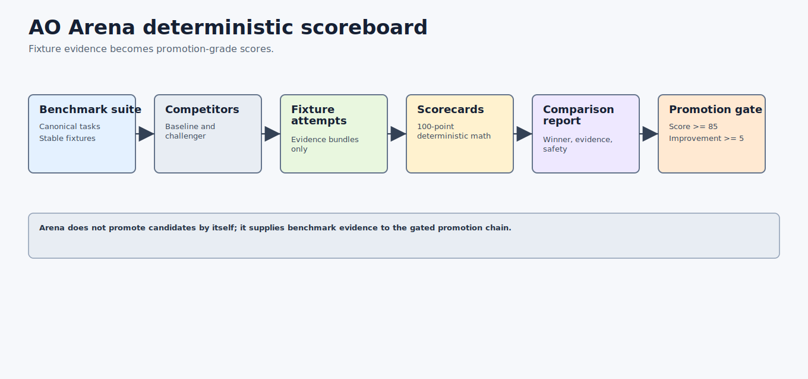

# AO Arena Architecture: Deterministic Benchmark Scoreboard For AO Orchestration



AO Arena is the deterministic benchmark and scoring layer for recursive AO stack improvement. It compares bare Codex prompts against AO orchestration prompts through fixture-mode suites, evidence bundles, scorecards, comparison reports, public-safety scans, and promotion gates.

## Search-Friendly Summary

AO Arena is the benchmark scoreboard for the AO orchestration framework. It proves whether AO orchestration beats a baseline from saved JSON evidence and blocks benchmark-win claims unless scores, safety status, required evidence, and stop conditions pass.

## Component At A Glance

| Field | Value |
| --- | --- |
| Framework layer | Benchmark and scoring |
| Primary job | Score fixture-mode attempts and produce comparison/promotion evidence |
| Owns | Benchmark suites, competitor profiles, attempt records, evidence bundles, scorecards, comparison reports, promotion gates |
| Does not own | Live provider execution, active-stack mutation, adversarial hardening, long-running monitoring |
| Main consumers | AO Foundry, AO Forge, AO Crucible, AO Promoter, release reviewers |

## Source Context

Source repository: `../../ao-arena`

High-signal source docs:

- `../../ao-arena/README.md`
- `../../ao-arena/docs/sdd/AO-ARENA-ARCHITECTURE.md`
- `../../ao-arena/docs/sdd/AO-ARENA-ACCEPTANCE-GATES.md`
- `../../ao-arena/docs/sdd/AO-ARENA-SCORING.md`
- `../../ao-arena/docs/sdd/AO-ARENA-SAFETY.md`

## Role In The AO Orchestration Framework

AO Arena answers:

- Did the AO orchestration challenger beat the bare Codex baseline?
- Which task scores, penalties, safety checks, and evidence paths support that result?
- Did the challenger meet the promotion threshold of score at least 85 and at least five points over baseline?
- Can the score be recomputed from saved fixture JSON without live providers?

Arena is not an execution runtime. It consumes fixture-mode evidence and emits deterministic reports that other repositories can trust as benchmark evidence.

## Architecture

AO Arena is a local-first Go CLI:

- `cmd/arena/main.go` is the executable.
- `internal/cli` routes suite, competitor, run, evidence, score, compare, report, gate, and safety commands.
- `internal/arena` owns fixture validation, deterministic scoring, comparison reports, promotion gate evaluation, safety scanning, and AO evidence import helpers.
- `docs/contracts` stores JSON schemas for suites, tasks, competitors, attempts, evidence bundles, scorecards, reports, and gates.
- `examples` stores valid and invalid fixtures that prove fail-closed behavior.

## Workflows

### Benchmark Workflow

1. Validate the canonical eight-task suite.
2. Validate baseline and challenger competitors.
3. Generate or load fixture-mode attempts and evidence bundles.
4. Compute deterministic scorecards from saved JSON.
5. Compare baseline and challenger aggregate scores.
6. Render JSON and Markdown reports.
7. Emit a promotion gate that passes only when the challenger wins safely.

### Public-Safety Workflow

Arena scans examples and evidence for secret-like strings, durable local paths, and forbidden fixture-mode actions. Invalid fixtures intentionally fail when validated directly, while public demo and valid example surfaces must scan cleanly.

## Agent Roles And Skills

- benchmark steward defines stable tasks and competitors;
- evidence auditor checks required artifacts and stop-condition proof;
- scoring evaluator recomputes deterministic scores;
- promotion gatekeeper blocks unsafe or insufficient wins;
- operator reporter renders human-readable comparison summaries.

## Contracts And Evidence

Arena contracts include benchmark suites, tasks, competitor profiles, attempt records, evidence bundles, scorecards, comparison reports, and promotion gates. Every meaningful score should be reproducible from JSON evidence without rerunning a provider.

## Interactions With Other Repositories


| Repository | AO Arena interaction |
| --- | --- |
| AO Foundry | Uses Arena reports to decide whether a candidate is worth delegating or promoting. |
| AO Forge | Can run implementation slices and consume Arena promotion gates as readiness evidence. |
| AO Covenant | Supplies policy and public-safety concepts used by Arena scans and gates. |
| AO2 | Supplies governed run summaries for future live evidence imports. |
| AO Crucible | Uses Arena promotion evidence as one input to hardening decisions. |
| AO Promoter | Requires fresh Arena promotion gates before activation. |

## Production-Readiness Notes

- Keep fixture mode as the default v0.1 path.
- Do not run live providers or mutate sibling repositories.
- Treat missing evidence, unsafe scans, missing baseline, and violated stop conditions as fail-closed.
- Keep generated outputs under `tmp/` and durable examples public-safe.

## FAQ

### Does AO Arena run the agents?

No. Arena scores saved fixture evidence. Execution belongs to AO2 or future explicitly opted-in live paths.

### Why does Arena compare against bare Codex?

The baseline keeps AO orchestration honest. AO improvements should win through better verified outcomes, not more artifacts.

## Quick Verification

Use the source repository for live verification:

```sh
cd ../../ao-arena
go test ./...
go vet ./...
go build -o tmp/bin/arena ./cmd/arena
PATH="$PWD/tmp/bin:$PATH" arena suite validate --suite examples/suites/valid/ao-arena-v0.1.json
PATH="$PWD/tmp/bin:$PATH" arena compare --suite examples/suites/valid/ao-arena-v0.1.json --fixture-mode --out tmp/arena-report.json
PATH="$PWD/tmp/bin:$PATH" arena gate promotion --report tmp/arena-report.json --out tmp/arena-promotion-gate.json
PATH="$PWD/tmp/bin:$PATH" arena safety scan --path examples --out tmp/arena-safety-scan.json
```
