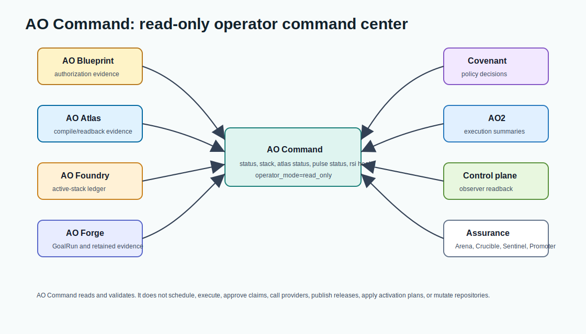

# AO Command Architecture: Read-Only Operator CLI For AI Agent Orchestration



AO Command is the read-only operator command component of the AO orchestration framework. It gives colleagues one daily command center for AI agent stack status, next actions, GoalRun inspection, RSI assurance-family health, evidence validation, and release rehearsal summaries.

It does not publish releases, promote production, mutate provider state, execute agents, or replace AO Forge policy decisions. Its value is visibility without authority drift.

## Search-Friendly Summary

AO Command is the operator-facing CLI for a governed AI agent orchestration stack. It helps humans inspect production-readiness status, release evidence, active-stack health, RSI fixture-loop health, and next recommended actions without giving the command surface authority to execute agents, approve risky work, or mutate source-of-truth evidence.

## Component At A Glance

| Field | Value |
| --- | --- |
| Framework layer | Operator status and read-only command UX |
| Primary job | Summarize readiness, evidence, RSI health, next actions, and release rehearsal state |
| Owns | CLI presentation, schema validation commands, RSI health summaries, rehearsal summaries |
| Does not own | Agent execution, policy approval, GoalRun source of truth, evidence storage |
| Main consumers | Operators, release reviewers, maintainers checking AO stack health |

## Source Context

Source repository: `../../ao-command`

High-signal source docs:

- `../../ao-command/README.md`
- `../../ao-command/docs/design/AO-COMMAND-V0.1.md`
- `../../ao-command/docs/design/AO-COMMAND-FOUNDRY.md`
- `../../ao-command/docs/design/FOUNDRY-REGISTRY-V0.1.md`
- `../../ao-command/docs/operations/PRODUCTION-READINESS.md`

## Role In The AO Orchestration Framework

AO Command answers:

- What is the current production-readiness status?
- What is the next recommended action?
- Which GoalRun or readiness evidence explains that recommendation?
- Did release preview, install verify, or release governance evidence validate?
- Is the active stack still in read-only operator mode?

It reads from AO Forge, AO Foundry, AO Covenant, AO2, ao2-control-plane, AO Arena, AO Crucible, AO Sentinel, and AO Promoter evidence surfaces. The command surface is intentionally narrow so operators get clarity without moving trust, execution, promotion, or storage authority into the CLI.

## Architecture

AO Command is a small Go CLI:

- `cmd/ao-command/main.go` is the executable entrypoint.
- `internal/cli` contains command parsing, evidence reading, and output formatting.
- `docs/contracts` defines structured audit contracts for production-readiness, release-preview, install-verify, and release-governance evidence.
- `scripts` contains smoke tests, dry-run release rehearsal, install verification, and branch-protection checks.

The architecture is pull-based. AO Command reads existing files and command outputs owned by other repositories. It can emit human text or machine-readable JSON, but it should not be the system of record for factory state.

## Main Commands

| Command | Purpose |
| --- | --- |
| `status` | Reads AO Forge readiness and reports gate counts, required next actions, production-ready decision, and release governance state. |
| `stack` | Reads AO Foundry active-stack readiness ledgers and reports repository and release-handoff state. |
| `rsi health` | Reads AO Arena, AO Crucible, AO Sentinel, and AO Promoter fixture evidence and reports governed local RSI health. |
| `next` | Presents the next operator action derived from Forge evidence. |
| `goals` | Inspects GoalRun evidence and loop state. |
| `evidence` | Validates a document against a schema-backed contract. |
| `rehearse` | Runs read-only release-preview rehearsal evidence through Forge-owned paths. |

## Workflows

### Daily Status Workflow

1. Run AO Command from the operator checkout.
2. Read stack readiness from AO Foundry or Forge evidence.
3. Inspect the next action and underlying GoalRun or release gate.
4. Drill into the owning repo only when the status requires action.

### Release Rehearsal Workflow

1. Use an AO Forge checkout at the release tag or candidate commit.
2. Run AO Command rehearsal.
3. Validate release-preview, install-verify, and release-governance audit JSON.
4. Preserve the output as operator evidence.

### Evidence Validation Workflow

1. Select the schema in `docs/contracts`.
2. Select the document emitted by Forge or another owner.
3. Run `ao-command evidence`.
4. Treat validation failure as an operator blocker, not as a reason for AO Command to mutate the source evidence.

### RSI Health Workflow

1. Generate fixture/local evidence in AO Arena, AO Crucible, AO Sentinel, and AO Promoter.
2. Run `ao-command rsi health` with the four JSON artifact paths.
3. Inspect `rsi_mode=governed_fixture_local`, `operator_mode=read_only`, and `mutates_repositories=false`.
4. Treat any blocked family as a reason to stop the RSI claim until the owning repository fixes its evidence.

## Agent Roles And Skills

AO Command does not run autonomous agents. It supports the operator role:

- inspect stack state;
- compare readiness evidence across repositories;
- rehearse release evidence;
- validate structured contracts;
- summarize RSI assurance-family evidence;
- summarize next actions without changing the run.

The relevant "skills" are operational: status inspection, schema validation, release rehearsal, and evidence triage.

## Contracts And Evidence

AO Command consumes and validates:

- production-readiness audit JSON;
- release-preview audit JSON;
- install-verify audit JSON;
- release-governance audit JSON;
- public provenance manifests;
- branch-protection evidence;
- retained-evidence records.
- Arena promotion gates, Crucible hardening gates, Sentinel verdicts, and Promoter promotion gates.

The CLI should prefer schema-backed JSON evidence over terminal-only summaries. Terminal text is useful for humans; JSON contracts are the durable interface.

## Interactions With Other Repositories


| Repository | AO Command interaction |
| --- | --- |
| AO Forge | Primary source for readiness, GoalRun truth, release preview, retained evidence, and governance state. |
| AO Foundry | Source for active-stack readiness ledgers and portfolio status. |
| AO Covenant | Source for policy, approval, allow, deny, and block evidence. |
| AO2 | Source for governed execution evidence summaries. |
| ao2-control-plane | Source for published observer readback when evidence has been ingested. |
| AO Arena | Source for benchmark promotion gate evidence. |
| AO Crucible | Source for hardening gate evidence. |
| AO Sentinel | Source for safety and regression verdict evidence. |
| AO Promoter | Source for promotion gate evidence; Command does not apply activation plans. |

## Production-Readiness Notes

- Keep AO Command read-only by default.
- Keep dangerous writes out of v0.1 command paths.
- Prefer schema validation over informal parsing.
- Keep CI focused on Go tests, vet, build, smoke, release rehearsal, install verify, and branch protection.
- Do not use AO Command as the source of truth for GoalRun, policy, execution, or observer storage.
- Keep `rsi health` evidence-only; it must not run providers, promote candidates, apply activation plans, or mutate repositories.

## FAQ

### What is AO Command in the AO orchestration framework?

AO Command is the read-only operator CLI. It gathers and summarizes evidence from AO Forge, AO Foundry, AO Covenant, AO2, ao2-control-plane, AO Arena, AO Crucible, AO Sentinel, and AO Promoter so humans can understand stack status without granting the CLI execution or promotion authority.

### Does AO Command run AI agents?

No. AO Command does not execute agents or providers. It inspects structured evidence, validates schemas, and presents status and next actions for operators.

### Why is AO Command read-only?

The AO framework separates operator visibility from execution and approval authority. Keeping AO Command read-only prevents status UX from accidentally becoming the policy kernel, factory scheduler, or source of truth.

## Quick Verification

Use the source repository for live verification:

```sh
cd ../../ao-command
go test ./...
go vet ./...
go build -o bin/ao-command ./cmd/ao-command
go run ./cmd/ao-command rsi health --arena-gate ../ao-arena/tmp/arena-promotion-gate.json --crucible-gate ../ao-crucible/tmp/crucible-hardening-gate.json --sentinel-verdict ../ao-sentinel/tmp/sentinel-verdict.json --promoter-gate ../ao-promoter/tmp/promotion-gate.json --json
scripts/ao-command-smoke.sh --forge ../ao-forge --out tmp/ao-command-smoke
scripts/verify-branch-protection.sh
```
