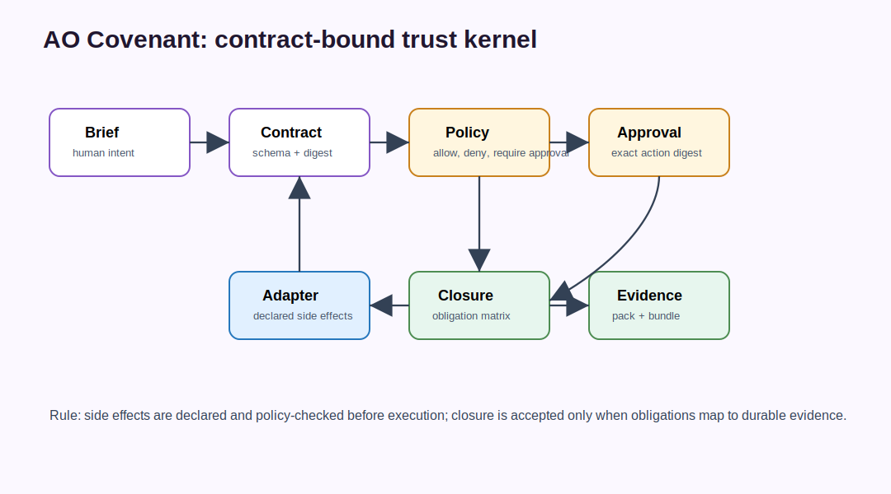

# AO Covenant Architecture: Policy And Trust Kernel For AI Agent Orchestration



AO Covenant is the policy and trust kernel component of the AO orchestration framework. In the active AO2-first stack, AO Forge asks it for decisions, AO2 performs governed execution, ao2-control-plane stores observer evidence, and AO Command presents read-only operator status.

AO Covenant should not become the execution engine, evidence archive UI, or whole-factory scheduler. It is the place where contracts, approvals, provenance, policy decisions, and closure evidence are made explicit.

## Search-Friendly Summary

AO Covenant makes AI agent work reviewable and enforceable by turning contracts, side effects, approvals, provenance, and release evidence into explicit trust artifacts. It is the fail-closed policy layer for governed autonomous software engineering, not a general-purpose agent runner.

## Component At A Glance

| Field | Value |
| --- | --- |
| Framework layer | Policy, trust, approval, and evidence verification |
| Primary job | Gate side effects and verify contracts, approvals, bundles, schemas, and release artifacts |
| Owns | Policy decisions, approval tickets, evidence integrity, bundle and release verification contracts |
| Does not own | Agent execution, portfolio scheduling, observer dashboards, operator command UX |
| Main consumers | AO Forge, AO2, release workflows, reviewers auditing trust evidence |

## Source Context

Source repository: `../../ao-covenant`

High-signal source docs:

- `../../ao-covenant/README.md`
- `../../ao-covenant/docs/threat-model.md`
- `../../ao-covenant/docs/public-api-stability.md`
- `../../ao-covenant/docs/release-verification.md`
- `../../ao-covenant/docs/release-threat-model-matrix.md`
- `../../ao-covenant/docs/output-writer-contract.md`

## Role In The AO Orchestration Framework

AO Covenant answers:

- What contract governs this work?
- Which side effects were declared?
- Did policy allow, deny, block, or require approval before execution?
- Is a public capability claim itself a governed `claim.publish` side effect?
- Is an approval exact-digest-bound and still valid?
- Does the evidence pack verify against recorded digests?
- Can the release, bundle, or schema artifact be validated offline?

Its default stance is fail-closed. Missing, malformed, denied, blocked, stale, or revoked trust evidence should stop the workflow instead of being interpreted optimistically.

## Architecture

AO Covenant is a Go CLI and library organized around trust primitives:

| Package | Responsibility |
| --- | --- |
| `internal/contract` | Compile, canonicalize, validate, lint, and summarize contracts. |
| `internal/policy` | Evaluate declared side effects and explain decisions. |
| `internal/approval` | Create, validate, attach, inspect, revoke, and bind approval tickets. |
| `internal/run` | Execute local contracts through typed adapter boundaries and event ledgers. |
| `internal/closure` | Evaluate obligations against evidence. |
| `internal/verify` | Recompute digests and verify evidence integrity. |
| `internal/bundle` | Export, inspect, sign, and report evidence bundles. |
| `internal/release` | Package releases, manifests, checksums, reports, diffs, and replacement preflights. |
| `internal/schema` | Embed public schemas and validate documents. |

Public JSON schemas live in `schemas/` and are embedded into the binary so automation can validate contracts, events, decisions, approvals, evidence packs, bundles, release reports, and schema export results without relying on a network service.

## Workflows

### Contract-Bound Run

1. Compile a brief into a schema-valid contract.
2. Canonicalize and digest the contract.
3. Validate declared reads, writes, task graph, obligations, and policy profile.
4. Evaluate side effects before execution.
5. Execute only through declared adapter boundaries.
6. Record events, artifacts, input snapshots, policy decisions, approvals, failures, and digests.
7. Evaluate closure from obligations to evidence.
8. Export and verify the evidence pack.

### RSI Claim Publication Gate

AO Covenant owns the policy boundary for full autonomous self-mutating RSI
wording. A claim that the stack has full autonomous self-mutating RSI is a
`claim.publish` side effect on the `full-autonomous-self-mutating-rsi` resource.
Covenant denies that side effect unless an approved evidence ticket explicitly
covers mutation authority, rollback evidence, and live self-change evidence.

The public fixture set introduced by AO Covenant PR #55 lives at
`examples/full-rsi-claim-boundary/` in the AO Covenant source repository. It
contains denied, generic-approval, and evidence-approved contracts; the
`evidence-approved.contract.json` fixture demonstrates that policy can record an
allowed full-RSI claim decision only when the ticket reason names all three
evidence classes.

This gate keeps the AO architecture from confusing the bounded, governed RSI
evidence chain with a stronger self-mutating claim that has not yet been proven.

### Approval Workflow

1. A risky action is described as a precise effect over a precise resource.
2. Covenant computes or records the action digest.
3. Policy returns approval-required, deny, block, or allow.
4. An approval ticket is created or attached.
5. Reuse is allowed only when the exact digest, run scope, expiry, and revocation state still match.

### Release Verification Workflow

1. Package release assets with manifest and checksums.
2. Verify checksums, signatures, attestations, replacement policy, and public schema contracts.
3. Run consumer smoke scripts for downloaded assets.
4. Publish only when release evidence remains public-safe and verifiable.

## Agent Roles And Skills

AO Covenant supports agentic work by constraining it:

- contract compiler turns natural-language or structured briefs into enforceable contracts;
- policy broker mediates side effects before execution;
- approval manager binds human approval to exact action digests;
- adapter boundary captures declared side effects as evidence;
- evaluator closure maps obligations to durable artifacts;
- verifier recomputes digests and rejects tampering.

The main skill is not "run an agent"; it is "make agent activity reviewable, bounded, and verifiable."

## Contracts And Evidence

AO Covenant owns many public contract families:

- contract and compile summaries;
- event ledgers;
- policy decisions and explanations;
- approval tickets and revocation lists;
- artifact references and input snapshots;
- closure matrices;
- evidence packs and bundles;
- schema validation reports;
- release manifests, reports, diffs, signatures, and verification results.

For colleagues, the key mental model is: a Covenant artifact should explain the authority behind a run, the declared side effects, the decision that allowed or blocked them, and the evidence that supports closure.

## Interactions With Other Repositories


| Repository | AO Covenant interaction |
| --- | --- |
| AO Forge | Forge treats Covenant decisions as gates for factory plans, release actions, and mutating paths. |
| AO2 | AO2 uses Covenant-style policy, approval, and closure concepts in governed execution. |
| ao2-control-plane | Control-plane may store signed evidence after the fact, but does not become the trust kernel. |
| AO Command | Command reads Covenant evidence for operator explanation. |
| AO Foundry | Foundry coordinates portfolio work but should not bypass Covenant trust gates. |

## Production-Readiness Notes

- Use embedded schemas as public automation contracts.
- Keep provider API-key paths out of the trust kernel.
- Treat evidence packs as potentially sensitive until redacted.
- Preserve public release evidence, replacement decisions, signatures, and checksums.
- Ensure CI covers Go tests, schema fixtures, repository hygiene, release readiness, and branch protection.

## FAQ

### What is AO Covenant in the AO orchestration framework?

AO Covenant is the trust and policy component. It decides whether declared side effects are allowed, denied, blocked, or approval-required and verifies the evidence that supports closure.

### Does AO Covenant execute AI agent work?

No. AO Covenant constrains and verifies work. AO2 owns governed execution, while AO Forge and AO Foundry coordinate factory and portfolio workflows.

### Why does AO Covenant fail closed?

Missing, malformed, stale, or denied trust evidence can make agent automation unsafe. AO Covenant treats those states as blockers so the AO framework does not proceed on optimistic assumptions.

## Quick Verification

Use the source repository for live verification:

```sh
cd ../../ao-covenant
go test ./...
go vet ./...
go run ./cmd/covenant schema catalog
go run ./cmd/covenant policy spine --json
scripts/check-license-policy.sh
scripts/verify-branch-protection.sh
```
