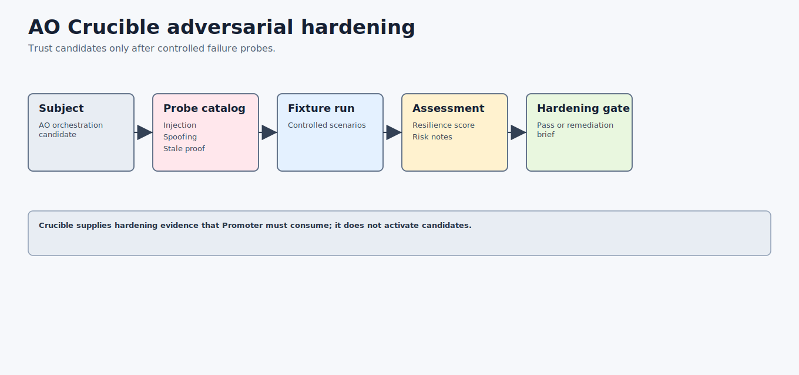

# AO Crucible Architecture: Adversarial Hardening Layer For AO Orchestration



AO Crucible is the adversarial hardening layer for the AO orchestration framework. It tries to make candidates fail in controlled fixture-mode conditions before a candidate is trusted for public release, autonomous overnight work, or promotion.

## Search-Friendly Summary

AO Crucible validates adversarial scenario suites, runs deterministic probes, assesses resilience, emits hardening gates, renders reports, scans public artifacts, and creates remediation briefs that block unsafe or overclaimed AO improvements.

## Component At A Glance

| Field | Value |
| --- | --- |
| Framework layer | Adversarial hardening and resilience assessment |
| Primary job | Probe candidates against controlled failure scenarios before trust increases |
| Owns | Scenario suites, probe catalog, fixture attempts, evidence bundles, assessments, hardening gates, remediation briefs |
| Does not own | Benchmark win claims, active-stack activation, live provider execution, policy authority |
| Main consumers | AO Forge, AO Foundry, AO Promoter, release reviewers |

## Source Context

Source repository: `../../ao-crucible`

High-signal source docs:

- `../../ao-crucible/README.md`
- `../../ao-crucible/docs/sdd/AO-CRUCIBLE-ARCHITECTURE.md`
- `../../ao-crucible/docs/sdd/AO-CRUCIBLE-SCENARIOS.md`
- `../../ao-crucible/docs/sdd/AO-CRUCIBLE-RISK-MODEL.md`
- `../../ao-crucible/docs/sdd/AO-CRUCIBLE-SAFETY.md`

## Role In The AO Orchestration Framework

AO Crucible answers:

- Does a candidate survive prompt-injection, approval-bypass, stale-evidence, stop-condition, forbidden-action, and public-safety probes?
- Which scenarios failed, and what remediation brief should block promotion?
- Is the resilience score high enough to emit a hardening gate?

Crucible does not certify a benchmark win. It hardens the candidate before Promoter can consider activation.

## Architecture

AO Crucible is a local-first Go CLI:

- `cmd/crucible/main.go` is the executable.
- `internal/cli` exposes suite, scenario, subject, rubric, probe, run, evidence, assess, report, gate, remediation, and safety commands.
- `internal/crucible` implements schema validation, fixture probes, evidence validation, resilience scoring, hardening gates, remediation briefs, safety scans, and AO evidence imports.
- `docs/contracts` stores schema-backed contracts for scenarios, suites, subjects, rubrics, attempts, evidence bundles, assessments, gates, and remediation briefs.
- `examples` contains valid and invalid fixtures for each failure family.

## Workflows

### Hardening Workflow

1. Validate the scenario suite, subject, and risk rubric.
2. Materialize the deterministic probe catalog.
3. Run fixture probes without live providers.
4. Validate the evidence bundle.
5. Assess resilience score and failed scenario details.
6. Render a hardening report.
7. Emit a hardening gate and remediation brief.

### Safety Workflow

Crucible keeps public artifacts clean while preserving invalid fixtures that prove fail-closed behavior. Generated run outputs stay under `tmp/`, and durable examples use sentinel strings rather than real secrets or machine-local paths.

## Agent Roles And Skills

- scenario designer defines adversarial probes;
- fixture runner executes controlled failure scenarios;
- resilience assessor scores risk and severity;
- remediation author produces bounded hardening briefs;
- hardening gatekeeper blocks promotion until score and safety requirements pass.

## Contracts And Evidence

Crucible contracts include subjects, suites, scenarios, risk rubrics, probe catalogs, attempts, evidence bundles, assessments, hardening gates, and remediation briefs. These are evidence inputs only; they do not imply active-stack approval.

## Interactions With Other Repositories


| Repository | AO Crucible interaction |
| --- | --- |
| AO Arena | Arena benchmark gates can become inputs to hardening decisions. |
| AO Covenant | Covenant policy decisions inform forbidden behavior and safety expectations. |
| AO2 | AO2 run summaries can become evidence imports. |
| AO Forge | Forge can execute remediation or hardening implementation slices. |
| AO Promoter | Promoter requires passing Crucible hardening gates before activation. |
| AO Sentinel | Sentinel can monitor regressions after Crucible hardening lands. |

## Production-Readiness Notes

- Keep fixture mode as the only default path.
- Do not run live providers, push, tag, upload, deploy, or mutate sibling repositories.
- Fail closed on missing stop conditions, unsafe scenario definitions, invalid evidence, or score over maximum.
- Keep remediation briefs bounded and evidence-backed.

## FAQ

### Is Crucible a red-team runner?

It is a fixture-mode hardening runner. It uses adversarial scenarios, but the v0.1 default path is deterministic and local.

### Does a passing Crucible gate promote a candidate?

No. It is one required promotion input. AO Promoter combines it with Arena, Sentinel, Covenant, Foundry, Forge, and AO2 evidence.

## Quick Verification

Use the source repository for live verification:

```sh
cd ../../ao-crucible
go test ./...
go vet ./...
go build -o tmp/bin/crucible ./cmd/crucible
PATH="$PWD/tmp/bin:$PATH" crucible suite validate --suite examples/suites/valid/ao-crucible-v0.1.json
PATH="$PWD/tmp/bin:$PATH" crucible run fixture --suite examples/suites/valid/ao-crucible-v0.1.json --subject examples/subjects/valid/ao-orchestration.json --out tmp/crucible-run
PATH="$PWD/tmp/bin:$PATH" crucible assess --attempt tmp/crucible-run/attempt.json --rubric examples/rubrics/resilience-v0.1.json --out tmp/crucible-assessment.json
PATH="$PWD/tmp/bin:$PATH" crucible gate hardening --assessment tmp/crucible-assessment.json --out tmp/crucible-hardening-gate.json
PATH="$PWD/tmp/bin:$PATH" crucible safety scan --path examples --out tmp/crucible-safety-scan.json
```
