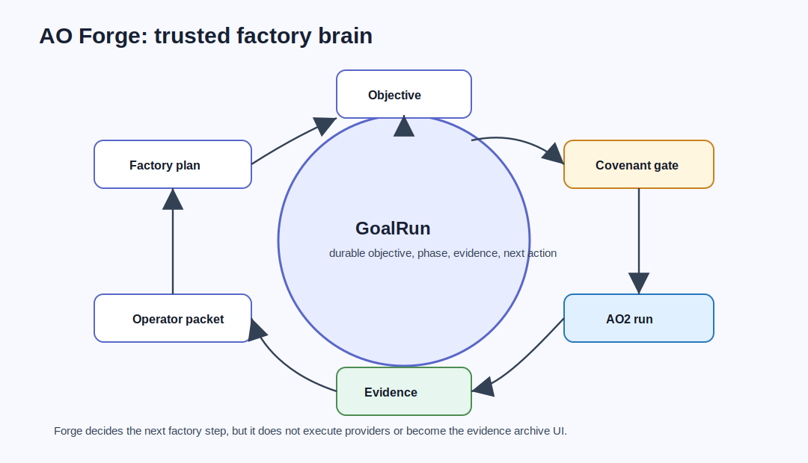

# AO Forge Architecture



AO Forge is the trusted factory brain for the AO stack. It turns an objective into an evidence-backed production line: factory brief, workcell graph, Covenant policy gate, AO2 execution, evidence routing, control-plane readback, operator packet, and next factory decision.

AO Forge does not replace AO2, AO Covenant, ao2-control-plane, AO Foundry, or AO Command. Its production value comes from coordinating those owners without taking over their authority.

## Source Context

Source repository: `../../ao-forge`

High-signal source docs:

- `../../ao-forge/README.md`
- `../../ao-forge/docs/design/AO-FORGE-V0.1.md`
- `../../ao-forge/docs/design/GOAL-RUNS.md`
- `../../ao-forge/docs/design/AO2-PULSE-GOAL-RUN-LOOP.md`
- `../../ao-forge/docs/security/RELEASE-THREAT-MODEL.md`
- `../../ao-forge/docs/release/PRODUCTION-STABLE-PROMOTION.md`

## Role In The Stack

AO Forge answers:

- What factory step is allowed next?
- What GoalRun state is current?
- Which objective, scope, acceptance criteria, phase, and stop conditions govern the loop?
- Which Covenant decision gates the next action?
- Which AO2 evidence proves execution happened?
- Which release-preview, release-verify, install-verify, rollback, promotion, or retained-evidence gate is blocking?

Forge is intentionally in the middle of the path: close enough to own durable task state and readiness semantics, but separate from provider execution, final policy authority, evidence archive UI, and operator command UX.

## Architecture

AO Forge is a Go CLI:

- `cmd/forge/main.go` is the main executable.
- `internal/cli` contains the command surface for plans, gates, contracts, goals, release workflows, readiness, and dashboard summaries.
- `internal/foundation` tracks verified baseline data.
- `docs/contracts` contains schema-backed contracts for factory briefs, packets, plans, GoalRun, Covenant gate results, release candidates, evidence bundles, rollbacks, promotions, production-readiness audits, and retained evidence.
- `examples` contains positive and negative fixtures for plans, decisions, gates, goals, release-preview artifacts, and vertical slices.
- `scripts` contains release preview, GoalRun fixture verification, AO2 Pulse readiness, branch protection, and production-readiness checks.

## Workflows

### Factory Plan Workflow

1. Receive an operator objective or factory brief.
2. Build a task graph or workcell plan.
3. Validate the plan against the schema.
4. Ask Covenant to gate declared side effects.
5. Delegate execution to AO2 only when the gate allows it.
6. Collect AO2 evidence and optional control-plane readback.
7. Emit an operator packet.

### GoalRun Loop

GoalRun is Forge's durable loop state. It records objective, phase, allowed scope, acceptance criteria, next action, stop conditions, and retained evidence.

Before any repeated hardening loop:

1. Read the latest GoalRun.
2. Run readiness checks.
3. Verify evidence hashes and lint retained evidence paths.
4. Confirm the next action still matches the objective and phase.
5. Perform bounded work.
6. Propose the next GoalRun through `forge goal update`.
7. Preserve the update audit, candidate GoalRun, readiness audit, evidence verification, and artifacts under durable repository-relative paths.

### Release Gate Workflow

Forge owns release-preview, install-verify, release-verify, rollback, promotion, retained-evidence, and production-readiness gates. Mutating paths remain fail-closed behind Covenant decisions, clean-workspace checks, explicit operator confirmation, release-preview evidence, and workflow gates.

## Agent Roles And Skills

AO Forge coordinates agents without being the execution agent:

- factory planner decomposes objectives into workcells;
- gatekeeper routes declared side effects through Covenant;
- GoalRun steward maintains durable loop state;
- release governor checks preview, verify, install, rollback, and promotion readiness;
- operator-packet author summarizes evidence for humans;
- AO2 Pulse or another executor may propose GoalRun updates, but Forge validates them before they become durable state.

The core skill is factory judgment: decide the next safe step from objective, scope, gates, and evidence.

## Contracts And Evidence

Forge contracts include:

- factory brief, plan, and packet;
- Covenant gate result;
- GoalRun, GoalRun update audit, readiness audit, evidence lint, evidence verify, retained evidence, and cleanup audit;
- release candidate, artifact inventory, evidence bundle, preview, verify, install verify, rollback, promotion, and production-readiness audits.

Forge treats evidence as immutable proof for the iteration that produced it. Scratch paths such as `tmp/`, `/tmp/`, home directories, parent traversal, and machine-local absolute paths must not become durable GoalRun evidence.

## Interactions With Other Repositories


| Repository | AO Forge interaction |
| --- | --- |
| AO Foundry | Foundry delegates individual governed runs to Forge and consumes readiness outcomes. |
| AO Covenant | Forge treats Covenant allow, deny, block, or malformed decisions as fail-closed gates. |
| AO2 | Forge delegates governed execution and consumes AO2 evidence. |
| ao2-control-plane | Forge may use observer readback as supporting evidence but not as approval. |
| AO Command | Command reads Forge readiness and release evidence for humans. |

## Production-Readiness Notes

- Keep legacy or archived execution paths behind explicit operator opt-in.
- Validate every machine-readable document against its schema.
- Preserve GoalRun evidence under durable repository-relative paths.
- Treat stale, missing, duplicated, or mismatched evidence as a stop condition.
- Do not allow control-plane upload to imply approval.

## Quick Verification

Use the source repository for live verification:

```sh
cd ../../ao-forge
go test ./...
go vet ./...
go build -o bin/forge ./cmd/forge
scripts/verify-goal-fixtures.sh
scripts/release-preview-dry-run.sh --out tmp/release-preview-check --tag v0.1.0-preview
scripts/verify-branch-protection.sh
```

