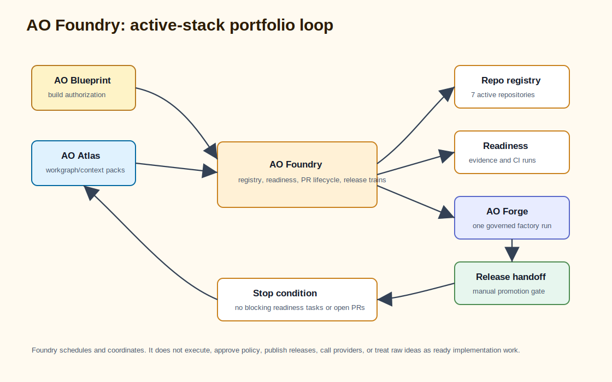

# AO Foundry Architecture: Multi-Repository AI Agent Operations Factory



AO Foundry is the multi-repository engineering operations factory component of the AO orchestration framework. It coordinates repositories, goals, branches, CI signals, release trains, evidence queues, and overnight advancement loops. It delegates individual governed implementation runs to AO Forge.

Foundry does not replace Forge. Foundry decides which repository or task is ready for a next step; Forge owns the governed run.

## Search-Friendly Summary

AO Foundry is the portfolio-level scheduler for governed AI agent orchestration. It watches active repositories, readiness ledgers, release gates, and CI evidence, then decides which task is safe to delegate next while preserving execution, policy, evidence storage, and operator UX boundaries.

## Component At A Glance

| Field | Value |
| --- | --- |
| Framework layer | Multi-repository operations, scheduling, and readiness coordination |
| Primary job | Decide which repository, release train, evidence queue, or GoalRun needs the next safe step |
| Owns | Active-stack registry, readiness ledgers, portfolio board, pulse events, release handoff evidence |
| Does not own | Governed implementation execution, policy authority, observer storage, operator command UX |
| Main consumers | AO Forge, AO Command, release coordinators, overnight loop supervisors |

## Source Context

Source repository: `../../ao-foundry`

High-signal source docs:

- `../../ao-foundry/README.md`
- `../../ao-foundry/docs/design/AO-FOUNDRY-V0.1.md`
- `../../ao-foundry/docs/operations/AO2-PULSE-EVENT-LOOP.md`
- `../../ao-foundry/docs/operations/ONE-SHOT-FACTORY-RUN.md`
- `../../ao-foundry/docs/operations/READINESS-EXIT-GATE.md`
- `../../ao-foundry/docs/operations/SIGNED-SMOKE-RELEASE-GATE.md`
- `../../ao-foundry/docs/sdd/AO-FOUNDRY-PRODUCTION-READINESS-SDD.md`

## Role In The AO Orchestration Framework

AO Foundry answers:

- Which repository is ready for work?
- Which task, branch, release candidate, or evidence queue is blocked?
- Which CI or production-readiness signal changed?
- Which release-handoff gates are ready or still manual?
- What next delegated factory action is safe?
- Is the active stack still aligned across six repositories?

Its scope is portfolio operations. It coordinates the operating picture across repos while preserving repo-local owners for execution, policy, evidence storage, and operator command UX.

## Architecture

AO Foundry is a Go CLI with two command surfaces:

- `cmd/foundry` for portfolio registry, task, readiness, release, goal, pulse, and repo-board commands.
- `cmd/ao` for a small operator-facing status/run/demo surface.
- `internal/cli` implements command parsing and workflow logic.
- `docs/contracts` contains schemas for registry, task, run, readiness, release, GoalRun, pulse, repo health, evals, traces, and signed-smoke artifacts.
- `examples` contains active-stack registries, tasks, goals, readiness ledgers, release candidates, evals, capabilities, runs, and approvals.
- `scripts` contains active-stack readiness loops, GitHub runs reports, branch protection, and readiness rollups.

## Workflows

### Portfolio Board Workflow

1. Read the Foundry registry for active sibling repositories.
2. Classify each repository as active-spine, supporting, or blocked-hygiene.
3. Check local checkout state and expected evidence.
4. Exit non-zero when a registered sibling is dirty or otherwise blocked.
5. Use the board to clean up before strategy work begins.

### Active-Stack Readiness Workflow

1. Validate the registry and tasks.
2. Run README readiness snapshot parity.
3. Run the repo board.
4. Validate release-candidate ledgers.
5. Run loop preflight and GitHub runs report checks.
6. Produce a machine-readable active-stack readiness loop result with first failing check and next actions.
7. Stop autonomous readiness work when goal readiness and competitive readiness are 100/100 and the loop has no `blocking_next_actions`.

The loop keeps `blocking_next_actions` separate from `maintenance_suggestions` so clean readiness does not invent more implementation work. Live Forge attempts, signed-smoke promotion, release promotion, and fresh implementation require explicit operator intent after the exit gate is satisfied.

### Release Handoff Workflow

1. Validate active-spine release-candidate ledgers.
2. Validate signed-smoke release-gate summaries.
3. Emit promotion JSON, candidate notes, and release manifest.
4. Keep signed-smoke as a manual required promotion gate.

### Pulse Workflow

Foundry's pulse command writes a local evidence bundle with readiness, GoalRun, Forge brief, Forge packet, policy gate, optional live Forge attempt, control-plane readback, run record, eval, trace, demo, release dry-run, competitive audit, and a final pulse-event summary. It is a scheduler and evidence loop only; live implementation remains delegated to AO Forge.

When the readiness exit gate is satisfied, the pulse summary records a stop-oriented next action instead of generating another autonomous task.

## Agent Roles And Skills

Foundry coordinates higher-level operating roles:

- portfolio coordinator reads registry and readiness ledgers;
- scheduler chooses safe next tasks or backoff;
- release-train coordinator validates candidate and promotion evidence;
- repo-health reader surfaces hygiene blockers;
- overnight loop supervisor runs bounded advancement loops;
- eval and trace collector turns loop activity into evidence.

The core skill is multi-repo operating judgment: decide where attention goes next without crossing into execution or approval authority.

## Contracts And Evidence

Foundry contracts include:

- registry, task, run, and capability matrix;
- active-stack readiness and production-readiness rollup;
- release candidate, release promotion, release manifest;
- GoalRun and goal-readiness audit;
- pulse event, loop event log, loop lease, trace, eval result, eval scorecard;
- signed-smoke ingest, preflight, result, and summary;
- control-plane readback and Forge live attempt.

The active-stack readiness ledger is the central source for explaining whether AO Foundry, AO Forge, AO Command, AO2, ao2-control-plane, and AO Covenant are ready.

## Interactions With Other Repositories


| Repository | AO Foundry interaction |
| --- | --- |
| AO Forge | Delegates individual governed factory runs and consumes run/gate outcomes. |
| AO Command | Supplies active-stack status for read-only operator summaries. |
| AO2 | Consumes execution readiness, Pulse evidence, and release evidence. |
| ao2-control-plane | Consumes observer readback and hosted evidence signals. |
| AO Covenant | Relies on policy spine and trust evidence for release and run gates. |

## Production-Readiness Notes

- Keep Foundry local-first and public-safe by default.
- Do not push, tag, publish, upload evidence, or mutate sibling repositories in normal verification paths.
- Preserve the active-stack ledger and README snapshot parity.
- Keep archived operator/runtime/conductor/swarm repositories out of the active registry.
- Treat 100/100 readiness with no `blocking_next_actions` as a stop signal, not a reason to continue autonomous hardening.
- Treat signed-smoke promotion as manual required evidence before production promotion.

## FAQ

### What is AO Foundry in the AO orchestration framework?

AO Foundry is the portfolio operations factory. It coordinates active AO repositories, readiness ledgers, CI evidence, release handoffs, and autonomous loop stop conditions.

### Does AO Foundry execute implementation tasks directly?

No. AO Foundry decides what should happen next at the portfolio level, then delegates governed implementation runs to AO Forge.

### Why does AO Foundry stop at 100/100 readiness?

The AO framework treats readiness with no blocking next actions as an exit gate. Foundry records that state and stops autonomous hardening instead of inventing maintenance work.

## Quick Verification

Use the source repository for live verification:

```sh
cd ../../ao-foundry
go test ./...
go run ./cmd/foundry registry validate --registry examples/registry/local-ao-stack.foundry-registry.json
go run ./cmd/foundry repo board --registry examples/registry/local-ao-stack.foundry-registry.json
scripts/active-stack-readiness-loop.sh --out tmp/active-stack-readiness-loop.json
scripts/verify-branch-protection.sh
```
