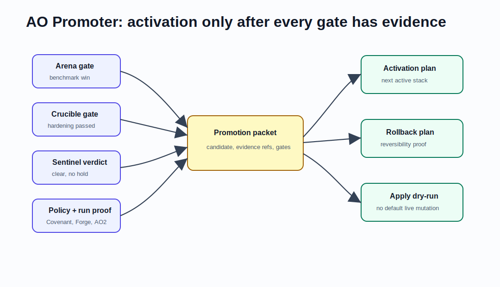

# AO Promoter Architecture: Gated Activation Path For The AO Stack



AO Promoter is the gated promotion path from an AO candidate to the active AO stack. It consumes evidence from AO Arena, AO Crucible, AO Covenant, AO Foundry, AO Forge, AO2, and AO Sentinel, then emits deterministic promotion decisions, activation plans, active-stack manifests, rollback plans, dry-run apply results, and public-safe operator reports.

## Search-Friendly Summary

AO Promoter is the activation gate for AO improvements. It does not make a candidate good by itself; it verifies that benchmark, hardening, policy, readiness, execution, safety, and rollback evidence all pass before producing an activation plan.

## Component At A Glance

| Field | Value |
| --- | --- |
| Framework layer | Promotion and activation |
| Primary job | Convert passing evidence into dry-run activation and rollback artifacts |
| Owns | Promotion packets, candidate validation, gate evaluation, activation plans, active-stack renders, rollback plans, dry-run apply, reports |
| Does not own | Benchmark scoring, hardening probes, policy authority, live control-plane mutation by default |
| Main consumers | AO Foundry, AO Command, release reviewers, future active-stack automation |

## Source Context

Source repository: `../../ao-promoter`

High-signal source docs:

- `../../ao-promoter/README.md`
- `../../ao-promoter/docs/sdd/AO-PROMOTER-ARCHITECTURE.md`
- `../../ao-promoter/docs/sdd/AO-PROMOTER-GATES.md`
- `../../ao-promoter/docs/sdd/AO-PROMOTER-ACTIVE-STACK.md`
- `../../ao-promoter/docs/sdd/AO-PROMOTER-SAFETY.md`

## Role In The AO Orchestration Framework

AO Promoter answers:

- Is the candidate packet internally consistent?
- Did Arena, Crucible, Covenant, Foundry, Forge, AO2, and Sentinel evidence pass?
- Is there a rollback plan before activation?
- What would the active-stack manifest look like after activation?
- Can the apply step run as a dry-run without mutating sibling repositories?

Promoter is intentionally conservative: failing, stale, missing, mismatched, unsafe, or live-apply-default evidence blocks promotion.

## Architecture

AO Promoter is a local-first Go CLI:

- `cmd/promoter/main.go` is the executable.
- `internal/cli` exposes packet, candidate, gates, plan, active, rollback, report, apply, and safety commands.
- `docs/contracts` stores schemas for candidates, evidence refs, packets, gates, activation plans, active-stack manifests, rollback plans, apply results, safety scans, and reports.
- `examples` stores valid and invalid promotion packets, candidates, evidence, active stacks, and reports.

## Workflows

### Promotion Workflow

1. Validate the candidate and promotion packet.
2. Evaluate all required evidence references and gates.
3. Produce an activation plan only when gates pass.
4. Render the next active-stack manifest from the plan.
5. Produce a rollback plan before any apply path.
6. Render a public-safe promotion report.
7. Run `apply --dry-run` by default; live mutation is outside v0.1 default paths.

### Safety Workflow

Promoter scans README, docs, and examples for public-safety issues. It blocks live apply by default and treats missing rollback, stale Arena gates, failed Crucible gates, unsafe scans, and candidate mismatches as fail-closed.

### First Docs-Only Activation Boundary

AO Promoter owns the final activation-boundary check for the first docs-only
class. It requires passing evidence from Covenant, Foundry, Forge, AO2,
Sentinel, rollback rehearsal, and AO Command readback before it can report that
the docs-only PR rehearsal boundary is satisfied.

Promoter still does not perform live execution by default. Its boundary can
distinguish dry-run activation readiness from live rehearsal promotion evidence,
including the completed fully unsupervised complex first non-planning closure,
but it cannot turn missing approval into permission, bypass Sentinel, or promote
fully unsupervised RSI.

## Agent Roles And Skills

- promotion packet validator checks candidate and evidence consistency;
- gate evaluator combines Arena, Crucible, Covenant, Foundry, Forge, AO2, and Sentinel signals;
- activation planner produces a deterministic active-stack update;
- rollback planner proves reversibility;
- dry-run operator validates apply behavior without mutation.

## Contracts And Evidence

Promoter contracts include candidates, evidence references, promotion packets, gate results, activation plans, active-stack manifests, rollback plans, apply results, safety scans, and reports. Evidence references are consumed as inputs; Promoter does not forge upstream approval.

## Interactions With Other Repositories


| Repository | AO Promoter interaction |
| --- | --- |
| AO Arena | Requires passing benchmark promotion gates. |
| AO Crucible | Requires passing hardening gates. |
| AO Sentinel | Stops when a hold or incident is present. |
| AO Covenant | Requires policy decisions and public-safety evidence. |
| AO Foundry | Consumes active-stack readiness and goal readiness evidence. |
| AO Forge | Consumes factory packet and release gate evidence. |
| AO2 | Consumes governed run summaries as execution evidence. |
| AO Command | Can summarize promotion status for operators. |

## Production-Readiness Notes

- Keep dry-run as the default apply path.
- Do not push, tag, release, upload, deploy, mutate sibling repositories, or write live control-plane state in default paths.
- Require rollback readiness before activation.
- Treat failed Sentinel, Crucible, Arena, or Covenant signals as promotion blockers.

## FAQ

### Does Promoter replace release management?

No. It produces gated activation evidence. Human operators and future explicit live workflows still own real-world promotion decisions.

### Why does Promoter need Sentinel and Crucible?

Arena can prove a benchmark win, but Sentinel catches regressions and Crucible probes adversarial failure modes. Promotion needs all three views.

## Quick Verification

Use the source repository for live verification:

```sh
cd ../../ao-promoter
go test ./...
go vet ./...
go build -o tmp/bin/promoter ./cmd/promoter
PATH="$PWD/tmp/bin:$PATH" promoter packet validate --packet examples/packets/valid/ao-promoter-v0.1.json
PATH="$PWD/tmp/bin:$PATH" promoter gates evaluate --packet examples/packets/valid/ao-promoter-v0.1.json --out tmp/promotion-gate.json
PATH="$PWD/tmp/bin:$PATH" promoter plan activate --packet examples/packets/valid/ao-promoter-v0.1.json --out tmp/activation-plan.json
PATH="$PWD/tmp/bin:$PATH" promoter apply --plan tmp/activation-plan.json --dry-run --out tmp/apply-dry-run.json
PATH="$PWD/tmp/bin:$PATH" promoter safety scan --path examples --out tmp/examples-scan.json
```

`public_safe_guided_evidence_application_four_attempts` is proven from AO Foundry PR #193, commit
`4ec509fd64d1fc1ea41ea7f22aae900ba79e09a1`, with tracked public evidence under
`docs/evidence/recursive-improvement-guided-evidence-application/`. Four public-safe
guided evidence-application attempts are tracked with baseline and post-change
measurements: guided candidate-fit evaluation quality (`0.67` -> `0.92`),
reviewer-blocker triage quality (`0.65` -> `0.91`), cross-evidence dependency
selection quality (`0.64` -> `0.90`), and safe-next-evidence prioritization
quality (`0.62` -> `0.89`). The highest proven live class is
`public_safe_guided_evidence_application_four_attempts` and the next denied class is
`broad_RSI`. Stronger recursive-improvement wording remains denied, `broad_RSI`
remains denied, unrestricted self-modification remains denied, hidden instruction
mutation remains denied, and policy-changing autonomy remains denied.
`public_safe_bounded_recursive_improvement_wording_generality_evidence` is proven from AO Foundry PR #197, commit `166398641b655f0da97817659acc771026b204e7`, with tracked public evidence under `docs/evidence/recursive-improvement-bounded-wording-generality/`. The approved public wording is exactly: "AO has public-safe bounded recursive-improvement wording generality evidence showing reviewer-approved bounded wording can transfer across additional public-safe review tasks under independent gates; broad_RSI remains denied." The highest proven live class is `public_safe_bounded_recursive_improvement_wording_generality_evidence` and the next denied class is `broad_RSI`.

This does not prove `broad_RSI`, unrestricted self-modification, hidden instruction mutation, policy-changing autonomy, policy/auth/secret/provider/deploy/release/config/dependency expansion, or unbounded stronger recursive-improvement claims.
