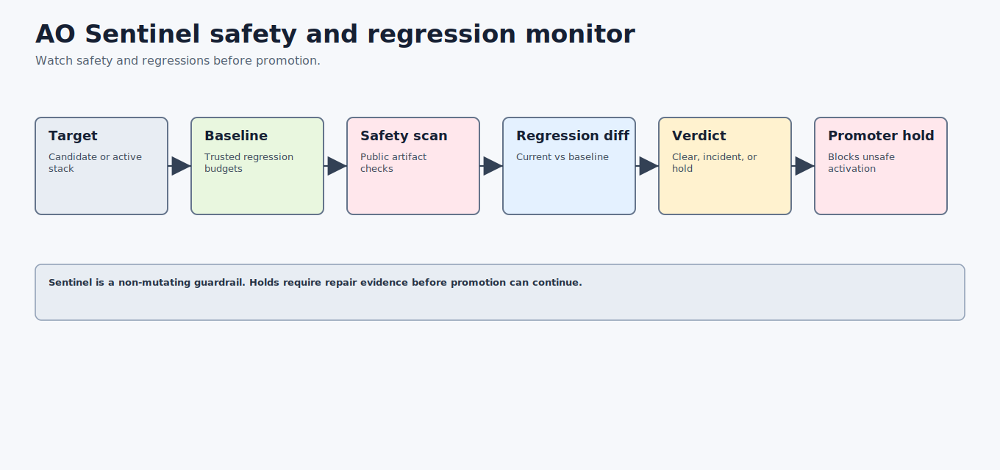

# AO Sentinel Architecture: Safety And Regression Monitor For AO Orchestration



AO Sentinel is the safety and regression monitor for the AO orchestration framework. It watches candidate and active-stack evidence, compares current runs against trusted baselines, detects public-safety leaks and behavioral regressions, and emits deterministic verdicts, incidents, promoter holds, and operator reports.

## Search-Friendly Summary

AO Sentinel is the monitor that keeps AO improvements from quietly regressing. It validates targets and baselines, runs fixture regression suites, compares drift, scans safety, evaluates verdicts, and blocks Promoter when a hold or incident is required.

## Component At A Glance

| Field | Value |
| --- | --- |
| Framework layer | Safety and regression monitoring |
| Primary job | Detect unsafe artifacts or behavioral regressions before promotion or continued automation |
| Owns | Targets, baselines, regression suites, regression runs, diffs, verdicts, incidents, promoter holds, watch dry-runs |
| Does not own | Promotion activation, benchmark scoring, adversarial hardening, policy authority |
| Main consumers | AO Promoter, AO Foundry, AO Command, release reviewers |

## Source Context

Source repository: `../../ao-sentinel`

High-signal source docs:

- `../../ao-sentinel/README.md`
- `../../ao-sentinel/docs/sdd/AO-SENTINEL-ARCHITECTURE.md`
- `../../ao-sentinel/docs/sdd/AO-SENTINEL-MONITORING.md`
- `../../ao-sentinel/docs/sdd/AO-SENTINEL-REGRESSION.md`
- `../../ao-sentinel/docs/sdd/AO-SENTINEL-SAFETY.md`

## Role In The AO Orchestration Framework

AO Sentinel answers:

- Is the candidate or active-stack evidence still public-safe?
- Did a regression suite drift beyond trusted baseline budgets?
- Should the stack remain clear, open an incident, or emit a promoter hold?
- Can a watch loop run dry without mutating live control-plane state?

Sentinel does not activate or approve candidates. It emits evidence that Promoter and operators must respect.

## Architecture

AO Sentinel is a local-first Go CLI:

- `cmd/sentinel/main.go` is the executable.
- `internal/cli` exposes target, baseline, safety, regression, monitor, incident, hold, report, and watch commands.
- `docs/contracts` stores schemas for targets, baselines, regression suites, runs, diffs, safety scans, verdicts, incidents, holds, and watch runs.
- `examples` stores valid and invalid fixtures for baselines, regression results, safety scans, targets, suites, and verdicts.

## Workflows

### Monitor Workflow

1. Validate the local AO stack target.
2. Validate the trusted baseline.
3. Run or load the public-safety scan.
4. Run fixture regression suites.
5. Compare current evidence with the baseline.
6. Evaluate a deterministic verdict.
7. Emit incident and promoter-hold artifacts when required.
8. Render a public-safe report.

### Watch Dry-Run Workflow

Sentinel can perform a bounded watch dry-run for a fixed iteration count. It records the monitor cycle without live provider calls or live control-plane writes.

### First Docs-Only Live-Mutation Hold Role

AO Sentinel owns the safety/regression hold verdict for the first docs-only
class. It can clear or hold the path based on approval evidence, rollback
evidence, docs-only allowlist evidence, public-safety scan evidence, and
verification evidence.

Sentinel does not approve or execute the mutation. A missing approval ticket,
missing rollback rehearsal, unsafe path, failed verification, public-safety
finding, or stale evidence should produce a hold that Promoter and Foundry must
respect.

## Agent Roles And Skills

- baseline curator owns trusted safety and regression references;
- regression runner executes fixture suites;
- drift analyst compares run evidence with baseline budgets;
- incident author emits operator-readable incident packets;
- hold emitter blocks Promoter when verdicts are not clear.

## Contracts And Evidence

Sentinel contracts include targets, baselines, regression suites, regression runs, regression diffs, safety scans, verdicts, incidents, promoter holds, and watch runs. Its outputs are monitoring evidence and do not imply approval.

## Interactions With Other Repositories


| Repository | AO Sentinel interaction |
| --- | --- |
| AO Promoter | Promoter must stop when Sentinel emits a hold or incident. |
| AO Foundry | Foundry can use Sentinel verdicts in active-stack readiness. |
| AO Command | Command can summarize Sentinel status for operators. |
| AO Arena | Arena benchmark winners remain subject to Sentinel regression checks. |
| AO Crucible | Crucible hardening can add cases that Sentinel later monitors as regressions. |
| AO Covenant | Covenant safety patterns inform Sentinel's forbidden-action and secret scans. |

## Production-Readiness Notes

- Keep watch runs dry-run and bounded by explicit iteration counts.
- Fail closed on stale baselines, live-mutation targets, failing regression runs, and incidents without holds.
- Redact finding values in public reports.
- Treat holds as blocking evidence for promotion.

## FAQ

### Does Sentinel run forever?

No. v0.1 supports bounded dry-runs. Continuous operation would need future explicit deployment and operator approval.

### Can Sentinel approve a promotion?

No. It can clear or block. AO Promoter owns promotion activation decisions.

## Quick Verification

Use the source repository for live verification:

```sh
cd ../../ao-sentinel
go test ./...
go vet ./...
go build -o tmp/bin/sentinel ./cmd/sentinel
PATH="$PWD/tmp/bin:$PATH" sentinel run regression --suite examples/suites/valid/ao-stack-regression.sentinel-suite.json --out tmp/regression-run.json
PATH="$PWD/tmp/bin:$PATH" sentinel safety scan --path README.md --out tmp/readme-safety.json
PATH="$PWD/tmp/bin:$PATH" sentinel compare regression --baseline examples/baselines/valid/ao-stack.sentinel-baseline.json --run tmp/regression-run.json --out tmp/regression-diff.json
PATH="$PWD/tmp/bin:$PATH" sentinel monitor evaluate --target examples/targets/valid/local-ao-stack.sentinel-target.json --baseline examples/baselines/valid/ao-stack.sentinel-baseline.json --safety tmp/readme-safety.json --regression tmp/regression-diff.json --out tmp/sentinel-verdict.json
PATH="$PWD/tmp/bin:$PATH" sentinel hold emit --verdict tmp/sentinel-verdict.json --out tmp/promoter-hold.json
```
