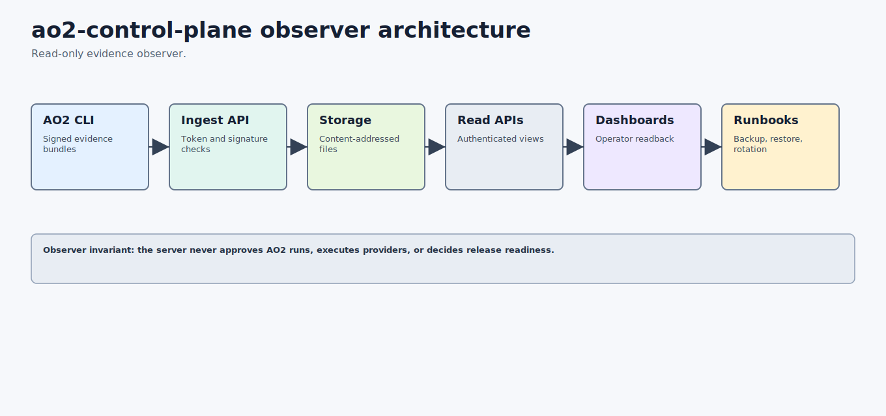

# ao2-control-plane Architecture



ao2-control-plane is the optional server layer for AO2 evidence ingest and readback. It receives signed acceptance bundles, control-plane bundles, AO2 memory exports, provider registry snapshots, and signed AO2 evidence packs. It stores them as content-addressed flat files and exposes authenticated read APIs and dashboards.

It is an observer. It does not approve AO2 runs, execute providers, own evaluator closure, decide release readiness, or mutate AO2 artifacts.

## Source Context

Source repository: `../../ao2-control-plane`

High-signal source docs:

- `../../ao2-control-plane/README.md`
- `../../ao2-control-plane/docs/DEPLOYMENT.md`
- `../../ao2-control-plane/docs/SECURITY.md`
- `../../ao2-control-plane/docs/runbooks/operations.md`
- `../../ao2-control-plane/docs/runbooks/storage-retention.md`
- `../../ao2-control-plane/docs/runbooks/release-smoke.md`

## Role In The Stack

ao2-control-plane answers:

- What signed AO2 evidence has been published?
- Who or what signed it?
- Are stored bundles still digest-valid?
- Which gates need attention?
- Can dashboards render the evidence without leaking bearer tokens?
- Can observer storage be backed up, restored, rotated, pruned, and verified?
- Do AO2 and control-plane public release assets still form a valid release pair?

The server improves visibility and durability without moving execution authority out of local AO2.

## Architecture

ao2-control-plane is a Rust workspace:

| Crate | Responsibility |
| --- | --- |
| `ao2-cp-server` | HTTP server, authenticated APIs, dashboards, ingest handlers, health endpoints, metrics, and release/cockpit surfaces. |
| `ao2-cp-storage` | Content-addressed flat-file storage, index handling, retention, pruning, and restore support. |
| `ao2-cp-schema` | Shared schema and canonical JSON support. |

Deployment assets live in `deploy/` for Linux systemd, macOS launchd, Windows NSSM, Caddy, and Nginx. Runbooks cover operations, release smoke, long-lived local dev, branch protection, and storage retention.

## Workflows

### Signed Evidence Ingest Workflow

1. AO2 produces signed evidence or support bundles.
2. AO2 CLI posts the bundle with a bearer token or signed upload path.
3. The server verifies token, signature, canonical digest, and schema expectations.
4. Storage writes immutable content-addressed files and sidecars.
5. The index is updated for authenticated read APIs and dashboards.

### Dashboard Readback Workflow

1. Operator opens authenticated dashboards or generates token-free local snapshots.
2. Dashboards display signed packs, source classes, verdicts, signer metadata, release cockpit state, gate-attention views, audit logs, or storage reports.
3. Browser-safe snapshot helpers inject tokens as headers and fail closed if token values appear in output.

### Backup, Restore, And Retention Workflow

1. Backup the whole data directory; bundles are content-addressed and immutable.
2. Restore with the service stopped.
3. Run restore drills to prove byte-identical readback.
4. Use storage reports and dry-run pruning before any observer-copy deletion.
5. Rotate audit logs with configured size limits and prove rotation through drills.

### Release Pair Verification Workflow

Control-plane CI verifies both AO2 and control-plane public releases as a pair: shared platform coverage, checksums, AO2 provenance/readiness assets, control-plane promotion summary evidence, and published release train records. This is read-only verification, not release approval.

## Agent Roles And Skills

ao2-control-plane does not host execution agents. It supports observer roles:

- evidence ingester verifies signed uploads;
- storage indexer writes content-addressed observer copies;
- dashboard renderer presents authenticated readback;
- release evidence bridge verifies AO2 artifacts can be consumed;
- retention operator reports and prunes observer copies by policy;
- disaster-recovery operator verifies backup and restore integrity.

The core skill is evidence readback: make completed AO2 work inspectable, durable, and auditable for operators.

## Contracts And Evidence

Control-plane evidence includes:

- signed AO2 evidence packs;
- acceptance bundles and provider pilot acceptance fixtures;
- provider registry snapshots;
- release support bundles;
- release publication closure summaries;
- release asset parity audits;
- public release pair verification summaries;
- stable promotion evidence index readbacks;
- dual-repo public approval closure readbacks;
- health, dashboard, restore, retention, and audit-log rotation reports.

Every endpoint should preserve the observer invariant: read, verify, store, and display evidence after the fact.

## Interactions With Other Repositories


| Repository | ao2-control-plane interaction |
| --- | --- |
| AO2 | Receives signed AO2 evidence, provider registry snapshots, release support bundles, and stable-promotion evidence. |
| AO Forge | Provides readback that may support operator decisions but never replaces Forge gates. |
| AO Foundry | Supplies observer evidence for active-stack readiness and release train status. |
| AO Command | Provides read-only evidence surfaces that Command can summarize. |
| AO Covenant | Stores evidence that may include Covenant-style trust material, but does not become the policy kernel. |

## Production-Readiness Notes

- Refuse provider API-key environment variables in the server process.
- Never put bearer tokens in URLs, logs, dashboards, snapshots, or generated evidence.
- Keep `/healthz` and `/readyz` wired into service supervisors.
- Keep backup/restore and audit-log rotation drills portable across Linux, macOS, and Windows.
- Keep pruning opt-in and dry-run by default.
- Do not approve releases or AO2 runs from observer readback.

## Quick Verification

Use the source repository for live verification:

```sh
cd ../../ao2-control-plane
cargo fmt --all --check
cargo test --workspace
cargo clippy --workspace --all-targets -- -D warnings
cargo build --release -p ao2-cp-server
scripts/smoke-three-os.sh
scripts/check-public-export.sh
```

