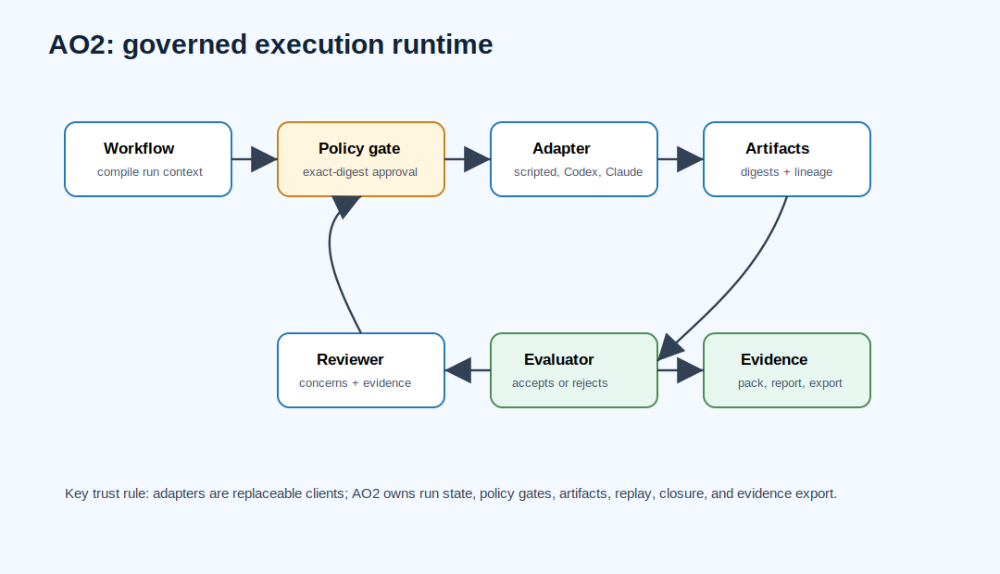

# AO2 Architecture: Governed Local Runtime For AI Agent Workflows



AO2 is the governed local execution runtime component of the AO orchestration framework. It owns workflow state, policy gates, exact-digest approvals, artifacts, evidence packs, evaluator closure, provider-adapter boundaries, and release-readiness evidence.

AO2 replaces the deprecated AO Operator and AO Runtime execution path for active AO work. It does not own cross-repo factory scheduling, release promotion policy, or durable observer storage.

## Search-Friendly Summary

AO2 is the local-first runtime for governed AI agent workflows. It compiles workflows, runs bounded roles and adapters, records policy decisions and approvals, captures artifacts and evidence packs, and blocks evaluator closure when required proof is missing.

## Component At A Glance

| Field | Value |
| --- | --- |
| Framework layer | Governed local execution runtime |
| Primary job | Execute bounded agent workflows and preserve structured evidence |
| Owns | Run records, role tasks, adapter boundaries, artifacts, approvals, evidence packs, evaluator closure |
| Does not own | Cross-repo portfolio scheduling, release promotion policy, durable observer storage, operator dashboard UX |
| Main consumers | AO Forge, AO Foundry, ao2-control-plane, AO Command, reviewers inspecting execution evidence |

## Source Context

Source repository: `../../ao2`

High-signal source docs:

- `../../ao2/README.md`
- `../../ao2/docs/ARCHITECTURE.md`
- `../../ao2/docs/PRD.md`
- `../../ao2/docs/SCHEMAS-AND-INTERFACES.md`
- `../../ao2/docs/IMPLEMENTATION-SLICES.md`
- `../../ao2/docs/SDD-risky-pr-run.md`

## Role In The AO Orchestration Framework

AO2 answers:

- What workflow version ran?
- Which roles and adapters participated?
- What context did each role receive?
- Which risky actions were denied or approved?
- Which files, commands, transcripts, patches, tests, and artifacts were produced?
- Why did evaluator closure accept, reject, or block the run?
- Where is the evidence pack or report?

AO2's design center is reviewability after the fact. The operator should not have to trust terminal scrollback or a vague completion message; the run leaves structured records.

## Architecture

AO2 is a Rust workspace plus supporting scripts:

| Crate | Responsibility |
| --- | --- |
| `ao2-cli` | User-facing `ao2` command surface. |
| `ao2-core` | Core workflow and run data structures. |
| `ao2-runtime` | Native execution runtime used by the CLI. |
| `ao2-policy` | Policy and approval checks. |
| `ao2-artifacts` | Artifact recording, digests, lineage, and evidence storage. |
| `ao2-adapters` | Shared adapter sandbox, transcript, timeout, and patch-promotion contracts. |
| `ao2-adapter-codex` | Codex provider prompt profile and adapter integration. |
| `ao2-adapter-claude` | Claude provider prompt profile and adapter integration. |
| `sdd-planner` | Structured design/development planning support. |

AO2 also includes Python tests, Node scripts, GitHub Actions workflows, release packaging scripts, provider readiness gates, Pulse automation scripts, and public schemas under `schemas/`.

## Workflows

### Risky PR Run

The first public workflow proves the governance path:

```text
objective -> workflow compile -> scoped plan -> policy-denied risky action
-> exact-digest approval -> patch/evidence -> reviewer concern
-> evaluator rejection -> correction -> evaluator acceptance -> evidence export
```

This is intentionally provider-free for the initial slice so the governance path can be verified deterministically.

### Adapter Execution Workflow

1. AO2 compiles a workflow into a local run record.
2. The runtime creates role tasks and policy boundaries.
3. The adapter runs a bounded local command or provider prompt in an isolated sandbox.
4. AO2 captures stdout, stderr, exit code, transcript, changed files, blockers, concerns, token usage, and summaries.
5. Sandbox patch promotion requires exact digest matching.
6. AO2 records artifacts and rejects closure when required evidence is missing.

### Tactical Context Shrink Workflow

AO2 context handling is tactical and per-run. It receives a bounded task packet
from Foundry or Forge, compiles the role context needed for that local workflow,
and records exactly what the adapter saw. When the context is too broad, stale,
or missing required evidence, AO2 should shrink, block, or reject the run and
emit artifacts explaining why.

AO2 does not own mission-scale context decomposition. Oversized objectives,
multi-node workgraphs, context-pack budgets, blocked-node repair plans, and
`needs_context` repacks belong to AO Atlas before Foundry schedules a ready
task. AO2's job is to execute one governed slice and produce durable evidence,
not to turn an entire mission into its own workgraph.

### Pulse Auto-Advance Workflow

Pulse can continue local AO2 work without opening a pull request only while a registered task still has unmet stop conditions. It writes local evidence for each iteration:

- summary JSON;
- per-iteration task executor summaries;
- command logs;
- generated packet, board, eval loop, prompt, resume metadata, and task manifest;
- append-only local ledger entries;
- PR/CI gate state when waiting on review or CI.

When AO2 consumes a Foundry stop decision or the readiness exit gate is satisfied, Pulse records the stop and does not generate another lengthy task. Direct-main publishing, live execution, signed-smoke promotion, or release promotion still requires explicit operator intent.

### Release Readiness Workflow

AO2's release readiness chain builds and consumes artifacts until final publication closure:

```text
ao2-release-readiness
-> ao2-release-readiness-hosted-artifact-gate
-> ao2-release-readiness-consumer
-> ao2-release-readiness-final-closure-verifier
```

The final verifier is the canonical readiness signal.

## Agent Roles And Skills

AO2 uses bounded roles, not unbounded autonomy:

- planner role emits scoped plan artifacts;
- implementer role runs through scripted, Codex, Claude, or future adapters;
- policy gateway denies or requires exact approval for risky actions;
- reviewer role emits concrete concerns;
- evaluator closer rejects missing evidence or unresolved concerns and accepts only mapped evidence;
- exporter packages portable run evidence.

Adapter skills include sandbox execution, timeout normalization, transcript parsing, patch digest preview/apply, provider doctor checks, provider matrix reports, and provider registry publication to the optional control plane.

## Contracts And Evidence

AO2 contracts include:

- workflow, role, run-record, task, event, artifact, context bundle, policy decision, approval ticket, tool request/result, obligation ledger, closure, report, and evidence pack schemas;
- provider-free command logs;
- Hermes/control-plane act contracts;
- release train records;
- public export manifests;
- provider registry snapshots.

Every role handoff should cross an artifact boundary. Terminal output is not the durable record.

## Interactions With Other Repositories


| Repository | AO2 interaction |
| --- | --- |
| AO Forge | Receives delegated governed execution from Forge and returns evidence packs or run summaries. |
| AO Atlas | Supplies mission-scale workgraph and context-pack material through Foundry/Forge; AO2 consumes only the bounded slice selected for execution. |
| AO Covenant | Uses the same trust model: declared side effects, policy gates, exact approvals, and evidence closure. |
| ao2-control-plane | Publishes signed evidence, provider registries, release support bundles, and readback material to the observer. |
| AO Foundry | Supplies execution and Pulse evidence for portfolio readiness. |
| AO Command | Supplies read-only execution status and evidence summaries. |

## Production-Readiness Notes

- Keep provider API-key authentication out of the public local-first path.
- Keep standalone deprecated `ao-runtime` and `ao-operator` out of `Cargo.lock`.
- Keep AO2 runtime authority local even when evidence is published to a control plane.
- Treat adapters, shells, package managers, network tools, and model providers as untrusted actors.
- Preserve cross-platform release smokes for macOS, Linux, and Windows.

## FAQ

### What is AO2 in the AO orchestration framework?

AO2 is the governed local runtime. It executes bounded AI agent workflows and leaves structured evidence that humans and other AO components can inspect.

### Does AO2 own the whole factory?

No. AO2 owns execution and evidence capture. AO Foundry schedules portfolio work, AO Forge governs factory runs, AO Covenant gates policy, and ao2-control-plane stores observer readback.

### Why is AO2 local-first?

Local-first execution keeps workflow authority, approvals, artifacts, and evaluator closure inspectable before any optional observer evidence is published.

## Quick Verification

Use the source repository for live verification:

```sh
cd ../../ao2
npm run verify
cargo test --workspace
cargo build --workspace
python3 -m pytest tests/test_ao2_native_runtime_platform_evidence.py
scripts/check-public-export.sh
```
