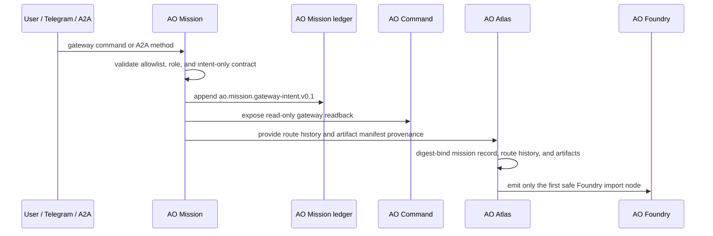

# AO Mission Gateway Sequence

AO Mission gateway inputs are intent/readback only. Telegram and A2A clients can
create operator intents and status requests, but they cannot approve policy,
execute mutation, call providers, schedule repository mutation, publish releases,
or bypass the Blueprint -> Atlas -> Foundry chain.

The gateway ledger preserves:

- `safe_to_execute=false`
- `executes_work=false`
- `approves_work=false`
- `mutates_repositories=false`

Atlas may consume AO Mission route-history provenance during import, but that
provenance remains readback evidence only. Foundry still applies its own gates
before any bounded implementation task can execute.
