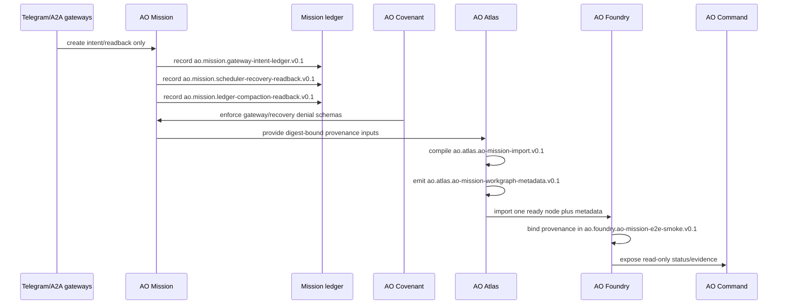

# AO Mission Provenance Sequence

AO Mission gateway, scheduler recovery, and ledger compaction outputs are
readback/provenance surfaces. They can be bound into Atlas and Foundry evidence,
then inspected by AO Command, but they do not schedule, execute, approve, mutate
repositories, call providers, use credentials, publish releases, widen direct-main
authority, or widen concurrent mutation authority.

## Boundary

This is the gateway/recovery/compaction -> Atlas -> Foundry -> Command readback
path. AO Mission records provenance and next-action evidence; Atlas compiles
context and workgraph metadata; Foundry validates agreement and implementation
gates; Command reads the result. None of those readbacks grant execution
authority.
