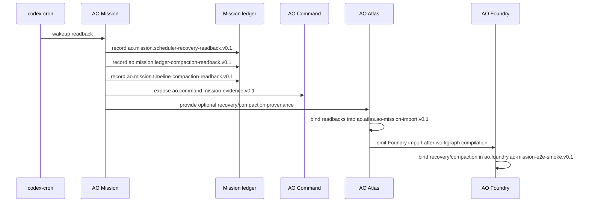

# AO Mission Recovery And Compaction Sequence

AO Mission scheduler recovery, ledger compaction, and timeline compaction are readback/provenance
flows. They preserve mission continuity evidence, but they do not grant work
authority.

Boundary rules:

- codex-cron remains scheduler wakeup substrate only.
- `ao.mission.scheduler-recovery-readback.v0.1` records missed and recovered
  wakeups and may recommend governed continuation.
- Scheduler recovery does not schedule work by itself.
- Scheduler recovery does not execute mutation, approve policy, mutate
  repositories, call providers, use credentials, publish releases, allow
  direct-main mutation, or allow concurrent mutation.
- `ao.mission.ledger-compaction-readback.v0.1` records compaction of local
  continuation evidence.
- Ledger compaction preserves digest-bound provenance and does not widen
  authority.
- `ao.mission.timeline-compaction-readback.v0.1` records retained route and
  continuation-step timeline digests.
- Timeline compaction preserves digest-bound provenance and does not widen
  authority.
- AO Atlas may import recovery and compaction readbacks only as provenance.
- AO Foundry may bind recovery and compaction readbacks only as e2e smoke
  evidence.
- Any readback that claims scheduling, execution, approval, repository mutation,
  provider, credential, release, direct-main, or concurrent authority must fail
  closed.
