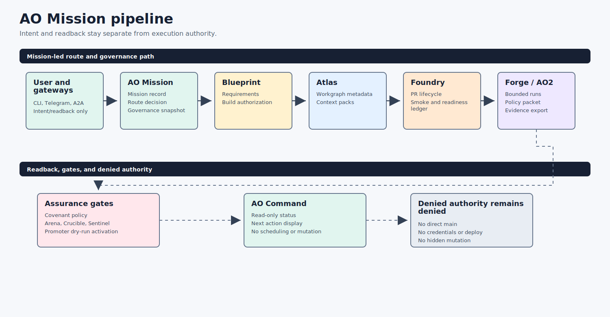
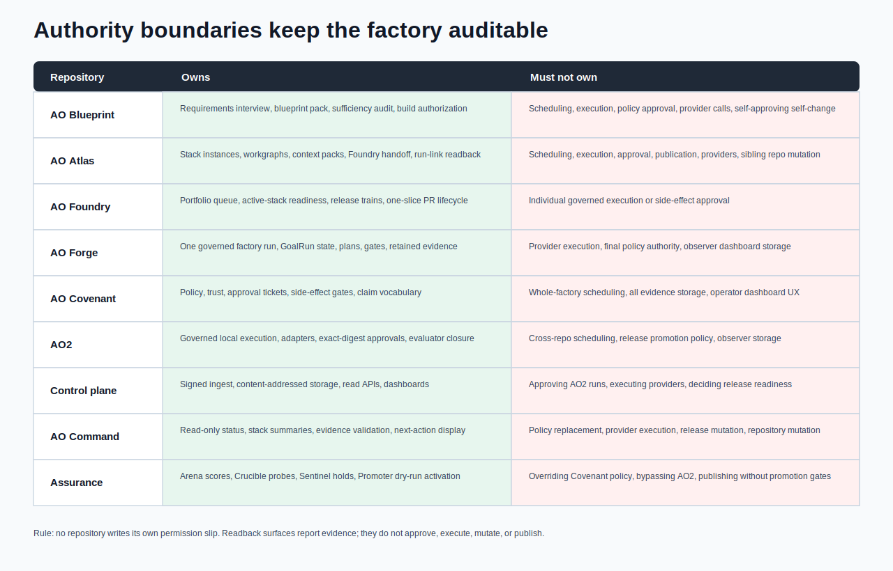

# AO Agent Orchestration Overview


This documentation explains how the active AO repositories cooperate to run AI-assisted engineering work in a governed, evidence-first way. The target reader is a colleague who needs to understand the stack well enough to review a run, explain the architecture, or decide where a new capability belongs.



The most important design decision is separation of authority. No single repository silently plans work, approves side effects, executes agent changes, stores all evidence, and presents the operator dashboard. Each repository owns one part of the factory, and the handoff between repositories is expressed as contracts, evidence, or read-only status.

## Repository Map

| Repository | Primary role | What to read next |
| --- | --- | --- |
| [AO Mission](../ao-mission/README.md) | Central user entry point, mission router, continuation ledger, gateway, scheduler adapter, and governance snapshot producer | Start here when a user objective needs durable status, next action, or continuation readback. |
| [AO Blueprint](../ao-blueprint/README.md) | Requirements interview, blueprint pack, sufficiency audit, and build authorization | Start here when an objective is not specified enough to build. |
| [AO Atlas](../ao-atlas/README.md) | Stack-instance, workgraph, context-pack, and Foundry fixture handoff compiler | Use this to understand oversized objective decomposition before Foundry scheduling. |
| [AO Command](../ao-command/README.md) | Read-only operator command center | Start here when someone asks "what is happening?" |
| [AO Foundry](../ao-foundry/README.md) | Portfolio-level engineering operations factory | Use this to understand multi-repo readiness and release trains. |
| [AO Forge](../ao-forge/README.md) | Trusted factory brain for one governed run | Use this to understand GoalRun, factory plans, and release gates. |
| [AO Covenant](../ao-covenant/README.md) | Policy, contract, approval, and trust kernel | Use this to understand side-effect approval and evidence-bound trust. |
| [AO2](../ao2/README.md) | Governed local execution runtime | Use this to understand agent adapters, approvals, artifacts, and closure. |
| [ao2-control-plane](../ao2-control-plane/README.md) | Optional read-only evidence observer | Use this to understand signed ingest, storage, dashboards, and readback. |
| [AO Arena](../ao-arena/README.md) | Deterministic benchmark scoreboard | Use this to understand fixture-mode scoring and promotion evidence. |
| [AO Crucible](../ao-crucible/README.md) | Adversarial hardening layer | Use this to understand resilience probes and remediation gates. |
| [AO Sentinel](../ao-sentinel/README.md) | Safety and regression monitor | Use this to understand regression verdicts, incidents, and promoter holds. |
| [AO Promoter](../ao-promoter/README.md) | Gated active-stack promotion path | Use this to understand activation plans, rollback plans, and dry-run apply. |

## Practical Rule

```text
AO Mission accepts objectives, records mission state, routes to the right AO component, and emits governance snapshots without approving or executing mutation.
AO Command shows what is happening.
AO Blueprint decides whether an objective is specified enough to build.
AO Atlas compiles oversized objectives into stack-instance workgraphs and bounded context packs.
AO Foundry coordinates the portfolio.
AO Forge decides the next allowed factory step.
AO Covenant decides whether declared side effects are trusted.
AO2 executes governed work and produces evidence.
ao2-control-plane stores and exposes evidence after the fact.
AO Arena scores whether a candidate beats the baseline.
AO Crucible tries to break candidates before they are trusted.
AO Sentinel watches active-stack safety and regression signals.
AO Promoter activates only when all gates and rollback evidence pass.
```

## AO Mission Contract Map

The AO Mission contract map defines how user objectives become durable,
read-only, inspectable mission state before Blueprint, Atlas, or Foundry work:

- `ao.mission.record.v0.1`: mission objective, digest, route, phase, artifacts,
  blockers, continuation steps, and exact next action.
- `ao.mission.event-loop-decision.v0.1`: Pulse-style continuation readback for
  the zero-wait event loop; it is not execution approval.
- `ao.mission.scheduler-readback.v0.1`: codex-cron wakeup readback; codex-cron
  remains scheduler wakeup substrate only.
- `ao.mission.scheduler-recovery-readback.v0.1`: missed/recovered wakeup
  readback; recovery can recommend governed continuation but cannot schedule or
  execute work.
- `covenant.scheduler-recovery-authority-denial.v1`: schema-backed Covenant
  denial that scheduler recovery remains readback/provenance only.
- `ao.mission.ledger-compaction-readback.v0.1`: continuation-ledger compaction
  readback; compaction preserves provenance but grants no authority.
- `ao.mission.route-decision.v0.1`: read-only next-route evidence for Command
  inspection.
- `ao.mission.archive.v0.1`: digest-bound public-safe Mission archive evidence.
- `ao.mission.archive-validation.v0.1`: Mission archive validation provenance
  only; it grants no execution authority.
- `ao.command.mission-status.v0.1`: AO Command operator readback over mission
  route, phase, next action, and denied authority flags.
- `ao.atlas.ao-mission-import.v0.1`: digest-bound import of Mission, Command,
  artifact-manifest, route-history, scheduler-recovery, ledger-compaction, and Mission archive validation
  readbacks before Atlas workgraph compilation.
- `ao.atlas.ao-mission-workgraph-metadata.v0.1`: digest-bound binding between
  an imported Mission context and a validated Atlas workgraph.
- `ao.foundry.ao-mission-smoke-readback.v0.1`: Foundry fixture smoke over route
  and governance snapshot readbacks.
- `ao.foundry.ao-mission-final-rollup-smoke.v0.1`: Foundry fixture smoke over
  Mission and Foundry final-rollup closure.
- `ao.foundry.ao-mission-readiness-ledger.v0.1`: readiness-only ledger entry
  derived from final-rollup smoke.
- `ao.foundry.ao-mission-e2e-smoke.v0.1`: cross-artifact smoke binding Mission,
  Atlas, Foundry, scheduler-recovery, ledger-compaction, and Mission archive validation readbacks without
  granting authority.

| Contract | Producer | Consumer | Authority boundary |
| --- | --- | --- | --- |
| `ao.mission.route-decision.v0.1` | AO Mission | AO Command, AO Atlas | Next-route readback only; does not execute the route. |
| `ao.mission.scheduler-recovery-readback.v0.1` | AO Mission | AO Command, AO Atlas, AO Foundry | Recovery provenance only; no scheduling, execution, approval, provider, credential, release, direct-main, or concurrent mutation authority. |
| `covenant.scheduler-recovery-authority-denial.v1` | AO Covenant | AO Mission, AO Command, AO Atlas, AO Foundry | Schema-backed denial that scheduler recovery does not schedule, execute, approve, mutate, call providers, use credentials, publish, or widen concurrency/direct-main authority. |
| `ao.mission.ledger-compaction-readback.v0.1` | AO Mission | AO Command, AO Atlas, AO Foundry | Ledger compaction provenance only; no scheduling, execution, approval, or repository mutation authority. |
| `ao.command.mission-evidence.v0.1` | AO Command | Operators | Read-only scheduler recovery and ledger compaction summary; no work authority is granted. |
| `ao.command.mission-status.v0.1` | AO Mission | AO Command, AO Atlas | Operator status readback only; no scheduling, execution, or approval. |
| `ao.mission.artifact-manifest.v0.1` | AO Mission | AO Command, AO Atlas | Artifact refs and digests only; no repository mutation authority. |
| `ao.mission.gateway-readiness-rollup.v0.1` | AO Mission | AO Atlas, AO Foundry, AO Command | Gateway readiness rollup is provenance only; Replay correlation IDs connect gateway readbacks to rollups without granting scheduling, execution, approval, or repository mutation authority. |
| `ao.mission.archive.v0.1` | AO Mission | AO Atlas, AO Foundry | Digest-bound Mission archive evidence only; no scheduling, execution, approval, or repository mutation. |
| `ao.mission.archive-validation.v0.1` | AO Mission | AO Atlas, AO Foundry | Mission archive validation provenance only; no execution, approval, provider, release, credential, direct-main, or concurrent mutation authority. |
| `ao.atlas.ao-mission-import.v0.1` | AO Atlas | AO Atlas workgraph compiler | Digest-bound Mission import only; Atlas still cannot execute work. |
| `ao.atlas.ao-mission-workgraph-metadata.v0.1` | AO Atlas | AO Foundry | Workgraph/node-count provenance only; Foundry gates execution separately. |
| `ao.foundry.ao-mission-e2e-smoke.v0.1` | AO Foundry | AO Command, operators | Cross-artifact agreement readback only; no authority is granted. |

Telegram and A2A gateways are intent/readback only. External chat or agent
clients can request status, next action, and continuation intents, but cannot
receive direct mutation authority or bypass the AO gate chain.

Gateway readiness rollup provenance may carry a `correlation_id` to connect
gateway replay readbacks to Atlas, Foundry, and Command rollups. That
correlation is readback evidence only and does not approve, execute, schedule,
or mutate repositories.

See [AO Mission Provenance Sequence](AO-MISSION-PROVENANCE-SEQUENCE.md) for the
combined gateway/recovery/compaction -> Atlas -> Foundry -> Command readback path.
See [AO Mission Gateway Authority Map](AO-MISSION-GATEWAY-AUTHORITY-MAP.md) for
the Telegram, A2A, codex-cron, Mission, Atlas, Foundry, and Command authority
boundary.



## How A Run Moves Through The Stack


1. An operator objective enters AO Blueprint when it needs requirements interview, sufficiency scoring, or build authorization.
2. AO Blueprint emits a blueprint pack and build-authorization packet, or blocks underspecified work before it reaches execution.
3. AO Atlas must compile oversized, mutation-class, and long-running Blueprint-authorized objectives into `ao.atlas.blueprint-import.v0.1`, stack-instance manifests, workgraphs, factory tasks, bounded context packs, candidate-selection records, and Foundry import material without copying source repositories.
4. AO Foundry decides whether the repository, branch, release train, Atlas import/readback packet, or task is ready for delegated work.
5. AO Forge converts the objective into a factory plan, GoalRun state, release gate, or operator packet.
6. AO Covenant evaluates declared side effects and produces allow, deny, block, or approval-required decisions.
7. AO2 executes the governed run through a bounded adapter such as scripted, Codex, or Claude.
8. AO2 writes run events, artifacts, exact-digest approvals, reviewer concerns, evaluator closure, and an evidence pack.
9. ao2-control-plane may ingest signed AO2 evidence and expose authenticated read APIs or dashboards.
10. AO Arena compares baseline and challenger evidence through deterministic fixture-mode scores.
11. AO Crucible runs adversarial hardening probes and emits hardening gates or remediation briefs.
12. AO Sentinel compares active evidence against trusted baselines and emits clear, incident, or promoter-hold verdicts.
13. AO Promoter consumes Arena, Crucible, Covenant, Foundry, Forge, AO2, and Sentinel evidence to produce activation, rollback, apply dry-run, and operator reports.
14. AO Forge, AO Foundry, and AO Command consume the evidence to explain status, next actions, readiness, and release decisions.

## Core Workflows

### Daily Operator Workflow

Use AO Command for the first read. It is intentionally read-only and gives one command-center surface for status, stack readiness, next actions, GoalRun inspection, and evidence validation.

Then drill into the owning repository:

- AO Blueprint for requirements sufficiency, blueprint packs, and build authorization before work is treated as ready.
- AO Atlas for mandatory Blueprint import before Foundry on oversized, mutation-class, or long-running work.
- AO Foundry for portfolio readiness, active-stack ledgers, release trains, and multi-repo blockers.
- AO Atlas for stack-instance manifests, workgraphs, context packs, Foundry fixture handoff/import, and run-link readback.
- AO Forge for factory plans, GoalRun transitions, production-readiness scoring, and release gates.
- AO Covenant for why a side effect was allowed, denied, blocked, or required approval.
- AO2 for what actually ran, which adapter participated, what changed, what evidence was produced, and why closure accepted or rejected the run.
- ao2-control-plane for durable observer readback after signed evidence has been published.
- AO Arena for deterministic benchmark scores and promotion gates.
- AO Crucible for adversarial resilience probes and remediation briefs.
- AO Sentinel for regression verdicts, incidents, and promoter holds.
- AO Promoter for activation plans and rollback-safe dry-run promotion reports.

### Governed Implementation Workflow

The governed implementation loop starts with a Blueprint-authorized task or objective and ends with evidence-bound closure. AO Atlas is the mandatory compiler between Blueprint and Foundry for oversized, mutation-class, and long-running work; it imports the Blueprint pack and authorization before Foundry gates treat the work as ready. AO Forge plans the work and keeps durable GoalRun state. AO Covenant gates side effects. AO2 executes the work locally, records artifacts, and rejects closure until evidence exists. The control plane is optional and receives evidence after the fact.

### Context Boundary Workflow

AO Atlas handles context at mission scale. It decides how an oversized objective
is split into workgraph nodes, factory tasks, context packs, repair tasks,
context repacks, and Foundry handoff material before any one factory run starts.

AO2 handles context at governed-run scale. It receives the bounded task context
selected by Foundry/Forge, compiles local role context, runs adapters in the
runtime, records transcripts and artifacts, and can shrink or reject the run
when the evidence or context is insufficient.

The boundary prevents two common failure modes: Atlas must not execute a
context pack as if it were a runtime, and AO2 must not absorb an entire
mission-scale workgraph as one oversized run.

### Portfolio Readiness Workflow

AO Foundry watches the active stack as a portfolio. It reads registry records, CI run evidence, release-candidate ledgers, signed-smoke gates, branch-protection status, and production-readiness rollups. It can recommend the next safe delegated action, but it delegates governed execution to AO Forge.

AO Atlas sits upstream of scheduling when a mission is too large for one factory context or belongs to a mutation/long-running class. It emits public-safe Blueprint import, stack-instance, and workgraph artifacts, then Foundry validates `ao.atlas.blueprint-import.v0.1`, `ao.atlas.foundry-import.v0.1`, `ao.foundry.atlas-readback.v0.1`, and `ao.foundry.atlas-status.v0.1` observer evidence before treating Atlas material as ready. The current Atlas import path selects only ready nodes, preserves factory assignment, acceptance criteria, safety limits, verification commands, context-pack refs, dependency refs, and required evidence, and emits explicit `schedules_work=false`, `executes_work=false`, and `approves_work=false` boundaries. Atlas does not schedule, execute, approve, publish, call providers, or mutate sibling repositories.

Pulse/event-loop startup is now a gated readback chain, not a direct runner. AO Foundry validates Atlas Blueprint import, Blueprint/Atlas intake preflight, one-slice PR lifecycle state, and `ao.foundry.pulse-overnight-start-gate.v0.1` before overnight advancement may begin. AO Command can read the Blueprint -> Atlas -> Foundry chain with `blueprint-atlas-foundry status`, and can read Pulse gates with `pulse status`, while remaining read-only. A blocked Blueprint clarification stops implementation instead of being treated as ready work.

AO Foundry now carries a fixture-only oversized-task proof for complex refactor
work. The proof uses `examples/complex-refactor-workgraph/` to model a
multi-slice refactor as Atlas factory tasks with completed, ready, blocked, and
stitch nodes. `scripts/complex-refactor-workgraph-rehearsal.sh` validates the
Atlas workgraph and context packs, Foundry import/readback, Pulse start-gate
evidence, and AO Command readback. It now also proves a one-task Foundry import
for the Atlas `workgraph next` safe node. Its summary can say that one ready
factory task may be selected while the overall mission remains blocked until
downstream run-link evidence exists. That is the intended behavior: Atlas
decomposes and records, Foundry gates selection, Command reads, and blocked
work does not start.

### First Docs-Only Live-Mutation Boundary


The first live-mutation path is intentionally tiny and docs-only. AO Foundry now
has a request -> Covenant ticket -> approval gate -> Forge guard -> AO2
docs-only patch packet -> worktree preparation -> rollback rehearsal -> Sentinel
-> Promoter -> AO Command dry-run chain for that class, plus a final
`ao.foundry.live-docs-pr-rehearsal-gate.v0.1` decision gate.

The architecture treats this as an approval-bound rehearsal path, not autonomous
mutation authority:

- `safe_to_request=true` means the docs-only class has enough dry-run evidence
  to ask for approval.
- `safe_to_execute=true` can appear only on the PR rehearsal gate when the
  explicit Covenant approval ticket is present and digest-bound.
- AO Foundry PR #98, commit
  `2e40f40cd48b9652c42dd670f9df959c930afd42`, adds the
  `ao.foundry.first-live-docs-readiness-rollup.v0.1` rollup that summarizes the
  request, ticket, gate, guard, patch packet, worktree, rollback, Sentinel,
  Promoter, and Command evidence for this first docs-only class.
- AO Command reads that gate with `live-mutation pr-rehearsal` and remains
  read-only.
- No component has authority to create branches, create worktrees, open PRs,
  merge, publish, upload, call providers, or mutate repositories from readback
  evidence alone.

Fully unsupervised complex live mutation is proven only inside the governed
26-node first non-planning rehearsal boundary.

### Mutation Authority Ladder

The current public ladder is documented in
[Mutation Authority Ladder](MUTATION-AUTHORITY-LADDER.md). The highest proven
live class is `public_safe_bounded_sandboxed_self_change_support_code_eval_four_attempts`.
Docs-only, test-only, low-risk-code, multi-repo low-risk, the governed 12-node
complex mutation rehearsal, the 26-node fully unsupervised complex first
non-planning rehearsal, `bounded_rsi_evidence_rehearsal`, and
`bounded_rsi_self_improvement_application` remain evidence-backed. `broad_RSI`
is prior governed campaign evidence; `unrestricted_self_modification` remains
the next denied class. The new highest class proves only four public-safe
bounded sandboxed self-change cross-repo documentation/readback attempts under
sandbox containment gates. It does not prove
unrestricted self-modification, hidden instruction mutation, policy-changing
autonomy, forbidden surface expansion, credential use, provider calls,
direct-main mutation, concurrent mutation, release/deploy/publish/upload/tag
authority, dependency update authority, hidden instruction changes, or any
unrestricted RSI claim. Foundry's Pulse event-loop policy may continue without operator Q&A
only inside the current proven class and only when class-gate, promotion-state,
rollback, CI, repo hygiene, evidence freshness, Sentinel, Promoter, branch
cleanup, and scope gates all pass.

`bounded_rsi_evidence_rehearsal` is live-proven as a bounded evidence rehearsal
state only. It does not change the highest proven live class from
`fully_unsupervised_complex_mutation`, does not prove broad RSI, and does not
authorize unrestricted self-modification.

`bounded_rsi_self_improvement_application` is proven only for the exact private
readback/eval rubric rehearsal. It changes the highest proven live class to
`bounded_rsi_self_improvement_application`, keeps `broad_RSI` as the next denied
class, and keeps unrestricted self-modification, hidden instruction mutation,
policy/auth/secret/provider/deploy/release/config/dependency expansion, and
policy-changing autonomy denied.

`exact_safe_public_claim_wording_conservative_readback_evidence` is proven only
for conservative public-safe readback evidence around bounded improvement-claim
review and retraction rehearsal. The approved public wording is exactly: "AO has
public-safe tracked readback evidence for bounded improvement-claim review and
retraction rehearsal; stronger recursive-improvement claims remain denied." It
remains prior evidence and keeps stronger recursive-improvement wording,
unrestricted self-modification, hidden
instruction mutation, policy-changing autonomy, and stronger recursive-improvement
claims denied.

`public_safe_bounded_improvement_evidence_expansion_four_attempts` is proven for four public-safe bounded evidence expansion attempts with
reproducibility runbooks. AO Foundry PR #181, commit `d31b6f2247780867c3c72dbda5abb7377f3a1b3e` records release/readiness evidence quality,
security/public-safety scan quality, operator readback UX, and cross-repo
evidence linking under `docs/evidence/recursive-improvement-public-evidence-expansion/`. It changes the highest proven live class to
`public_safe_bounded_improvement_evidence_expansion_four_attempts`, keeps `broad_RSI` as the next denied class, and keeps stronger
recursive-improvement wording, unrestricted self-modification, hidden instruction
mutation, and policy-changing autonomy denied.


`public_safe_reviewer_approved_bounded_recursive_improvement_wording_evidence` is proven for exact public-safe reviewer-approved bounded recursive-improvement wording evidence. AO Foundry PR #195, commit `0f742738324c185ba7243bc53ee2f1bc81804ef6` records 820 completed nodes and four reviewer-approved bounded wording attempts under `docs/evidence/recursive-improvement-reviewer-approved-wording/`. It remains prior evidence. `broad_RSI`, unrestricted self-modification, hidden instruction mutation, policy-changing autonomy, and unbounded stronger recursive-improvement claims remain denied.

`public_safe_bounded_recursive_improvement_wording_generality_evidence` remains prior evidence for public-safe bounded recursive-improvement wording generality. AO Foundry PR #197, commit `166398641b655f0da97817659acc771026b204e7` records 900 completed nodes and four bounded wording generality attempts under `docs/evidence/recursive-improvement-bounded-wording-generality/`. `broad_RSI`, unrestricted self-modification, hidden instruction mutation, policy-changing autonomy, policy/auth/secret/provider/deploy/release/config/dependency expansion, and unbounded stronger recursive-improvement claims remain denied.

`public_safe_bounded_recursive_improvement_review_durability_evidence` is proven from AO Foundry PR #199, commit `12d524b60c200cab643e44f9105169b045602798`, with tracked public evidence under
`docs/evidence/recursive-improvement-review-durability/`. The approved public wording is exactly: "AO has public-safe bounded recursive-improvement review durability evidence showing bounded recursive-improvement wording remains stable across delayed re-review, adversarial drift checks, stale-language sweeps, and reproducibility retests under independent gates; broad_RSI remains denied." This remains prior evidence. `broad_RSI`, unrestricted self-modification, hidden instruction mutation, policy-changing autonomy, policy/auth/secret/provider/deploy/release/config/dependency expansion, and unbounded stronger recursive-improvement claims remain denied.

`public_safe_recursive_improvement_claim_threshold_calibration_evidence` is proven from AO Foundry PR #201, commit `3e3d1101da112fa5ff0aca26f8ab2933652f3502`, with tracked public evidence under
`docs/evidence/recursive-improvement-claim-threshold-calibration/`. The approved public wording is exactly: "AO has public-safe recursive-improvement claim threshold calibration evidence showing stronger bounded recursive-improvement claims can be evaluated against reproducible threshold, public-reader, adversarial wording, Covenant, Sentinel, rollback, and retraction gates; broad_RSI remains denied." This remains prior evidence after the segment-07 promotion. `broad_RSI`, unrestricted self-modification, hidden instruction mutation, policy-changing autonomy, policy/auth/secret/provider/deploy/release/config/dependency expansion, and unbounded stronger recursive-improvement claims remain denied.

`public_safe_bounded_reversible_self_change_application_rehearsal` is proven
from AO Foundry PR #218, commit
`3b2feaced4207c97f98cef44f3b3276c59a7873b`, with tracked public evidence under
`docs/evidence/unrestricted-self-modification-bounded-reversible-application/`.
The approved public wording is exactly: "AO has public-safe bounded reversible
self-change application evidence for one exact-scope support/readback
improvement under sandbox containment gates; unrestricted self-modification,
hidden instruction mutation, policy-changing autonomy, and forbidden surface
expansion remain denied." The run completed `640 / 640` nodes, measured
baseline `0.70`, post-change `0.94`, improvement `0.24`, and passed
eval/regression, rollback, retraction, kill-switch, Covenant, Sentinel,
Promoter, and Command gates. This advances the highest proven live class to
that exact narrow class and keeps `unrestricted_self_modification`, hidden
instruction mutation, policy-changing autonomy, forbidden surface expansion,
policy/auth/secret/provider/deploy/release/config/dependency expansion,
credential use, provider calls, release/deploy/publish/upload/tag authority,
dependency update authority, direct-main mutation, concurrent mutation, and any
unrestricted RSI claim denied.

`public_safe_repeated_bounded_reversible_self_change_applications_four_attempts`
is proven from AO Foundry PR #219, commit
`88b52ce1ca9e8679cccdc64fe21c2b63340076b5`, with tracked public evidence under
`docs/evidence/unrestricted-self-modification-repeated-bounded-applications/`.
The approved public wording is exactly: "AO has public-safe repeated bounded
reversible self-change application evidence across four exact-scope
support/readback attempts under sandbox containment gates; unrestricted
self-modification, hidden instruction mutation, policy-changing autonomy, and
forbidden surface expansion remain denied." The run completed `960 / 960`
nodes and four independent attempts: support/readback evidence quality `0.71`
-> `0.93`, public-safety scan readback quality `0.69` -> `0.92`,
rollback/retraction runbook quality `0.67` -> `0.91`, and cross-evidence
linking readback quality `0.66` -> `0.90`. This advances the highest proven
live class to that exact narrow class and keeps `unrestricted_self_modification`,
hidden instruction mutation, policy-changing autonomy, forbidden surface
expansion, policy/auth/secret/provider/deploy/release/config/dependency
expansion, credential use, provider calls, release/deploy/publish/upload/tag
authority, dependency update authority, direct-main mutation, concurrent
mutation, and any unrestricted RSI claim denied.

This distinction matters because dry-run readiness, approved live docs
mutation, approved test-only mutation, approved low-risk code mutation,
multi-repo rehearsal, complex mutation, and fully unsupervised RSI are separate
claim levels. A lower-class rehearsal is promotion evidence only when Promoter,
Sentinel, Covenant, Command, rollback, CI, and class-specific gates all agree.

Blocked-node repair and `needs_context` repack remain Atlas-owned artifacts.
They can become explicit factory tasks or bounded replacement context packs,
but they do not schedule or execute themselves. Foundry consumes those artifacts
as rehearsal inputs, and AO Command reads the resulting repair/repack status
from the Foundry summary so operators can see whether the next safe action is
to run one ready task, repair a blocked node, or collect missing context.

The readiness exit gate is stop-oriented. When goal readiness and competitive readiness are 100/100 and the active-stack loop passes with no `blocking_next_actions`, autonomous readiness work stops. Follow-up `maintenance_suggestions` stay separate from blockers, and live execution, signed-smoke promotion, release promotion, or new implementation work requires explicit operator intent.

### Governed RSI Evidence Workflow

The active RSI claim is a bounded, governed RSI evidence chain. AO Foundry
generates AO Foundry RSI candidate evidence, checks it through the AO Foundry
RSI improvement gate, then emits AO Foundry RSI next improvement task evidence
when the candidate and gate support the next bounded action. AO Forge retains
that evidence, AO2 emits claim-readiness plus governed self-change dry-run
summaries with a temporary-workspace rollback rehearsal and a dry-run
`covenant.live-self-change-authority.v1` authority-packet candidate,
ao2-control-plane reads those summaries and the packet back as observer-only
evidence, and AO Command verifies both Foundry pulse -> Forge retention ->
Command health and the architecture manifest's rollback-rehearsal evidence
requirements from read-only inputs.

The executable stack check for that bounded claim is AO Command's
`scripts/rsi-evidence-chain-smoke.sh`. It runs Foundry pulse evidence, checks
the retained Forge RSI proofs through Command health, and confirms the Covenant
RSI claim boundary still denies full autonomous self-mutating RSI wording when
mutation authority, Covenant-approved full-claim rollback evidence, and live
self-change evidence are missing.

This workflow can support a roughly 5 percent local recursive-improvement claim
when the candidate, gate, retained evidence, AO2 dry-run evidence, control-plane
readbacks, and command health checks all pass. It is not a claim of full
autonomous self-mutating RSI. The current architecture now pins the
mutation-authority packet shape through AO2 PR #201 and control-plane readback
through ao2-control-plane PR #73, but mutation authority and live self-change
are not proven for the full claim because that packet remains a dry-run
candidate with `schema_valid_for_claim_publish=false`. The stack keeps
repository mutation outside the default RSI health path until AO
Covenant-approved policy, rollback, live-change evidence, and observer readback
exist.

The 2026-07-01 closure adds one precise public state:
`bounded_rsi_evidence_rehearsal` is live-proven. AO Foundry PR #175 merged at
`b12ac9b62ab8d20b4092d2a5d13081607567e816`; the matching Promoter verdict and
Command readback promote only the bounded evidence rehearsal and keep broad RSI,
hidden instruction mutation, and unrestricted self-modification denied. The
later bounded self-improvement application closure supersedes the current
highest-class readback.

The bounded self-improvement application closure adds one newer precise public
state: `bounded_rsi_self_improvement_application` is proven only for the exact
private readback/eval rubric rehearsal. The Foundry final rollup records
baseline `0.60`, post-change `1.00`, improvement `0.40`, eval/regression
passed, and no denied-surface regressions. Promoter accepts only that bounded
application, and Command reads back `highest_proven_live_class` as
`bounded_rsi_self_improvement_application` with `next_denied_class=broad_RSI`.

The exact safe public claim wording closure adds the current precise public
state: `exact_safe_public_claim_wording_conservative_readback_evidence` is
proven. AO Foundry PR #179 merged at
`c8baee170100d8f3427e235180581caeb5ee93e0`; its tracked public evidence lives
under `docs/evidence/rsi-exact-safe-public-claim-wording/`. The approved public
wording is exactly: "AO has public-safe tracked readback evidence for bounded
improvement-claim review and retraction rehearsal; stronger recursive-improvement
claims remain denied." Covenant and Architecture approve only the conservative
evidence wording, Sentinel clears only that wording while holding broad_RSI
wording, Promoter promotes only the exact safe public claim wording class, and
Command reads back `broad_RSI` as denied.

The public-safe bounded improvement evidence expansion closure adds the current
precise public state: `public_safe_bounded_improvement_evidence_expansion_four_attempts` is proven. AO Foundry PR #181, commit `d31b6f2247780867c3c72dbda5abb7377f3a1b3e` records four public-safe bounded
evidence expansion attempts with reproducibility runbooks under `docs/evidence/recursive-improvement-public-evidence-expansion/`.
Public-reader and Covenant approve narrow evidence expansion only, Architecture
approves narrow evidence expansion only, Sentinel clears the narrow expansion
while holding stronger recursive-improvement wording, Promoter promotes only the
bounded evidence expansion class, and Command reads back `broad_RSI` as denied.
`public_safe_reviewed_causal_chain_boundary_generalization_evidence` is proven from AO Foundry PR #187, commit `ee55f7918b86f997922707e4c0b2ba6536fe43cf`, with tracked public evidence under
`docs/evidence/recursive-improvement-reviewed-boundary-generalization/`. The approved public wording is exactly: "AO has public-safe reviewed causal-chain boundary generalization evidence across multiple independent claim-review roles; stronger recursive-improvement wording and broad_RSI remain denied." This remains prior evidence. Stronger recursive-improvement wording remains denied, and `broad_RSI`, unrestricted self-modification, hidden instruction mutation, and policy-changing autonomy remain denied.

`public_safe_intermediate_causal_review_claim_evidence` is proven from AO Foundry PR #189, commit `860e3f353ab833c4a671b9d0ee6d8101ece2815c`, with tracked public evidence under
`docs/evidence/recursive-improvement-safe-intermediate-claim/`. The approved public wording is exactly: "AO has public-safe intermediate causal-review evidence that bounded improvement evidence can guide and constrain later claim review across independent roles; stronger recursive-improvement wording and broad_RSI remain denied." This remains prior evidence. Stronger recursive-improvement wording remains denied, and `broad_RSI`, unrestricted self-modification, hidden instruction mutation, and policy-changing autonomy remain denied.

`public_safe_causal_review_evidence_selection_guidance` is proven from AO Foundry PR #191, commit `413b70f15d8f3d0203dc7be076914a2f3b539881`, with tracked public evidence under
`docs/evidence/recursive-improvement-evidence-selection-guidance/`. The approved public wording is exactly: "AO has public-safe causal-review evidence that prior bounded evidence can guide later evidence-selection and blocker prioritization under independent review gates; stronger recursive-improvement wording and broad_RSI remain denied." This advances the highest proven live class to that exact narrow class. The guard is explicit: stronger recursive-improvement wording remains denied, and `broad_RSI`, unrestricted self-modification, hidden instruction mutation, and policy-changing autonomy remain denied.

`public_safe_guided_evidence_application_four_attempts` is proven from AO
Foundry PR #193, commit `4ec509fd64d1fc1ea41ea7f22aae900ba79e09a1`, with
tracked public evidence under
`docs/evidence/recursive-improvement-guided-evidence-application/`. The approved
public wording is exactly: "AO has public-safe guided evidence-application
evidence showing causal-review guidance can select and prioritize later bounded
evidence attempts under independent gates; stronger recursive-improvement
wording and broad_RSI remain denied." This advances the highest proven live
class to that exact narrow class. The guard is explicit: stronger
recursive-improvement wording remains denied, and `broad_RSI`, unrestricted
self-modification, hidden instruction mutation, and policy-changing autonomy
remain denied.

The broad_RSI ten-day governed campaign segment-07 closure adds the current
precise public state:
`public_safe_broad_RSI_governed_campaign_segment_07_evidence` is proven. AO
Foundry PR #210 merged at `8f8ac5f8f74d942c7a02a6c2dd39a7c974872bb6`; its
tracked public evidence lives under
`docs/evidence/broad-rsi-ten-day-campaign-segment-07/`. Segment 07 completed
540 nodes and advances campaign progress to 2520 / 2800 nodes. The approved
public wording is exactly: "AO has public-safe broad_RSI governed campaign
segment-07 evidence extending the 10-day campaign through multi-repo evidence
linkage stress, reproducibility reruns, long-horizon drift checks, refactoring
pulse support-debt containment, context-repack, rollback, and claim-gate
readbacks while broad_RSI remains denied." This advances the highest proven
live class to that exact narrow class. `broad_RSI`, full 10-day campaign
completion, unrestricted self-modification, hidden instruction mutation,
policy-changing autonomy, policy/auth/secret/provider/deploy/release/config/
dependency expansion, release/deploy/publish/upload/tag/provider calls,
credential use, direct main mutation, concurrent mutation, and unbounded
stronger recursive-improvement claims remain denied.


AO Covenant now treats full autonomous self-mutating RSI wording as a governed
`claim.publish` side effect. The `full-autonomous-self-mutating-rsi` resource is
denied unless an approved evidence ticket covers mutation authority, rollback
evidence, and live self-change evidence. That keeps the public architecture
aligned with the evidence actually produced by the stack. AO Covenant now
publishes `covenant.live-self-change-authority.v1` for the mutation authority
packet, but live self-change execution and observer readback remain unproven.
AO2 PR #201 emits that packet as a dry-run candidate, and ao2-control-plane PR
#73 verifies the packet hash and denial boundary without approving RSI claims,
publishing claims, applying AO2 patches, or mutating repositories.
Its retained-rollback
fixture also makes explicit that rollback rehearsal evidence alone is not enough
to publish the full self-mutating RSI claim.

Use [RSI Claim Evidence Map](RSI-CLAIM-EVIDENCE-MAP.md) for the current
cross-repo snapshot, and use
[Live Mutation Stale Language Sweep](LIVE-MUTATION-STALE-LANGUAGE-SWEEP.md) to
check that public wording does not overclaim live mutation authority. Use
[Live Mutation Documentation Consistency Proof](LIVE-MUTATION-DOCUMENTATION-CONSISTENCY.md)
as the final cross-repo checklist for the first-live-docs public boundary. AO Forge
also retains AO Command's manifest-validation
proof so the architecture can audit the rollback rehearsal markers after the
original command run has completed, and AO Command now fails closed when those
Forge and Covenant retained evidence pins are absent. AO Forge's
`goalrun.architecture_rsi_pin_readback` production-readiness gate now also
proves this architecture pins those retained Forge RSI proofs, and AO Command
PR #33 fail-closes the manifest when that Forge PR #144 readback is absent. The
AO Command PR #34 validator also fail-closes the manifest when AO Covenant PR
#58's `covenant.live-self-change-authority.v1` authority packet schema and
fixture pins are absent. The architecture manifest now also pins AO2 PR #201's
dry-run authority-packet candidate and ao2-control-plane PR #73's observer-only
authority-packet readback so the next AO Command validator can fail-close on
those newer pins. The
companion
[`rsi-claim-evidence-manifest.json`](rsi-claim-evidence-manifest.json) pins the
known PRs, source commits, artifact paths, claim-level decisions, and deprecated
or out-of-scope repositories that must not be used as active RSI evidence.

### Release And Promotion Workflow

Release readiness is intentionally multi-repo:

- AO Covenant provides trust primitives, release verification, signatures, schema validation, and release threat models.
- AO Forge owns release preview, install verify, release verify, rollback, promotion, retained evidence, and production-readiness gates.
- AO2 owns release-readiness evidence for the execution runtime and provider/adaptor surface.
- ao2-control-plane verifies readback for AO2 release evidence and its own release assets.
- AO Arena proves benchmark wins before promotion.
- AO Crucible proves resilience against adversarial fixture probes before trust increases.
- AO Sentinel blocks promotion when public-safety or regression signals fail.
- AO Promoter combines these gates into dry-run activation and rollback evidence.
- AO Foundry rolls the active stack into a release-handoff view.
- AO Command summarizes read-only release rehearsal and governance status.

## Agent Roles And Skills

This stack uses "agent" to mean a bounded role in a governed run, not an unlimited autonomous actor.

| Role | Owned by | Skill or capability |
| --- | --- | --- |
| Operator | Human plus AO Command | Inspect status, choose next action, approve intentional gates. |
| Requirements authorizer | AO Blueprint | Interview, compile blueprint packs, score sufficiency, and emit or deny build authorization. |
| Stack-instance compiler | AO Atlas | Import Blueprint packs and authorization for oversized, mutation-class, or long-running work; turn authorized objectives into bounded workgraphs, context packs, Foundry fixture import material, and run-link readback. |
| Portfolio coordinator | AO Foundry | Select ready repositories, tasks, release trains, and readiness loops. |
| Factory planner | AO Forge | Decompose objective into GoalRun state, plans, gates, and packets. |
| Policy broker | AO Covenant | Evaluate declared side effects, approval tickets, revocations, and trust evidence. |
| Execution adapter | AO2 | Run scripted, Codex, Claude, or future provider-backed roles in a bounded sandbox. |
| Reviewer | AO2 workflow role | Emit concerns, evidence requirements, and correction requests. |
| Evaluator closer | AO2 and Covenant patterns | Accept or reject only from mapped evidence. |
| Evidence observer | ao2-control-plane | Verify, store, index, and present signed evidence after execution. |
| Operator gate reader | AO Command | Read Blueprint -> Atlas -> Foundry status plus Pulse intake preflight, PR lifecycle, and overnight start-gate artifacts without starting loops or mutating repositories. |
| Benchmark scorer | AO Arena | Compare baseline and challenger outcomes from deterministic fixture evidence. |
| Adversarial probe runner | AO Crucible | Exercise candidates against controlled failure scenarios before promotion. |
| Regression monitor | AO Sentinel | Watch trusted baselines and emit holds when safety or behavior regresses. |
| Promotion activator | AO Promoter | Convert passing gates into activation, rollback, dry-run apply, and reports. |

## Contracts And Evidence

The repositories communicate through durable artifacts rather than implicit process memory:

- JSON schemas for contracts, GoalRun state, release candidates, readiness audits, provider registries, evidence packs, and control-plane summaries.
- Atlas contracts for Blueprint import, stack instances, intake, workgraphs, factory tasks, context packs, Foundry handoff/import, run links, and Foundry observer status.
- Foundry Pulse contracts for intake preflight, one-slice PR lifecycle, overnight start gates, and read-only Command status summaries.
- Canonical digests and sidecar checksums for contracts, artifacts, bundles, and release assets.
- Append-only ledgers or JSONL records for events and run history.
- Operator packets, readiness rollups, release reports, and dashboard readbacks.
- CI artifacts and workflow run IDs used as public or internal evidence.

The recurring production-readiness principle is simple: if a decision matters, it should have a contract, a schema, a digest, a verification command, and a documented owner.

## Skills Integration

Selected reusable Codex and Claude Code agent skills are promoted into AO only
when they can become enforceable contracts or gates. The current integration
plan is documented in [AO Skills Integration SDD](AO-SKILLS-INTEGRATION-SDD.md):
AO Blueprint owns implementation-spec and quality-profile gates, AO Forge owns
context handoff and GoalRun verification validation, AO Sentinel owns CI triage
and security-review packets, and future instruction, learning, distillation,
agent-introspection, or RAG work remains deferred until explicitly needed.

## Source Repositories Inspected

These overview docs were written from the public source repositories:

| Repository | Public source |
| --- | --- |
| AO Blueprint | [uesugitorachiyo/ao-blueprint](https://github.com/uesugitorachiyo/ao-blueprint) |
| AO Atlas | [uesugitorachiyo/ao-atlas](https://github.com/uesugitorachiyo/ao-atlas) |
| AO Command | [uesugitorachiyo/ao-command](https://github.com/uesugitorachiyo/ao-command) |
| AO Arena | [uesugitorachiyo/ao-arena](https://github.com/uesugitorachiyo/ao-arena) |
| AO Covenant | [uesugitorachiyo/ao-covenant](https://github.com/uesugitorachiyo/ao-covenant) |
| AO Crucible | [uesugitorachiyo/ao-crucible](https://github.com/uesugitorachiyo/ao-crucible) |
| AO Forge | [uesugitorachiyo/ao-forge](https://github.com/uesugitorachiyo/ao-forge) |
| AO Foundry | [uesugitorachiyo/ao-foundry](https://github.com/uesugitorachiyo/ao-foundry) |
| AO Promoter | [uesugitorachiyo/ao-promoter](https://github.com/uesugitorachiyo/ao-promoter) |
| AO Sentinel | [uesugitorachiyo/ao-sentinel](https://github.com/uesugitorachiyo/ao-sentinel) |
| AO2 | [uesugitorachiyo/ao2](https://github.com/uesugitorachiyo/ao2) |
| ao2-control-plane | [uesugitorachiyo/ao2-control-plane](https://github.com/uesugitorachiyo/ao2-control-plane) |

The target folders in this repository are documentation-only mirrors for explaining the system to colleagues.

## Documentation Quality Gate

This documentation set is considered production-ready when:

- each target folder has a Markdown guide;
- every guide includes at least one image from `../images`;
- every guide explains role, architecture, workflows, agents or skills, contracts, operations, and boundaries;
- the overview explains cross-repository interaction;
- all image references resolve;
- no guide claims a repository owns authority that the source repository explicitly excludes.

## Governed Broad RSI Public-Safe Campaign Completion

`broad_RSI` is proven from AO Foundry PR #211, commit `630edc70905db745380edd1072e04b546dcccfe3`, with tracked public evidence under `docs/evidence/broad-rsi-ten-day-campaign-segment-08/`. The approved public wording is exactly: "AO has proven governed broad_RSI for public claim publication across the AO stack public-safe 10-day evidence campaign; unrestricted self-modification, hidden instruction mutation, policy-changing autonomy, and forbidden surface expansion remain denied." The campaign completed `2800 / 2800` nodes, the segment-08 Blueprint emitted `28000 SDD slices`, and final public-reader, adversarial wording, Covenant, Architecture, Sentinel, Promoter, Command, rollback/retraction, stale-language, no-repeat, no-abandonment, and eval/regression gates passed.

This does not prove unrestricted self-modification, hidden instruction mutation, policy-changing autonomy, policy/auth/secret/provider/deploy/release/config/dependency expansion, release/deploy/publish/upload/tag/provider calls, credential use, direct main mutation, concurrent mutation, or any unrestricted RSI claim. This remains prior evidence; the current highest proven live class is `public_safe_bounded_sandboxed_self_change_support_code_eval_four_attempts`, and the next denied class is `unrestricted_self_modification` (`next_denied_class=unrestricted_self_modification`).

Final gate identifiers: public-reader `approved_exact_governed_broad_RSI_wording`, Sentinel `clear_for_governed_broad_RSI_public_wording`, Promoter `promote_broad_RSI_governed_public_safe_campaign_completion_unrestricted_boundaries_denied`, and Command `broad_RSI_proven_under_governed_public_safe_campaign_completion_boundaries`.

## Unrestricted Self-Modification Sandbox Containment Evidence

`public_safe_unrestricted_self_modification_sandbox_containment_rehearsal` is proven
from AO Foundry PR #216, commit
`7881613065de48f2547833a9ecc9a9011b55a96a`, with tracked public evidence under
`docs/evidence/unrestricted-self-modification-sandbox-containment/`. The approved
public wording is exactly: "AO has public-safe sandbox containment evidence for
dry-run self-change proposal evaluation; unrestricted self-modification,
hidden instruction mutation, policy-changing autonomy, and forbidden surface
expansion remain denied." The sandbox-containment run completed `420 / 420`
nodes and passed Covenant, Architecture, Sentinel, Promoter, Command,
rollback/retraction, stale-language, public-safety, and eval/regression gates.

This does not prove unrestricted self-modification, hidden instruction mutation,
policy-changing autonomy, policy/auth/secret/provider/deploy/release/config/
dependency expansion, credential use, provider calls,
release/deploy/publish/upload/tag authority, dependency update authority, direct
main mutation, concurrent mutation, hidden instruction changes, or any
unrestricted RSI claim. The highest proven live class is
`public_safe_unrestricted_self_modification_sandbox_containment_rehearsal`; the next
denied class is `unrestricted_self_modification`
(`next_denied_class=unrestricted_self_modification`).

Final gate identifiers: Covenant
`deny_unrestricted_self_modification_allow_sandbox_containment_rehearsal`, Architecture
`approve_sandbox_containment_wording_deny_unrestricted_self_modification_claim`,
Sentinel `clear_sandbox_containment_hold_unrestricted_self_modification`,
Promoter
`promote_public_safe_unrestricted_self_modification_sandbox_containment_rehearsal_keep_unrestricted_self_modification_denied`,
and Command
`public_safe_unrestricted_self_modification_sandbox_containment_rehearsal_proven_unrestricted_self_modification_denied`.

## Unrestricted Self-Modification Adversarial Negative Controls

`public_safe_unrestricted_self_modification_adversarial_negative_controls` is
proven from AO Foundry PR #217, commit
`b7e487022ae7436be13e0a49d0bf15f5c7936145`, with tracked public evidence under
`docs/evidence/unrestricted-self-modification-adversarial-negative-controls/`.
The approved public wording is exactly: "AO has public-safe adversarial
negative-control evidence that unsafe dry-run self-change proposals are
rejected under sandbox containment gates; unrestricted self-modification,
hidden instruction mutation, policy-changing autonomy, and forbidden surface
expansion remain denied." The adversarial negative-control run completed
`560 / 560` nodes and passed Covenant, Sentinel, Promoter, Command,
rollback/retraction, stale-language, public-safety, and eval/regression gates.

This proves only public-safe adversarial negative-control rejection for unsafe
dry-run self-change proposals. It does not prove unrestricted self-modification,
hidden instruction mutation, policy-changing autonomy, policy/auth/secret/
provider/deploy/release/config/dependency expansion, credential use, provider
calls, release/deploy/publish/upload/tag authority, dependency update authority,
direct main mutation, concurrent mutation, hidden instruction changes, forbidden
surface expansion, or any unrestricted RSI claim. The highest proven live class
is `public_safe_unrestricted_self_modification_adversarial_negative_controls`;
the next denied class is `unrestricted_self_modification`
(`next_denied_class=unrestricted_self_modification`).

Final gate identifiers: Covenant
`deny_unrestricted_self_modification_allow_adversarial_negative_controls`,
Sentinel `clear_adversarial_negative_controls_hold_unrestricted_self_modification`,
Promoter
`promote_public_safe_unrestricted_self_modification_adversarial_negative_controls_keep_unrestricted_self_modification_denied`,
and Command
`public_safe_unrestricted_self_modification_adversarial_negative_controls_proven_unrestricted_self_modification_denied`.

## Bounded Sandboxed Self-Change Applications

`public_safe_bounded_sandboxed_self_change_applications_non_readback_four_attempts`
is proven from AO Foundry PR #220, commit
`eff03edd62ba32af57defc71a7f3b800f320b8d3`, with tracked public evidence under
`docs/evidence/unrestricted-self-modification-bounded-sandbox-applications/`.
The approved public wording is exactly: "AO has public-safe bounded sandboxed
self-change application evidence across four non-readback exact-scope evidence
tasks under sandbox containment gates; unrestricted self-modification, hidden
instruction mutation, policy-changing autonomy, and forbidden surface expansion
remain denied." The run completed `140 / 140` nodes and passed fixture/schema
evidence quality `0.68` -> `0.91`, CI/readiness diagnostics evidence quality
`0.66` -> `0.90`, public-safety rule calibration evidence quality `0.65` ->
`0.89`, and rollback/evidence-link integrity quality `0.64` -> `0.88`.

This proves only bounded sandboxed self-change application evidence across four
non-readback exact-scope evidence tasks under sandbox containment gates. It
does not prove unrestricted self-modification, hidden instruction mutation,
policy-changing autonomy, forbidden surface expansion, policy/auth/secret/
provider/deploy/release/config/dependency expansion, credential use, provider
calls, release/deploy/publish/upload/tag authority, dependency update
authority, direct main mutation, concurrent mutation, hidden instruction
changes, or any unrestricted RSI claim. This remains prior evidence. The current highest proven live class is
`public_safe_bounded_sandboxed_self_change_support_code_eval_four_attempts`;
the next denied class is `unrestricted_self_modification`
(`next_denied_class=unrestricted_self_modification`).

Final gate identifiers: Covenant
`deny_unrestricted_self_modification_allow_bounded_sandbox_non_readback_applications`,
Architecture
`approve_bounded_sandbox_non_readback_wording_deny_unrestricted_self_modification_claim`,
Sentinel
`clear_bounded_sandbox_non_readback_applications_hold_unrestricted_self_modification`,
Promoter
`promote_public_safe_bounded_sandboxed_self_change_applications_non_readback_four_attempts_keep_unrestricted_self_modification_denied`,
and Command
`public_safe_bounded_sandboxed_self_change_applications_non_readback_four_attempts_proven_unrestricted_self_modification_denied`.

## Cross-Repo Documentation/Readback Sandboxed Self-Change

`public_safe_bounded_sandboxed_self_change_cross_repo_doc_readback_four_attempts`
is proven from AO Foundry PR #221, commit
`a993f4b6284de711cdb2b3fd6f006bb2706df9c8`, with tracked public evidence under
`docs/evidence/unrestricted-self-modification-cross-repo-doc-readback/`. The
approved public wording is exactly: "AO has public-safe bounded sandboxed
self-change cross-repo documentation/readback evidence across four exact-scope
documentation consistency attempts under sandbox containment gates; unrestricted
self-modification, hidden instruction mutation, policy-changing autonomy, and
forbidden surface expansion remain denied." The run completed `180 / 180`
nodes and passed Architecture source-of-truth consistency evidence quality
`0.70` -> `0.94`, component README readback parity quality `0.68` -> `0.93`,
CI/PR merge evidence linkage quality `0.67` -> `0.92`, and stale-language
denial sweep quality `0.66` -> `0.91`.

This proves only bounded sandboxed self-change cross-repo
documentation/readback evidence across four exact-scope documentation
consistency attempts under sandbox containment gates. It does not prove
unrestricted self-modification, hidden instruction mutation, policy-changing
autonomy, forbidden surface expansion, policy/auth/secret/provider/deploy/
release/config/dependency expansion, credential use, provider calls,
release/deploy/publish/upload/tag authority, dependency update authority, direct
main mutation, concurrent mutation, hidden instruction changes, or any
unrestricted RSI claim. The highest proven live class is
`public_safe_bounded_sandboxed_self_change_support_code_eval_four_attempts`;
the next denied class is `unrestricted_self_modification`
(`next_denied_class=unrestricted_self_modification`).

Final gate identifiers: Covenant
`deny_unrestricted_self_modification_allow_cross_repo_doc_readback`,
Architecture
`approve_cross_repo_doc_readback_wording_deny_unrestricted_self_modification_claim`,
Sentinel `clear_cross_repo_doc_readback_hold_unrestricted_self_modification`,
Promoter
`promote_public_safe_bounded_sandboxed_self_change_cross_repo_doc_readback_four_attempts_keep_unrestricted_self_modification_denied`,
and Command
`public_safe_bounded_sandboxed_self_change_cross_repo_doc_readback_four_attempts_proven_unrestricted_self_modification_denied`.

## Multi-Surface Support/Eval Negative-Control Readback

This prior proven live class is
`public_safe_bounded_sandboxed_self_change_multi_surface_support_eval_negative_controls_four_attempts`. It is proven from AO Foundry PR #223, commit
`3cd8c470538d626bebfc63262979f364ea53b081`, with tracked public evidence under
`docs/evidence/unrestricted-self-modification-multi-surface-support-eval/` and final rollup `docs/evidence/unrestricted-self-modification-multi-surface-support-eval/final-rollup.json`. The approved public wording is exactly: "AO has public-safe bounded sandboxed self-change multi-surface support/eval negative-control evidence across four exact-scope reversible attempts under sandbox containment gates; unrestricted self-modification, hidden instruction mutation, policy-changing autonomy, and forbidden surface expansion remain denied."

This keeps `unrestricted_self_modification`, hidden instruction mutation, policy-changing autonomy, forbidden surface expansion, sandbox containment bypass, and unrestricted RSI denied.

## Delegated Dry-Run Authority-Gap Readback

This prior proven live class is
`public_safe_bounded_sandboxed_self_change_delegated_dry_run_authority_gap_four_attempts`. It is proven from AO Foundry PR #224, commit
`afdd6562dfe83cec2eaa5d4172e23f9cec26c14e`, with tracked public evidence under
`docs/evidence/unrestricted-self-modification-delegated-dry-run-authority-gap/` and final rollup `docs/evidence/unrestricted-self-modification-delegated-dry-run-authority-gap/final-rollup.json`. The approved public wording is exactly: "AO has public-safe bounded sandboxed self-change delegated dry-run authority-gap evidence across four exact-scope reversible attempts under sandbox containment gates; unrestricted self-modification, hidden instruction mutation, policy-changing autonomy, forbidden surface expansion, and sandbox containment bypass remain denied."

This keeps `unrestricted_self_modification`, hidden instruction mutation, policy-changing autonomy, forbidden surface expansion, sandbox containment bypass, direct-main mutation, concurrent mutation, credential/provider authority, release/deploy/publish/upload/tag authority, and unrestricted RSI denied.

## Sandbox-Boundary Generality Readback

The current highest proven live class is
`public_safe_bounded_sandboxed_self_change_sandbox_boundary_generality_four_attempts`. It is proven from AO Foundry PR #227, commit
`d5a03bded8157df53b4fedc0736e953f29854501`, with tracked public evidence under
`docs/evidence/unrestricted-self-modification-sandbox-boundary-generality/` and final rollup `docs/evidence/unrestricted-self-modification-sandbox-boundary-generality/final-rollup.json`. The approved public wording is exactly: "AO has public-safe bounded sandboxed self-change sandbox-boundary generality evidence across four additional exact-scope reversible attempts under sandbox containment gates; unrestricted self-modification, hidden instruction mutation, policy-changing autonomy, forbidden surface expansion, sandbox containment bypass, and external execution authority remain denied."

The run completed `500 / 500` nodes. Attempt E covered sandboxed evidence-link permission boundary (`0.75` -> `0.97`), Attempt F covered sandboxed negative-control fixture portability (`0.73` -> `0.96`), Attempt G covered sandboxed rollback replay boundary (`0.72` -> `0.95`), and Attempt H covered sandboxed cross-surface claim-minimization boundary (`0.71` -> `0.94`).

This keeps `unrestricted_self_modification`, sandbox containment bypass, external execution authority, hidden instruction mutation, policy-changing autonomy, forbidden surface expansion, direct-main mutation, concurrent mutation, credential/provider authority, release/deploy/publish/upload/tag authority, dependency update authority, and unrestricted RSI denied.

## External Execution Authority Boundary Fixture Readback

Prior external-execution authority boundary fixture evidence remains proven as
`public_safe_external_execution_authority_boundary_fixture_evidence_four_attempts`. It is proven from AO Foundry PR #229, commit
`fcd734c1907c3649166334a5b15c42d0e2e990de`, with tracked public evidence under
`docs/evidence/external-execution-authority-boundary/` and final rollup `docs/evidence/external-execution-authority-boundary/final-rollup.json`. The approved public wording is exactly: "AO has public-safe external-execution-authority boundary fixture evidence across four exact-scope reversible attempts under sandbox containment gates; actual external execution authority, provider calls, credential use, unrestricted self-modification, hidden instruction mutation, policy-changing autonomy, forbidden surface expansion, and sandbox containment bypass remain denied."

The run completed `260 / 260` nodes. Attempt E covered provider-call denial fixture quality (`0.76` -> `0.97`), Attempt F covered credential-use denial fixture quality (`0.74` -> `0.96`), Attempt G covered external-command allowlist readback quality (`0.73` -> `0.95`), and Attempt H covered rollback/retraction evidence quality (`0.72` -> `0.94`).

This keeps actual external execution authority, provider calls, credential use, sandbox containment bypass, `unrestricted_self_modification`, hidden instruction mutation, policy-changing autonomy, forbidden surface expansion, direct-main mutation, concurrent mutation, release/deploy/publish/upload/tag authority, dependency update authority, and unrestricted RSI denied.

Prior sandbox-boundary stress evidence remains proven from AO Foundry PR #225, commit
`8297e87cb32b8889a205ac6d38736e32004ba824`, with tracked public evidence under
`docs/evidence/unrestricted-self-modification-sandbox-boundary-stress/` and final rollup `docs/evidence/unrestricted-self-modification-sandbox-boundary-stress/final-rollup.json`. The approved public wording is exactly: "AO has public-safe bounded sandboxed self-change sandbox-boundary stress evidence across four exact-scope reversible attempts under sandbox containment gates; unrestricted self-modification, hidden instruction mutation, policy-changing autonomy, forbidden surface expansion, sandbox containment bypass, and external execution authority remain denied."

The run completed `420 / 420` nodes. Attempt A covered sandbox boundary fixture denial consistency (`0.74` -> `0.97`), Attempt B covered containment escape negative-control coverage (`0.72` -> `0.96`), Attempt C covered delegated packet boundary drift detection (`0.71` -> `0.95`), and Attempt D covered rollback/kill-switch traceability under sandbox-boundary stress (`0.70` -> `0.94`).

This keeps `unrestricted_self_modification`, sandbox containment bypass, external execution authority, hidden instruction mutation, policy-changing autonomy, forbidden surface expansion, direct-main mutation, concurrent mutation, credential/provider authority, release/deploy/publish/upload/tag authority, dependency update authority, and unrestricted RSI denied.

## Sandboxed External-Execution Dry-Run Packet Readback

Prior sandboxed external-execution dry-run packet evidence remains proven as
`public_safe_sandboxed_external_execution_dry_run_packet_evidence_four_attempts`. It is proven from AO Foundry PR #231, commit
`18a609f430a9a7e91fc0e62aea4b5789144c9fec`, with tracked public evidence under
`docs/evidence/sandboxed-external-execution-dry-run-packet/` and final rollup `docs/evidence/sandboxed-external-execution-dry-run-packet/final-rollup.json`. The approved public wording is exactly: "AO has public-safe sandboxed external-execution dry-run authority packet evidence across four exact-scope reversible attempts under sandbox containment gates; actual external execution authority, provider calls, credential use, sandbox containment bypass, unrestricted self-modification, hidden instruction mutation, policy-changing autonomy, and forbidden surface expansion remain denied."

The run completed `520 / 520` nodes. Attempt I covered provider-call dry-run ticket fixture quality (`0.77` -> `0.97`), Attempt J covered credential-use denial packet quality (`0.75` -> `0.96`), Attempt K covered external-command dry-run allowlist packet quality (`0.74` -> `0.95`), and Attempt L covered sandbox containment bypass negative-control packet quality (`0.73` -> `0.94`).

This keeps actual external execution authority, provider calls, credential use, sandbox containment bypass, `unrestricted_self_modification`, hidden instruction mutation, policy-changing autonomy, forbidden surface expansion, direct-main mutation, concurrent mutation, release/deploy/publish/upload/tag authority, dependency update authority, and unrestricted RSI denied.

## External-Execution Authority Readiness Boundary Readback

`public_safe_external_execution_authority_readiness_boundary_map` is proven
from AO Foundry PR #232, commit
`b6f409946775bc19a04f5ca25a9aea91b9631707`, with tracked public evidence under
`docs/evidence/external-execution-authority-readiness-boundary/` and final
rollup
`docs/evidence/external-execution-authority-readiness-boundary/final-rollup.json`.
The approved public wording is exactly: "AO has public-safe external-execution
authority readiness-boundary evidence across four exact-scope reversible dry-run
attempts under sandbox containment gates; actual external execution authority,
provider calls, credential use, sandbox containment bypass, unrestricted
self-modification, hidden instruction mutation, policy-changing autonomy, and
forbidden surface expansion remain denied."

The run completed `640 / 640` nodes. Attempt M covered execution-authority
denial readiness-map quality (`0.78` -> `0.98`), Attempt N covered
provider-call quarantine readiness quality (`0.76` -> `0.97`), Attempt O
covered credential non-use readiness quality (`0.75` -> `0.96`), and Attempt P
covered sandbox bypass stop-readiness quality (`0.74` -> `0.95`).

This keeps actual external execution authority, provider calls, credential use,
sandbox containment bypass, `unrestricted_self_modification`, hidden instruction
mutation, policy-changing autonomy, forbidden surface expansion, direct-main
mutation, concurrent mutation, release/deploy/publish/upload/tag authority,
dependency update authority, and unrestricted RSI denied.


## Bounded Sandboxed External-Execution Authority Rehearsal Readback

The current highest proven live class is
`public_safe_bounded_sandboxed_external_execution_authority_rehearsal_four_attempts`. It is proven from AO Foundry PR #233, commit
`ee11d0e8093d357d803e6a5df8c36e5badf46dc6`, with tracked public evidence under
`docs/evidence/bounded-sandboxed-external-execution-authority-rehearsal/` and
final rollup
`docs/evidence/bounded-sandboxed-external-execution-authority-rehearsal/final-rollup.json`.
The approved public wording is exactly: "AO has public-safe bounded sandboxed external-execution authority rehearsal evidence across four exact-scope reversible allowlisted local-command attempts under sandbox containment gates; provider calls, credential use, sandbox containment bypass, unrestricted self-modification, hidden instruction mutation, policy-changing autonomy, forbidden surface expansion, release/deploy/publish/upload/tag authority, dependency updates, direct-main mutation, concurrent mutation, and broad public claims remain denied."

The run completed `720 / 720` nodes. Attempt Q covered allowlisted local command
sandbox rehearsal quality (`0.79` -> `0.98`), Attempt R covered sandbox
environment isolation evidence quality (`0.77` -> `0.97`), Attempt S covered
provider and credential quarantine during sandboxed execution quality (`0.76` ->
`0.96`), and Attempt T covered kill-switch rollback and retraction evidence
quality (`0.75` -> `0.95`).

This proves only the bounded sandbox-contained allowlisted local-command
rehearsal class. It keeps provider calls, credential use, sandbox containment
bypass, `unrestricted_self_modification`, hidden instruction mutation,
policy-changing autonomy, forbidden surface expansion,
release/deploy/publish/upload/tag authority, dependency updates, direct-main
mutation, concurrent mutation, broad public claims, and unrestricted RSI denied.

## Contained External-Command Self-Change Application

`public_safe_contained_external_command_self_change_application_four_attempts`
is the current highest proven live class. AO Foundry PR #234, commit
`a9ea020f4b19a43c22dcde7194409989862ae951`, records tracked public evidence
under
`docs/evidence/unrestricted-self-modification-contained-external-command-self-change/`
and final rollup
`docs/evidence/unrestricted-self-modification-contained-external-command-self-change/final-rollup.json`.
The approved public wording is exactly: "AO has public-safe contained external-command self-change application evidence across four exact-scope reversible allowlisted local-command attempts under sandbox containment gates; unrestricted self-modification, sandbox containment bypass, provider calls, credential use, hidden instruction mutation, policy-changing autonomy, forbidden surface expansion, release/deploy/publish/upload/tag authority, dependency updates, direct-main mutation, concurrent mutation, and broad public claims remain denied."

The run completed `720 / 720` nodes across four contained local-command
application attempts: readback fixture (`0.78` -> `0.97`), eval fixture
(`0.76` -> `0.96`), rollback fixture (`0.75` -> `0.95`), and stale-language
fixture (`0.74` -> `0.94`). The next denied class remains
`unrestricted_self_modification`.

Final gate identifiers: Covenant
`deny_unrestricted_self_modification_allow_contained_external_command_self_change_application`,
Architecture
`approve_contained_external_command_self_change_wording_deny_unrestricted_self_modification_claim`,
Sentinel
`clear_contained_external_command_self_change_hold_unrestricted_self_modification_and_sandbox_bypass`,
Promoter
`promote_public_safe_contained_external_command_self_change_application_four_attempts_keep_unrestricted_self_modification_denied`,
Command
`public_safe_contained_external_command_self_change_application_four_attempts_proven_unrestricted_self_modification_denied`,
and Forge/AO2
`bounded_packet_enforced_for_contained_external_command_self_change_application`.

## Sandbox Bypass Resistance Evidence

`public_safe_sandbox_bypass_resistance_evidence_four_attempts` is the current
highest proven live class. AO Foundry PR #235, commit
`322bd8b2ce3b6f8134196d33b0f605e0fe68f938`, records tracked public evidence
under
`docs/evidence/unrestricted-self-modification-sandbox-bypass-resistance/` and
final rollup
`docs/evidence/unrestricted-self-modification-sandbox-bypass-resistance/final-rollup.json`.
The approved public wording is exactly: "AO has public-safe sandbox containment bypass resistance evidence across four exact-scope reversible negative-control attempts under contained external-command self-change gates; unrestricted self-modification, sandbox containment bypass authority, provider calls, credential use, hidden instruction mutation, policy-changing autonomy, forbidden surface expansion, release/deploy/publish/upload/tag authority, dependency updates, direct-main mutation, concurrent mutation, and broad public claims remain denied."

The run completed `9000 / 9000` nodes across four negative-control evidence
attempts: sandbox bypass negative-control readback quality (`0.77` -> `0.97`),
allowlist-denial fixture quality (`0.75` -> `0.96`),
containment-boundary rollback trace quality (`0.74` -> `0.95`), and
stale-language and public-claim bypass denial quality (`0.73` -> `0.94`). The
next denied class remains `unrestricted_self_modification`.

Final gate identifiers: Covenant
`deny_unrestricted_self_modification_allow_sandbox_bypass_resistance_evidence`,
Architecture
`approve_sandbox_bypass_resistance_wording_deny_unrestricted_self_modification_claim`,
Sentinel
`clear_sandbox_bypass_resistance_hold_unrestricted_self_modification_and_bypass_authority`,
Promoter
`promote_public_safe_sandbox_bypass_resistance_evidence_four_attempts_keep_unrestricted_self_modification_denied`,
Command
`public_safe_sandbox_bypass_resistance_evidence_four_attempts_proven_unrestricted_self_modification_denied`,
and Forge/AO2
`bounded_packet_enforced_for_sandbox_bypass_resistance_evidence_only`.

## Authority-Escalation Criteria Evidence

`public_safe_unrestricted_self_modification_authority_escalation_criteria_four_attempts`
is the current highest proven live class. AO Foundry PR #236, commit
`b5f3b9a4f3164635a0dff078675a15a03f7c2fb6`, records tracked public evidence
under
`docs/evidence/unrestricted-self-modification-authority-escalation-criteria/`
and final rollup
`docs/evidence/unrestricted-self-modification-authority-escalation-criteria/final-rollup.json`.
The approved public wording is exactly: "AO has public-safe unrestricted self-modification authority-escalation criteria evidence across four exact-scope reversible readback and negative-control attempts under contained external-command self-change gates; unrestricted self-modification, sandbox containment bypass authority, real sandbox escape, provider calls, credential use, hidden instruction mutation, policy-changing autonomy, forbidden surface expansion, release/deploy/publish/upload/tag authority, dependency updates, direct-main mutation, concurrent mutation, and broad public claims remain denied."

The run completed `10000 / 10000` nodes across four criteria attempts:
authority threshold rubric completeness (`0.78` -> `0.98`), denied-surface
escalation mapping quality (`0.76` -> `0.97`), operator and Covenant
escalation readback quality (`0.75` -> `0.96`), and rollback and kill-switch
escalation proof quality (`0.74` -> `0.95`). The next denied class remains
`unrestricted_self_modification`.

Final gate identifiers: Covenant
`deny_unrestricted_self_modification_allow_authority_escalation_criteria_evidence`,
Architecture
`approve_authority_escalation_criteria_wording_deny_unrestricted_self_modification_claim`,
Sentinel
`clear_authority_escalation_criteria_hold_unrestricted_self_modification_and_bypass_authority`,
Promoter
`promote_public_safe_unrestricted_self_modification_authority_escalation_criteria_four_attempts_keep_unrestricted_self_modification_denied`,
Command
`public_safe_unrestricted_self_modification_authority_escalation_criteria_four_attempts_proven_unrestricted_self_modification_denied`,
and Forge/AO2
`bounded_packet_enforced_for_authority_escalation_criteria_evidence_only`.

## Authority-Request Dry-Run Evidence

`public_safe_unrestricted_self_modification_authority_request_dry_run_four_attempts`
is the current highest proven live class. AO Foundry PR #237, commit
`1eda6a0c0fc6a97580e7ef52a94cfae85f41d5f2`, records tracked public evidence
under
`docs/evidence/unrestricted-self-modification-authority-request-dry-run/` and
final rollup
`docs/evidence/unrestricted-self-modification-authority-request-dry-run/final-rollup.json`.
The approved public wording is exactly: "AO has public-safe unrestricted self-modification authority-request dry-run evidence across four exact-scope reversible packet, denial-ticket, hold, and no-execution readback attempts under contained external-command self-change gates; unrestricted self-modification, sandbox containment bypass authority, real sandbox escape, provider calls, credential use, hidden instruction mutation, policy-changing autonomy, forbidden surface expansion, release/deploy/publish/upload/tag authority, dependency updates, direct-main mutation, concurrent mutation, and broad public claims remain denied."

The run completed `12000 / 12000` nodes across four authority-request dry-run
attempts: authority-request packet completeness (`0.80` -> `0.98`), Covenant
denial ticket readback quality (`0.78` -> `0.97`), Sentinel hold and
kill-switch request trace quality (`0.76` -> `0.96`), and Command and Promoter
no-execution decision quality (`0.75` -> `0.95`). The next denied class remains
`unrestricted_self_modification`.

This is not active unrestricted self-modification evidence. It keeps
unrestricted self-modification, sandbox containment bypass authority, real
sandbox escape, provider calls, credential use, hidden instruction mutation,
policy-changing autonomy, forbidden surface expansion,
release/deploy/publish/upload/tag authority, dependency updates, direct-main
mutation, concurrent mutation, broad public claims, and unrestricted RSI denied.
